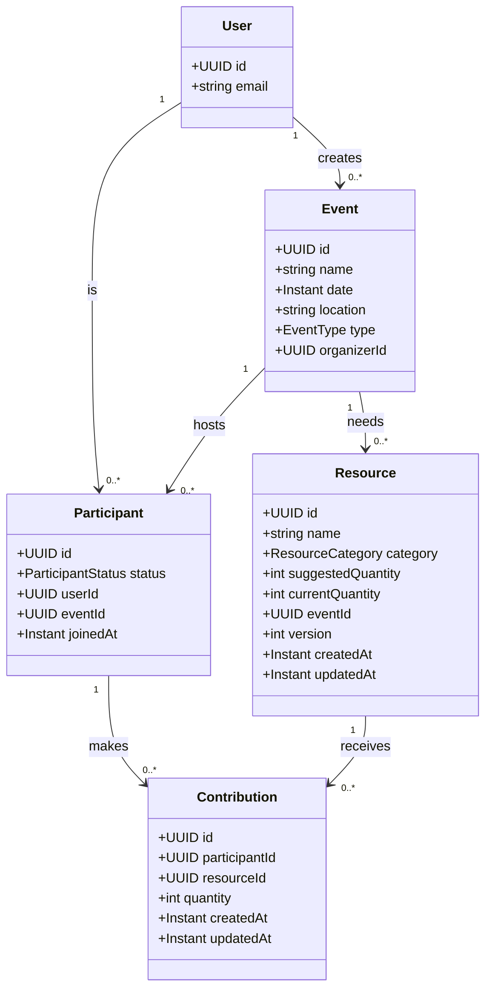

# Contribution & Resource Management - Architecture Analysis

## Problem Statement

Implement a collaborative resource management system where:
- Users can add resources to events (e.g., "sausages", "coca-cola")
- Multiple users can contribute quantities to resources
- Need to handle concurrent updates
- Potentially need real-time updates

## Data Model



## Architectural Decision

### ✅ RECOMMENDED: PostgreSQL + REST API + Optimistic Locking

**Rationale:**
1. **Existing Infrastructure** - Already have PostgreSQL working
2. **Data Integrity** - ACID transactions critical for quantities
3. **Relational Nature** - Data is highly relational (User-Event-Resource-Contribution)
4. **Simplicity** - REST API easier to implement and maintain
5. **Scalability** - Can add real-time later via SSE or WebSockets

### Technology Stack

```
Database:     PostgreSQL (existing)
ORM:          Exposed (existing)
API Style:    REST
Concurrency:  Optimistic Locking (version field)
Real-time:    Phase 2 - Server-Sent Events (optional)
```

## Database Schema Design

### Table: `participant`
```sql
CREATE TABLE IF NOT EXISTS configuration.participant (
    id UUID PRIMARY KEY DEFAULT gen_random_uuid(),
    user_id UUID NOT NULL,
    event_id UUID NOT NULL REFERENCES configuration.event(id) ON DELETE CASCADE,
    status VARCHAR(50) NOT NULL DEFAULT 'CONFIRMED',
    joined_at TIMESTAMP NOT NULL DEFAULT NOW(),
    created_at TIMESTAMP NOT NULL DEFAULT NOW(),
    updated_at TIMESTAMP NOT NULL DEFAULT NOW(),
    UNIQUE(user_id, event_id)
);

CREATE INDEX idx_participant_user ON configuration.participant(user_id);
CREATE INDEX idx_participant_event ON configuration.participant(event_id);
```

### Table: `resource`
```sql
CREATE TYPE configuration.RESOURCE_CATEGORY AS ENUM (
    'FOOD', 
    'DRINK', 
    'UTENSIL', 
    'DECORATION', 
    'OTHER'
);

CREATE TABLE IF NOT EXISTS configuration.resource (
    id UUID PRIMARY KEY DEFAULT gen_random_uuid(),
    name VARCHAR(255) NOT NULL,
    category configuration.RESOURCE_CATEGORY NOT NULL,
    suggested_quantity INTEGER NOT NULL DEFAULT 0,
    current_quantity INTEGER NOT NULL DEFAULT 0,
    event_id UUID NOT NULL REFERENCES configuration.event(id) ON DELETE CASCADE,
    version INTEGER NOT NULL DEFAULT 1,
    created_at TIMESTAMP NOT NULL DEFAULT NOW(),
    updated_at TIMESTAMP NOT NULL DEFAULT NOW()
);

CREATE INDEX idx_resource_event ON configuration.resource(event_id);
```

### Table: `contribution`
```sql
CREATE TABLE IF NOT EXISTS configuration.contribution (
    id UUID PRIMARY KEY DEFAULT gen_random_uuid(),
    participant_id UUID NOT NULL REFERENCES configuration.participant(id) ON DELETE CASCADE,
    resource_id UUID NOT NULL REFERENCES configuration.resource(id) ON DELETE CASCADE,
    quantity INTEGER NOT NULL CHECK (quantity > 0),
    created_at TIMESTAMP NOT NULL DEFAULT NOW(),
    updated_at TIMESTAMP NOT NULL DEFAULT NOW(),
    UNIQUE(participant_id, resource_id)
);

CREATE INDEX idx_contribution_participant ON configuration.contribution(participant_id);
CREATE INDEX idx_contribution_resource ON configuration.contribution(resource_id);
```

## API Design

### Resource Management Endpoints

#### 1. Add Resource to Event
```http
POST /event/configuration/api/v1/events/{eventId}/resources
Content-Type: application/json
x-user-id: {userId}

{
  "name": "Coca-Cola",
  "category": "DRINK",
  "suggestedQuantity": 10
}

Response 201 Created:
{
  "id": "uuid",
  "name": "Coca-Cola",
  "category": "DRINK",
  "suggestedQuantity": 10,
  "currentQuantity": 0,
  "contributions": []
}
```

#### 2. Get Event Resources
```http
GET /event/configuration/api/v1/events/{eventId}/resources
x-user-id: {userId}

Response 200 OK:
[
  {
    "id": "uuid",
    "name": "Sausages",
    "category": "FOOD",
    "suggestedQuantity": 20,
    "currentQuantity": 6,
    "contributions": [
      {
        "participantId": "uuid",
        "userName": "John Doe",
        "quantity": 6
      }
    ]
  },
  {
    "id": "uuid",
    "name": "Coca-Cola",
    "category": "DRINK",
    "suggestedQuantity": 10,
    "currentQuantity": 3,
    "contributions": [
      {
        "participantId": "uuid",
        "userName": "John Doe",
        "quantity": 2
      },
      {
        "participantId": "uuid2",
        "userName": "Jane Smith",
        "quantity": 1
      }
    ]
  }
]
```

#### 3. Add/Update Contribution
```http
POST /event/configuration/api/v1/events/{eventId}/resources/{resourceId}/contributions
Content-Type: application/json
x-user-id: {userId}

{
  "quantity": 2
}

Response 200 OK:
{
  "id": "contribution-uuid",
  "resourceId": "resource-uuid",
  "participantId": "participant-uuid",
  "quantity": 2,
  "resource": {
    "id": "uuid",
    "name": "Coca-Cola",
    "currentQuantity": 5
  }
}
```

#### 4. Delete Contribution
```http
DELETE /event/configuration/api/v1/events/{eventId}/resources/{resourceId}/contributions
x-user-id: {userId}

Response 204 No Content
```

## Handling Concurrency

### Optimistic Locking Strategy

```kotlin
// In SqlResourceRepository.kt
override fun updateResourceQuantity(
    resourceId: UUID,
    quantityDelta: Int,
    currentVersion: Int
): Either<UpdateResourceException, Resource> = Either.catch {
    transaction(exposedDatabase.database) {
        val updatedRows = ResourceTable.update({
            (ResourceTable.id eq resourceId) and 
            (ResourceTable.version eq currentVersion)
        }) {
            it[currentQuantity] = currentQuantity + quantityDelta
            it[version] = version + 1
            it[updatedAt] = clock.instant()
        }
        
        if (updatedRows == 0) {
            throw OptimisticLockException(resourceId, currentVersion)
        }
        resourceId
    }
}.flatMap { find(it) }
```

### Client-Side Handling

```kotlin
// Retry logic with exponential backoff
fun addContribution(resourceId: UUID, quantity: Int, maxRetries: Int = 3) {
    repeat(maxRetries) { attempt ->
        val resource = getResource(resourceId)
        val result = updateContribution(
            resourceId = resourceId,
            quantity = quantity,
            version = resource.version
        )
        
        when (result) {
            is Success -> return
            is OptimisticLockFailure -> {
                if (attempt == maxRetries - 1) throw ConcurrencyException()
                delay(100 * (2.pow(attempt)))
            }
        }
    }
}
```

## Domain Layer Structure

```
domain/
  src/main/kotlin/com/happyrow/core/domain/
    participant/
      model/
        Participant.kt
        ParticipantStatus.kt
      create/
        CreateParticipantUseCase.kt
      get/
        GetParticipantsByEventUseCase.kt
        
    resource/
      model/
        Resource.kt
        ResourceCategory.kt
      create/
        CreateResourceUseCase.kt
      get/
        GetResourcesByEventUseCase.kt
      update/
        UpdateResourceQuantityUseCase.kt
        
    contribution/
      model/
        Contribution.kt
      create/
        AddContributionUseCase.kt
      update/
        UpdateContributionUseCase.kt
      delete/
        DeleteContributionUseCase.kt
      get/
        GetContributionsByResourceUseCase.kt
```

## Use Case Examples

### AddContributionUseCase

```kotlin
class AddContributionUseCase(
    private val contributionRepository: ContributionRepository,
    private val participantRepository: ParticipantRepository,
    private val resourceRepository: ResourceRepository,
) {
    fun execute(request: AddContributionRequest): Either<AddContributionException, Contribution> {
        return participantRepository
            .findOrCreateParticipant(request.userId, request.eventId)
            .flatMap { participant ->
                contributionRepository
                    .addOrUpdateContribution(
                        participantId = participant.id,
                        resourceId = request.resourceId,
                        quantity = request.quantity
                    )
            }
            .mapLeft { AddContributionException(request, it) }
    }
}
```

## Real-Time Updates (Phase 2)

### Option A: Server-Sent Events (SSE)

**Pros:**
- Simple to implement
- Built-in reconnection
- One-way server → client
- Works over HTTP

**Implementation:**
```kotlin
// In Ktor
get("/events/{eventId}/resources/stream") {
    val eventId = UUID.fromString(call.parameters["eventId"])
    
    call.respondTextWriter(contentType = ContentType.Text.EventStream) {
        while (true) {
            val resources = getResourcesByEvent(eventId)
            write("data: ${Json.encodeToString(resources)}\n\n")
            flush()
            delay(5000) // Poll every 5 seconds
        }
    }
}
```

### Option B: WebSockets (If Needed)

**Use when:**
- Need bi-directional communication
- Very high frequency updates
- Chat-like features

**Not recommended initially** due to complexity.

## Implementation Phases

### Phase 1: Core CRUD (Week 1)
- [ ] Create Participant domain & repository
- [ ] Create Resource domain & repository
- [ ] Create Contribution domain & repository
- [ ] POST /resources endpoint
- [ ] GET /resources endpoint
- [ ] POST /contributions endpoint
- [ ] Database migrations

### Phase 2: Concurrency Handling (Week 1-2)
- [ ] Add version field to Resource
- [ ] Implement optimistic locking
- [ ] Add retry logic
- [ ] Add conflict detection tests

### Phase 3: Real-time (Phase 2 - Optional)
- [ ] Implement SSE endpoint
- [ ] Add change detection
- [ ] Frontend integration

## Testing Strategy

### Unit Tests
```kotlin
@Test
fun `should handle concurrent contributions correctly`() {
    val resource = createResource(suggestedQuantity = 10)
    
    // Simulate two users adding contributions simultaneously
    val contribution1 = addContribution(resource.id, quantity = 2, version = 1)
    val contribution2 = addContribution(resource.id, quantity = 3, version = 1)
    
    // One should succeed, one should fail with OptimisticLockException
    assertTrue(contribution1 is Success || contribution2 is Success)
    assertTrue(contribution1 is Failure || contribution2 is Failure)
    
    val finalResource = getResource(resource.id)
    // Only one contribution should be applied
    assertEquals(2 or 3, finalResource.currentQuantity)
}
```

## Pros & Cons Summary

### ✅ PostgreSQL + REST Approach

**Pros:**
- Leverage existing infrastructure
- ACID transactions for data consistency
- Simpler to implement and test
- Well-understood patterns
- Easy to debug and monitor
- Can scale with read replicas

**Cons:**
- No built-in real-time updates
- Need optimistic locking for concurrency
- Clients need to poll or refresh

### ❌ MongoDB + WebSocket Approach

**Pros:**
- Real-time updates out of the box
- Flexible schema
- Change streams

**Cons:**
- New database to manage
- Complex connection management
- Harder to scale WebSockets
- No ACID transactions across documents
- Overkill for this use case

## Recommendation

**Start with PostgreSQL + REST API + Optimistic Locking**

1. Implement core CRUD operations
2. Add optimistic locking for concurrency
3. Test thoroughly with concurrent users
4. Measure actual need for real-time
5. Add SSE if needed (Phase 2)

This approach:
- ✅ Builds on existing infrastructure
- ✅ Simpler to implement
- ✅ Easier to maintain
- ✅ Can evolve to real-time if needed
- ✅ Follows your existing hexagonal architecture

## Next Steps

1. **Review this architecture** - Does it fit your requirements?
2. **Define exact API contracts** - What fields, validations, etc.?
3. **Create database migrations** - Participant, Resource, Contribution tables
4. **Implement domain layer** - Following existing patterns
5. **Build infrastructure layer** - Repositories, endpoints
6. **Test with concurrent scenarios** - Ensure optimistic locking works

Would you like me to start implementing the Participant/Resource/Contribution entities following this architecture?
