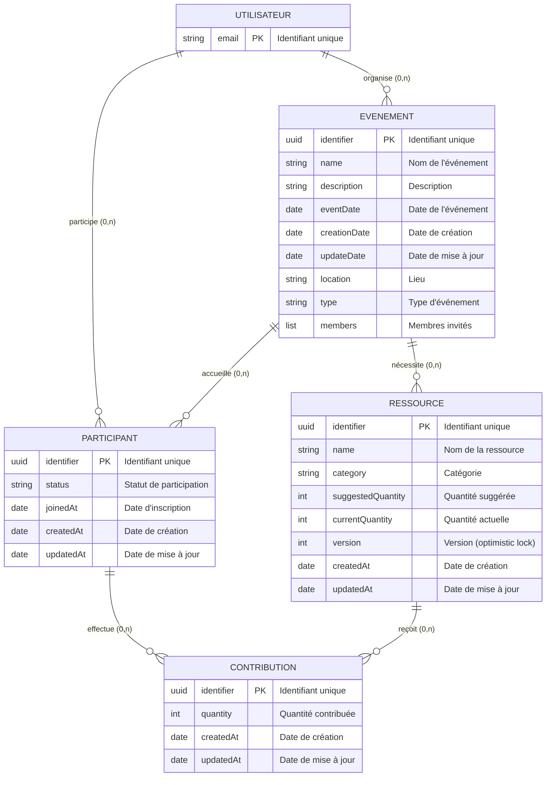
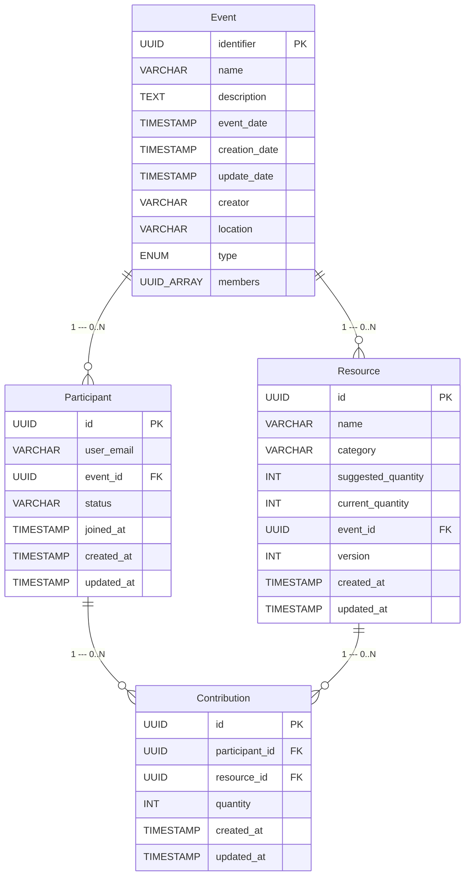
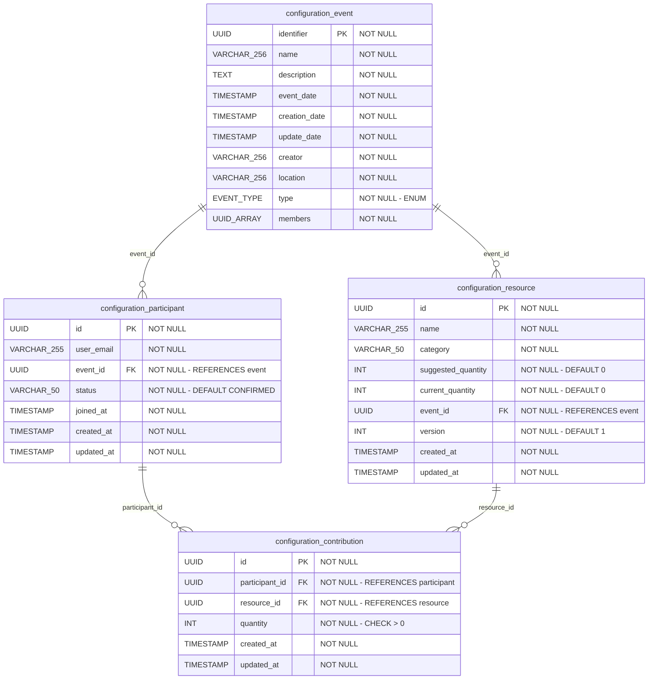

# Méthode MERISE - HappyRow Core

## Dictionnaire des données

| Nom de la donnée        | Format         | Longueur / Type          | Entité       |
|-------------------------|----------------|--------------------------|--------------|
| Email utilisateur       | alphanumérique | 255                      | UTILISATEUR  |
| Identifiant événement   | alphanumérique | UUID                     | EVENEMENT    |
| Nom événement           | alphabétique   | 256                      | EVENEMENT    |
| Description événement   | alphabétique   | TEXT                     | EVENEMENT    |
| Date événement          | date           | TIMESTAMP                | EVENEMENT    |
| Date de création        | date           | TIMESTAMP                | (commun)     |
| Date de mise à jour     | date           | TIMESTAMP                | (commun)     |
| Créateur                | alphanumérique | 256                      | EVENEMENT    |
| Lieu                    | alphabétique   | 256                      | EVENEMENT    |
| Type événement          | alphabétique   | ENUM (PARTY, BIRTHDAY, DINER, SNACK) | EVENEMENT |
| Membres                 | alphanumérique | UUID[]                   | EVENEMENT    |
| Identifiant participant | alphanumérique | UUID                     | PARTICIPANT  |
| Statut participant      | alphabétique   | 50 (INVITED, CONFIRMED, DECLINED, MAYBE) | PARTICIPANT |
| Date d'inscription      | date           | TIMESTAMP                | PARTICIPANT  |
| Identifiant ressource   | alphanumérique | UUID                     | RESSOURCE    |
| Nom ressource           | alphabétique   | 255                      | RESSOURCE    |
| Catégorie ressource     | alphabétique   | 50 (FOOD, DRINK, UTENSIL, DECORATION, OTHER) | RESSOURCE |
| Quantité suggérée       | numérique      | INT                      | RESSOURCE    |
| Quantité actuelle       | numérique      | INT                      | RESSOURCE    |
| Version                 | numérique      | INT                      | RESSOURCE    |
| Identifiant contribution| alphanumérique | UUID                     | CONTRIBUTION |
| Quantité contribution   | numérique      | INT (> 0)                | CONTRIBUTION |

## Règles de gestion

- **RG1** : Un utilisateur peut organiser 0 à N événements
- **RG2** : Un événement est organisé par exactement 1 utilisateur
- **RG3** : Un utilisateur peut participer à 0 à N événements
- **RG4** : Un événement peut accueillir 0 à N participants
- **RG5** : Un même utilisateur ne peut participer qu'une seule fois à un même événement (contrainte unique sur user_email + event_id)
- **RG6** : Un événement peut nécessiter 0 à N ressources
- **RG7** : Une ressource appartient à exactement 1 événement
- **RG8** : Un participant peut faire 0 à N contributions
- **RG9** : Une contribution est faite par exactement 1 participant
- **RG10** : Une ressource peut recevoir 0 à N contributions
- **RG11** : Une contribution concerne exactement 1 ressource
- **RG12** : Un participant ne peut contribuer qu'une seule fois à une même ressource (contrainte unique participant_id + resource_id)
- **RG13** : La quantité d'une contribution doit être strictement positive

---

## MCD — Modèle Conceptuel de Données

Le MCD décrit les entités du système d'information et leurs relations, indépendamment de toute implémentation technique.



### Cardinalités détaillées

| Association            | Entité source | Cardinalité | Entité cible | Cardinalité |
|------------------------|---------------|-------------|--------------|-------------|
| ORGANISER              | UTILISATEUR   | 0,N         | EVENEMENT    | 1,1         |
| PARTICIPER             | UTILISATEUR   | 0,N         | EVENEMENT    | 0,N         |
| NÉCESSITER             | EVENEMENT     | 1,1         | RESSOURCE    | 0,N         |
| EFFECTUER              | PARTICIPANT   | 1,1         | CONTRIBUTION | 0,N         |
| RECEVOIR               | RESSOURCE     | 1,1         | CONTRIBUTION | 0,N         |

> **PARTICIPANT** est une entité associative issue de la relation N:M PARTICIPER entre UTILISATEUR et EVENEMENT. Elle porte les propriétés `status` et `joinedAt` et possède son propre identifiant. La contrainte d'unicité (user_email, event_id) garantit qu'un utilisateur ne participe qu'une seule fois à un même événement.
>
> **CONTRIBUTION** est une entité associative issue de la relation N:M entre PARTICIPANT et RESSOURCE. Elle porte la propriété `quantity` et possède son propre identifiant.
>
> **Note sur UTILISATEUR** : cette entité est conceptuelle. Dans l'implémentation actuelle, les utilisateurs sont gérés par un service d'authentification externe (Supabase). Il n'existe pas de table `user` en base de données PostgreSQL. L'utilisateur est identifié par son email, qui apparaît comme `creator` dans EVENEMENT et `user_email` dans la table `participant`.

---

## MLD — Modèle Logique de Données

Le MLD transforme le MCD en schéma relationnel. Les entités deviennent des tables, les identifiants deviennent des clés primaires, et les relations se traduisent par des clés étrangères.



### Notation relationnelle

```
Event (identifier, name, description, event_date, creation_date, update_date, creator, location, type, members)

Participant (id, user_email, #event_id, status, joined_at, created_at, updated_at)
    UNIQUE (user_email, event_id)

Resource (id, name, category, suggested_quantity, current_quantity, #event_id, version, created_at, updated_at)

Contribution (id, #participant_id, #resource_id, quantity, created_at, updated_at)
    UNIQUE (participant_id, resource_id)
    CHECK (quantity > 0)
```

> Les clés étrangères sont préfixées par `#`. Les identifiants soulignés sont les clés primaires.

### Règles de transformation appliquées

| Cas MCD                              | Transformation MLD                                      |
|--------------------------------------|---------------------------------------------------------|
| Entité conceptuelle (UTILISATEUR)    | Pas de table dédiée (auth externe Supabase), référencée par `creator` dans Event et `user_email` dans Participant |
| Entité forte (EVENEMENT)             | Table Event avec clé primaire propre                    |
| Entité associative N:M (PARTICIPANT) | Table Participant avec FK vers Event + `user_email` référençant l'utilisateur, UNIQUE (user_email, event_id) |
| Entité forte (RESSOURCE)             | Table Resource avec FK vers Event (event_id)            |
| Entité associative N:M (CONTRIBUTION)| Table Contribution avec FK vers Participant et Resource, UNIQUE (participant_id, resource_id) |

---

## MPD — Modèle Physique de Données

Le MPD traduit le MLD en schéma PostgreSQL concret, avec les types de données, contraintes, index et valeurs par défaut.



### Script DDL PostgreSQL

```sql
-- Schema
CREATE SCHEMA IF NOT EXISTS configuration;

-- Enums
CREATE TYPE EVENT_TYPE AS ENUM ('PARTY', 'BIRTHDAY', 'DINER', 'SNACK');

-- Table EVENT
CREATE TABLE configuration.event (
    identifier UUID PRIMARY KEY,
    name       VARCHAR(256) NOT NULL,
    description TEXT NOT NULL,
    event_date TIMESTAMP NOT NULL,
    creation_date TIMESTAMP NOT NULL,
    update_date TIMESTAMP NOT NULL,
    creator    VARCHAR(256) NOT NULL,
    location   VARCHAR(256) NOT NULL,
    type       EVENT_TYPE NOT NULL,
    members    UUID[] NOT NULL
);

-- Table PARTICIPANT
CREATE TABLE configuration.participant (
    id         UUID PRIMARY KEY,
    user_email VARCHAR(255) NOT NULL,
    event_id   UUID NOT NULL REFERENCES configuration.event(identifier),
    status     VARCHAR(50) NOT NULL DEFAULT 'CONFIRMED',
    joined_at  TIMESTAMP NOT NULL,
    created_at TIMESTAMP NOT NULL,
    updated_at TIMESTAMP NOT NULL,

    CONSTRAINT uq_participant_user_event UNIQUE (user_email, event_id)
);

CREATE INDEX idx_participant_user ON configuration.participant(user_email);
CREATE INDEX idx_participant_event ON configuration.participant(event_id);

-- Table RESOURCE
CREATE TABLE configuration.resource (
    id                  UUID PRIMARY KEY,
    name                VARCHAR(255) NOT NULL,
    category            VARCHAR(50) NOT NULL,
    suggested_quantity  INT NOT NULL DEFAULT 0,
    current_quantity    INT NOT NULL DEFAULT 0,
    event_id            UUID NOT NULL REFERENCES configuration.event(identifier),
    version             INT NOT NULL DEFAULT 1,
    created_at          TIMESTAMP NOT NULL,
    updated_at          TIMESTAMP NOT NULL
);

CREATE INDEX idx_resource_event ON configuration.resource(event_id);

-- Table CONTRIBUTION
CREATE TABLE configuration.contribution (
    id              UUID PRIMARY KEY,
    participant_id  UUID NOT NULL REFERENCES configuration.participant(id),
    resource_id     UUID NOT NULL REFERENCES configuration.resource(id),
    quantity        INT NOT NULL,
    created_at      TIMESTAMP NOT NULL,
    updated_at      TIMESTAMP NOT NULL,

    CONSTRAINT uq_contribution_participant_resource UNIQUE (participant_id, resource_id),
    CONSTRAINT chk_quantity_positive CHECK (quantity > 0)
);

CREATE INDEX idx_contribution_participant ON configuration.contribution(participant_id);
CREATE INDEX idx_contribution_resource ON configuration.contribution(resource_id);
```

### Contraintes et index

| Table          | Contrainte                          | Type           |
|----------------|-------------------------------------|----------------|
| participant    | uq_participant_user_event           | UNIQUE (user_email, event_id) |
| participant    | idx_participant_user                | INDEX (user_email) |
| participant    | idx_participant_event               | INDEX (event_id) |
| resource       | idx_resource_event                  | INDEX (event_id) |
| contribution   | uq_contribution_participant_resource| UNIQUE (participant_id, resource_id) |
| contribution   | chk_quantity_positive               | CHECK (quantity > 0) |
| contribution   | idx_contribution_participant        | INDEX (participant_id) |
| contribution   | idx_contribution_resource           | INDEX (resource_id) |
