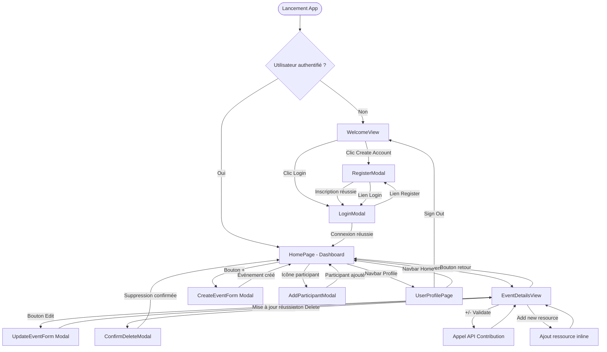

# Maquettes et Enchaînement des Écrans -- HappyRow Front-End

> **Destination** : `06_SPECIFICATIONS_FONCTIONNELLES.md` section 6.3 (Maquettes et enchaînement).

---

## 1. Liste des Écrans / Pages de l'Application

L'application HappyRow est une **SPA (Single Page Application)** React. La navigation repose sur React Router DOM et un système de **rendu conditionnel** basé sur l'état d'authentification.

### Routes déclarées

| Route | Condition | Composant rendu | Description |
|-------|-----------|-----------------|-------------|
| `/` | Non authentifié | `WelcomeView` | Page d'accueil publique |
| `/` | Authentifié | `HomePage` (dans `AppLayout`) | Dashboard des événements |
| `/profile` | Authentifié | `UserProfilePage` (dans `AppLayout`) | Profil utilisateur |
| `*` | Authentifié | `Navigate to /` | Redirection catch-all |

### Modales (overlays)

| Modale | Déclencheur | Composant |
|--------|-------------|-----------|
| Connexion | Bouton "Login" sur WelcomeView | `LoginModal` |
| Inscription | Bouton "Create Account" sur WelcomeView | `RegisterModal` |
| Création d'événement | Bouton "+" dans la navbar bottom | `CreateEventForm` (dans `Modal`) |
| Modification d'événement | Bouton "Edit" dans EventDetailsView | `UpdateEventForm` (dans `Modal`) |
| Suppression d'événement | Bouton "Delete Event" | `ConfirmDeleteModal` |
| Ajout de participant | Icône "Add participant" sur EventCard | `AddParticipantModal` |

### Vues inline (remplacement de contenu)

| Vue | Déclencheur | Composant |
|-----|-------------|-----------|
| Détail d'un événement | Clic sur une EventCard | `EventDetailsView` (remplace le contenu de HomePage) |

---

## 2. Description Fonctionnelle de Chaque Écran

### 2.1. WelcomeView -- Page d'accueil publique

**Rôle fonctionnel** : Première page affichée aux utilisateurs non connectés. Présente la marque et oriente vers l'inscription ou la connexion.

**Composants principaux** :
- Logo SVG de l'application (`/logo.svg`)
- Titre "HAPPY ROW" et tagline "Plan Together, Celebrate Better."
- Bouton "Create Account" (ouvre RegisterModal)
- Bouton "Login" (ouvre LoginModal)
- Footer avec copyright

**Interactions utilisateur** :
- Clic "Create Account" → ouvre la modale d'inscription
- Clic "Login" → ouvre la modale de connexion

---

### 2.2. LoginModal -- Modale de connexion

**Rôle fonctionnel** : Permet à un utilisateur existant de se connecter via email/mot de passe (Supabase Auth).

**Composants principaux** :
- Header avec message d'accueil ("Hello... Login")
- Champ email avec placeholder
- Champ mot de passe avec bouton toggle visibilité
- Bouton "Login" avec état de chargement
- Lien "Don't have account? Register"
- Bouton de fermeture (X)

**Interactions utilisateur** :
- Saisie email et mot de passe
- Toggle visibilité du mot de passe
- Soumission du formulaire → appel Supabase `signInWithPassword`
- Lien vers inscription → ferme LoginModal, ouvre RegisterModal
- Fermeture par clic sur le backdrop ou bouton X (avec animation)

---

### 2.3. RegisterModal -- Modale d'inscription

**Rôle fonctionnel** : Permet à un nouvel utilisateur de créer un compte.

**Composants principaux** :
- Champs : prénom, nom, email, mot de passe, confirmation mot de passe
- Bouton "Register" avec état de chargement
- Lien vers connexion
- Validation côté client

**Interactions utilisateur** :
- Remplissage du formulaire
- Soumission → appel Supabase `signUp`
- Après inscription réussie → bascule automatique vers LoginModal

---

### 2.4. HomePage -- Dashboard des événements

**Rôle fonctionnel** : Écran principal après connexion. Affiche la liste des événements créés par l'utilisateur.

**Composants principaux** :
- Liste d'`EventCard` (une carte par événement)
- Message "No events yet" si la liste est vide
- Indicateur de chargement
- `AppNavbar` (barre de navigation bottom avec Home, Profile, bouton "+")

**Interactions utilisateur** :
- Clic sur une EventCard → navigation vers EventDetailsView
- Clic sur l'icône "Add participant" d'une carte → ouvre AddParticipantModal
- Clic sur le bouton "+" de la navbar → ouvre la modale de création d'événement
- Navigation vers le profil via la navbar

---

### 2.5. EventCard -- Carte d'événement

**Rôle fonctionnel** : Résume les informations clés d'un événement dans une carte colorée.

**Composants principaux** :
- Section date (mois, jour, heure)
- Titre de l'événement
- Nombre de participants (avec icône)
- Localisation (avec icône)
- Boutons d'action rapide (message, ressources, ajouter participant)
- Toggle switch optionnel

**Interactions utilisateur** :
- Clic sur la carte → détail de l'événement
- Clic sur icône participant → ouvre AddParticipantModal
- Couleur alternée (coral/teal) selon le jour

---

### 2.6. EventDetailsView -- Détail d'un événement

**Rôle fonctionnel** : Affiche le détail complet d'un événement avec ses ressources (Food, Drinks), les contributions et les actions d'édition.

**Composants principaux** :
- Header : bouton retour, nom de l'événement, métadonnées (participants, lieu)
- Bouton "Edit" (si organisateur)
- Sections par catégorie de ressources (`ResourceCategorySection`) : Food et Drinks
- Chaque ressource avec contrôles de contribution (+/- et Validate)
- Formulaire inline d'ajout de ressource par catégorie
- Bouton "Delete Event" (si organisateur)

**Interactions utilisateur** :
- Retour à la liste (bouton ←)
- Incrémenter/décrémenter une contribution sur une ressource
- Valider une contribution → appel API POST
- Ajouter une nouvelle ressource inline
- Éditer l'événement (ouvre UpdateEventForm en modale)
- Supprimer l'événement (ouvre ConfirmDeleteModal)

---

### 2.7. UserProfilePage -- Profil utilisateur

**Rôle fonctionnel** : Affiche les informations du profil et permet la déconnexion.

**Composants principaux** :
- Avatar (icône SVG)
- Nom complet et email
- Section "Profile Settings" (coming soon)
- Bouton "Sign Out"

**Interactions utilisateur** :
- Déconnexion → appel `signOut`, retour au WelcomeView

---

### 2.8. AppLayout -- Layout principal

**Rôle fonctionnel** : Encadre toutes les pages authentifiées avec la navbar bottom.

**Composants principaux** :
- Zone de contenu principal (`<Outlet />`)
- `AppNavbar` (navigation bottom : Home, Profile, Create "+")
- Modale de création d'événement

---

## 3. Diagramme d'Enchaînement des Écrans

---

## 4. Fichiers de Maquettes (Figma)

Les assets exportés depuis Figma se trouvent dans le dossier `design-figma/` à la racine du projet :

| Fichier | Description |
|---------|-------------|
| `design-figma/logo.svg` | Logo de l'application HappyRow |
| `design-figma/bg_gradient.svg` | Fond dégradé utilisé sur la page d'accueil |
| `design-figma/message.svg` | Icône de message (action card) |
| `design-figma/text_plus.svg` | Icône d'ajout de texte/ressource |
| `design-figma/add_participant.svg` | Icône d'ajout de participant |

Les maquettes Figma originales ne sont pas exportées dans le repo mais ont été utilisées comme référence pour l'implémentation pixel-perfect de chaque écran. La charte graphique repose sur les Design Tokens CSS définis dans `src/core/styles/tokens/` (couleurs : teal `#5FBDB4`, navy `#3D5A6C`, coral `#E6A19A` ; police : Comic Neue).
