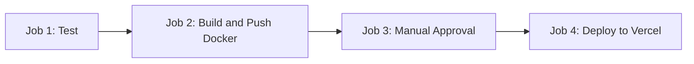
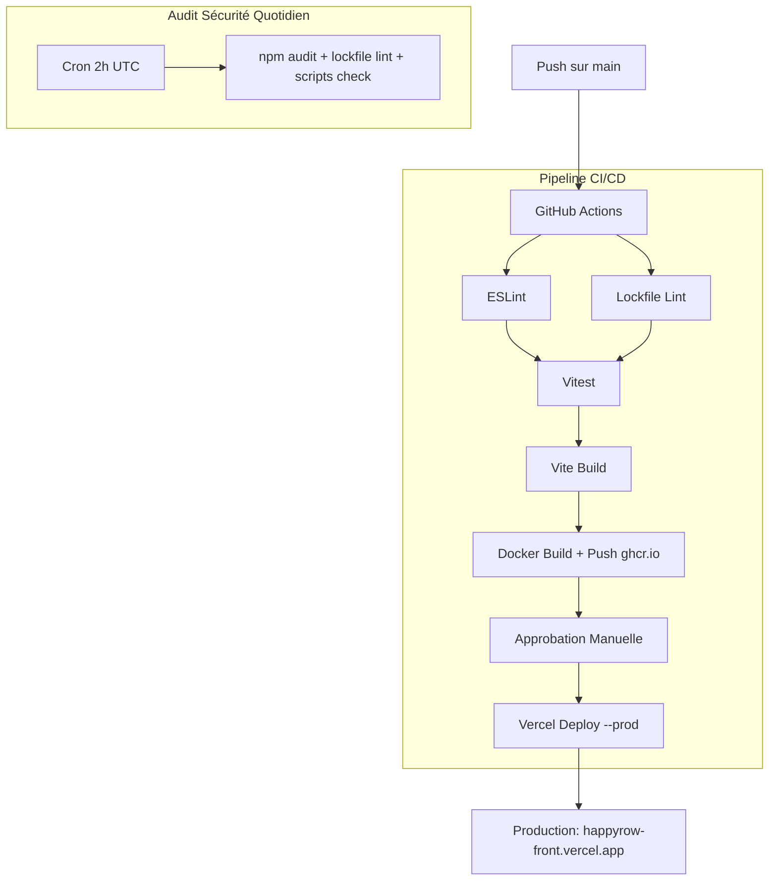

# CI/CD et Déploiement Front-End -- HappyRow

> **Destination** : `05_GESTION_DE_PROJET.md` et `08_REALISATIONS.md`.

---

## 1. Plateforme de Déploiement

Le front-end HappyRow est déployé sur **Vercel**, une plateforme spécialisée dans l'hébergement d'applications front-end.

| Élément | Détail |
|---------|--------|
| Plateforme | Vercel |
| URL de production | `https://happyrow-front.vercel.app` |
| Déclenchement | Push sur la branche `main` ou `master` via GitHub Actions |
| Outil CLI | `vercel --prod` (installé dans le pipeline CI) |

---

## 2. Pipeline CI/CD -- GitHub Actions

Le projet dispose de **2 workflows GitHub Actions** :

### 2.1. Workflow de Déploiement (`deploy.yml`)

Ce workflow orchestre le déploiement complet en **4 jobs séquentiels** :



```yaml
# .github/workflows/deploy.yml
name: Deploy to Production

on:
  push:
    branches: [ main, master ]
  workflow_dispatch:

env:
  REGISTRY: ghcr.io
  IMAGE_NAME: ${{ github.repository }}

jobs:
  test:
    runs-on: ubuntu-latest
    steps:
    - name: Checkout code
      uses: actions/checkout@v4

    - name: Setup Node.js
      uses: actions/setup-node@v4
      with:
        node-version: '20'
        cache: 'npm'

    - name: Security check - Validate lockfile
      run: |
        npm install --save-dev lockfile-lint
        npx lockfile-lint --path package-lock.json --type npm --allowed-hosts npm --validate-https

    - name: Install dependencies (secure mode)
      run: npm ci --ignore-scripts

    - name: Run linter
      run: npm run lint

    - name: Run tests
      run: npm run test

    - name: Clean install
      run: npm run clean

    - name: Build application
      run: npm run build

    - name: Upload build artifacts
      uses: actions/upload-artifact@v4
      with:
        name: dist
        path: dist/

  build-and-push:
    needs: test
    runs-on: ubuntu-latest
    permissions:
      contents: read
      packages: write
    steps:
    - name: Checkout code
      uses: actions/checkout@v4

    - name: Log in to Container Registry
      uses: docker/login-action@v3
      with:
        registry: ${{ env.REGISTRY }}
        username: ${{ github.actor }}
        password: ${{ secrets.GITHUB_TOKEN }}

    - name: Extract metadata
      id: meta
      uses: docker/metadata-action@v5
      with:
        images: ${{ env.REGISTRY }}/${{ env.IMAGE_NAME }}
        tags: |
          type=ref,event=branch
          type=ref,event=pr
          type=sha,prefix={{branch}}-
          type=raw,value=latest,enable={{is_default_branch}}

    - name: Build and push Docker image
      uses: docker/build-push-action@v5
      with:
        context: .
        target: production
        push: true
        tags: ${{ steps.meta.outputs.tags }}
        labels: ${{ steps.meta.outputs.labels }}

  approval:
    needs: build-and-push
    runs-on: ubuntu-latest
    if: github.ref == 'refs/heads/main' || github.ref == 'refs/heads/master'
    environment:
      name: production
      url: https://happyrow-front.vercel.app
    steps:
    - name: Manual Approval Required
      run: echo "Waiting for manual approval..."

  deploy:
    needs: approval
    runs-on: ubuntu-latest
    steps:
    - name: Checkout code
      uses: actions/checkout@v4

    - name: Setup Node.js
      uses: actions/setup-node@v4
      with:
        node-version: '20'
        cache: 'npm'

    - name: Security check - Lockfile validation
      run: |
        npm install --save-dev lockfile-lint
        npx lockfile-lint --path package-lock.json --type npm --allowed-hosts npm --validate-https

    - name: Install dependencies (secure mode)
      run: npm ci --ignore-scripts

    - name: Build application
      run: npm run build

    - name: Install Vercel CLI
      run: npm install --global vercel@latest

    - name: Deploy to Vercel
      run: vercel --prod --token=${{ secrets.VERCEL_TOKEN }} --yes
      env:
        VERCEL_ORG_ID: ${{ secrets.VERCEL_ORG_ID }}
        VERCEL_PROJECT_ID: ${{ secrets.VERCEL_PROJECT_ID }}
```

**Détail des jobs** :

| Job | Rôle | Actions principales |
|-----|------|---------------------|
| `test` | Validation qualité | Lockfile lint, `npm ci --ignore-scripts`, lint, tests, build |
| `build-and-push` | Image Docker | Build multi-stage, push vers `ghcr.io` |
| `approval` | Porte de validation | Approbation manuelle requise (GitHub Environment) |
| `deploy` | Déploiement | Build + deploy vers Vercel en production |

---

### 2.2. Workflow d'Audit de Sécurité (`security-audit.yml`)

Ce workflow s'exécute sur chaque push, chaque PR, et quotidiennement (cron) :

```yaml
# .github/workflows/security-audit.yml
name: Security Audit

on:
  push:
    branches: [ main, master, develop ]
  pull_request:
    branches: [ main, master ]
  schedule:
    - cron: '0 2 * * *'  # Quotidien à 2h UTC
  workflow_dispatch:

jobs:
  security-audit:
    runs-on: ubuntu-latest
    permissions:
      contents: read
      security-events: write
    steps:
    - name: Checkout code
      uses: actions/checkout@v4

    - name: Setup Node.js
      uses: actions/setup-node@v4
      with:
        node-version: '20'
        cache: 'npm'

    - name: Validate lockfile integrity
      run: |
        npm install --save-dev lockfile-lint
        npx lockfile-lint \
          --path package-lock.json \
          --type npm \
          --allowed-hosts npm \
          --validate-https \
          --validate-package-names

    - name: Check for malicious packages
      run: npm audit --audit-level=moderate || true

    - name: Install dependencies (secure mode)
      run: npm ci --ignore-scripts

    - name: Run npm audit
      run: npm audit --audit-level=moderate
      continue-on-error: true

    - name: Check for lifecycle scripts
      run: |
        node -e "
        const fs = require('fs');
        const packageLock = JSON.parse(fs.readFileSync('package-lock.json', 'utf8'));
        let scriptsFound = [];
        if (packageLock.packages) {
          for (const [pkgPath, pkg] of Object.entries(packageLock.packages)) {
            if (pkgPath && pkg.hasInstallScript) {
              scriptsFound.push({ name: pkgPath, version: pkg.version });
            }
          }
        }
        if (scriptsFound.length > 0) {
          console.log('WARNING: Packages with install scripts found:');
          scriptsFound.forEach(s => console.log('  - ' + s.name));
        } else {
          console.log('No lifecycle scripts detected');
        }
        "

    - name: Check dependency freshness
      run: |
        node -e "
        // Vérifie si des dépendances ont été publiées il y a moins de 7 jours
        // (indicateur potentiel de supply chain attack)
        // ... script de vérification ...
        "
      continue-on-error: true
```

**Vérifications effectuées** :

| Vérification | Outil | Objectif |
|-------------|-------|----------|
| Intégrité du lockfile | `lockfile-lint` | Vérifier que toutes les URLs sont HTTPS et proviennent de npm |
| Audit de vulnérabilités | `npm audit` | Détecter les CVE connues dans les dépendances |
| Scripts d'installation | Script Node custom | Détecter les packages avec `postinstall` (risque supply chain) |
| Fraîcheur des packages | Script Node custom | Alerter si un package a moins de 7 jours (indicateur de compromission) |

---

## 3. Gestion des Variables d'Environnement

### 3.1. Variables utilisées

| Variable | Environnement | Description |
|----------|--------------|-------------|
| `VITE_SUPABASE_URL` | Dev + Prod | URL du projet Supabase |
| `VITE_SUPABASE_ANON_KEY` | Dev + Prod | Clé anonyme Supabase (publique) |
| `VITE_API_BASE_URL` | Optionnel | Surcharge de l'URL du back-end |
| `NODE_ENV` | Dev + Prod | Environnement d'exécution |
| `VERCEL_TOKEN` | CI uniquement | Token d'authentification Vercel |
| `VERCEL_ORG_ID` | CI uniquement | ID de l'organisation Vercel |
| `VERCEL_PROJECT_ID` | CI uniquement | ID du projet Vercel |

### 3.2. Gestion sécurisée des secrets

Le fichier `.env.example` documente les variables mais **n'expose aucun secret**. Les secrets sont gérés via des gestionnaires de secrets :

```bash
# .env.example (extrait)
# ✅ SECURE (NEW WAY - DO THIS):
# Using 1Password CLI:
VITE_SUPABASE_URL=op://vault/supabase/url
VITE_SUPABASE_ANON_KEY=op://vault/supabase/anon-key

# Then run your app with:
# op run -- npm run dev
```

**En développement** : Les secrets sont injectés via 1Password CLI (`op run -- npm run dev`) ou Infisical.

**En production (Vercel)** : Les variables sont configurées dans les settings du projet Vercel et injectées au build.

**En CI (GitHub Actions)** : Les secrets sont stockés dans les GitHub Secrets du repository.

### 3.3. Mécanisme de résolution

```typescript
// src/core/config/api.ts -- Résolution de l'URL API
export const getApiConfig = (): ApiConfig => {
  const isProduction = import.meta.env.PROD;
  const envApiUrl = import.meta.env.VITE_API_BASE_URL;

  if (envApiUrl) return { baseUrl: envApiUrl };          // 1. Variable d'env explicite
  if (isProduction) return { baseUrl: 'https://happyrow-core.onrender.com' }; // 2. Production
  return { baseUrl: '/api' };                             // 3. Dev (proxy Vite)
};
```

---

## 4. Dockerfile -- Build Multi-Stage

Le projet dispose d'un **Dockerfile multi-stage** avec 3 étapes :

```dockerfile
# Dockerfile

# Stage 1: Build stage
FROM node:20-alpine AS builder
WORKDIR /app
COPY package*.json ./
RUN npm ci --legacy-peer-deps
COPY . .
RUN npm run build

# Stage 2: Production stage (Nginx)
FROM nginx:alpine AS production
COPY nginx.conf /etc/nginx/nginx.conf
COPY --from=builder /app/dist /usr/share/nginx/html
EXPOSE 80
HEALTHCHECK --interval=30s --timeout=3s --start-period=5s --retries=3 \
  CMD curl -f http://localhost:80/ || exit 1
CMD ["nginx", "-g", "daemon off;"]

# Stage 3: Development stage (Vite dev server)
FROM node:20-alpine AS development
WORKDIR /app
COPY package*.json ./
RUN npm ci --legacy-peer-deps
COPY . .
EXPOSE 5173
CMD ["npm", "run", "dev", "--", "--host", "0.0.0.0"]
```

### Docker Compose

```yaml
# docker-compose.yml
services:
  happyrow-front-dev:
    build:
      context: .
      dockerfile: Dockerfile
      target: development
    ports:
      - "5173:5173"
    volumes:
      - .:/app
      - /app/node_modules
    environment:
      - NODE_ENV=development
      - VITE_API_BASE_URL=/api
    profiles:
      - dev

  happyrow-front-prod:
    build:
      context: .
      dockerfile: Dockerfile
      target: production
    ports:
      - "80:80"
    environment:
      - NODE_ENV=production
    profiles:
      - prod
    restart: unless-stopped

networks:
  happyrow-network:
    driver: bridge
```

**Commandes Docker** :
- `npm run docker:dev` -- lance le mode développement avec hot reload
- `npm run docker:prod` -- lance le mode production (Nginx)
- `npm run docker:build:prod` -- build l'image de production

---

## 5. Synthèse du Pipeline de Déploiement


