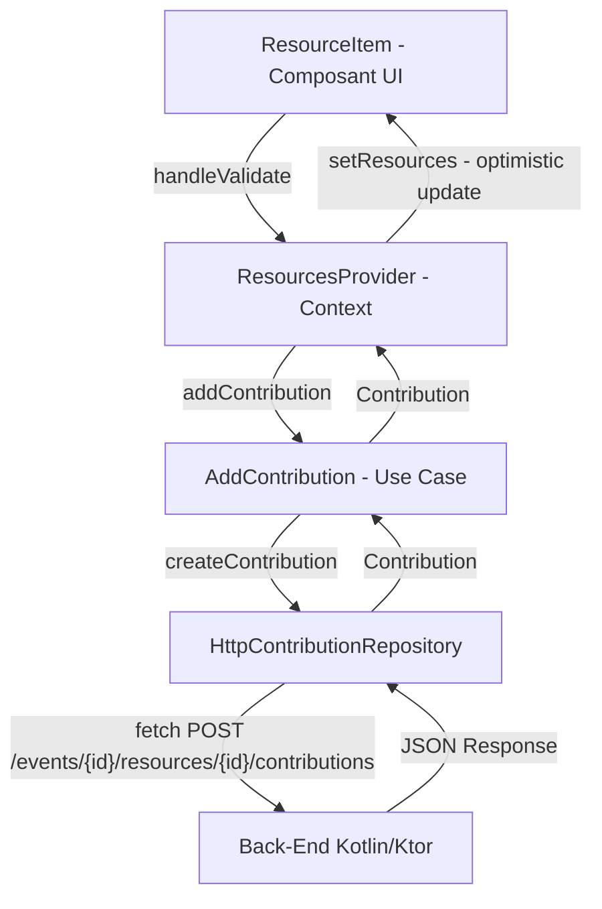

# Fonctionnalité Contribution -- Code Complet Côté Front-End

> **Destination** : `ANNEXES.md` Annexes A, B et E -- la fonctionnalité représentative complète (front + back).

---

## Vue d'ensemble

La fonctionnalité de **contribution** permet à un participant d'un événement de contribuer une quantité de ressource (nourriture, boissons) à cet événement. C'est la fonctionnalité la plus représentative du projet car elle met en jeu :

- L'affichage de données imbriquées (événement → ressources → contributions)
- L'interaction utilisateur avec mise à jour optimiste
- L'appel API REST avec JWT
- La gestion d'erreurs avec rollback
- Le pattern Clean Architecture complet (composant → context → use case → repository → fetch)

### Flux de données



---

## 1. Composant d'affichage des ressources par catégorie

Ce composant organise les ressources d'un événement par catégorie (Food, Drinks) et délègue l'affichage de chaque ressource au `ResourceItem`.

```typescript
// src/features/events/components/ResourceCategorySection.tsx
import React from 'react';
import type { Resource } from '@/features/resources';
import {
  ResourceCategory,
  ResourceItem,
  InlineAddResourceForm,
} from '@/features/resources';

interface ResourceCategorySectionProps {
  title: string;
  category: ResourceCategory;
  resources: Resource[];
  currentUserId: string;
  onAddContribution: (resourceId: string, quantity: number) => Promise<void>;
  onUpdateContribution: (resourceId: string, quantity: number) => Promise<void>;
  onDeleteContribution: (resourceId: string) => Promise<void>;
  onAddResource: (data: {
    name: string;
    category: ResourceCategory;
    quantity: number;
    suggestedQuantity?: number;
  }) => Promise<void>;
}

export const ResourceCategorySection: React.FC<
  ResourceCategorySectionProps
> = ({
  title, category, resources, currentUserId,
  onAddContribution, onUpdateContribution, onDeleteContribution, onAddResource,
}) => {
  return (
    <div className="category-section">
      <h2 className="category-title">{title}</h2>
      <div className="resources-list">
        {resources.map(resource => (
          <ResourceItem
            key={resource.id}
            resource={resource}
            currentUserId={currentUserId}
            onAddContribution={onAddContribution}
            onUpdateContribution={onUpdateContribution}
            onDeleteContribution={onDeleteContribution}
          />
        ))}
      </div>
      <InlineAddResourceForm category={category} onSubmit={onAddResource} />
    </div>
  );
};
```

---

## 2. Composant de contribution -- ResourceItem

C'est le composant central de la fonctionnalité. Il gère l'interaction utilisateur pour ajouter, modifier ou supprimer une contribution sur une ressource.

```typescript
// src/features/resources/components/ResourceItem.tsx
import React, { useState } from 'react';
import type { Resource } from '../types/Resource';
import './ResourceItem.css';

interface ResourceItemProps {
  resource: Resource;
  currentUserId: string;
  onAddContribution: (resourceId: string, quantity: number) => Promise<void>;
  onUpdateContribution: (resourceId: string, quantity: number) => Promise<void>;
  onDeleteContribution: (resourceId: string) => Promise<void>;
}

export const ResourceItem: React.FC<ResourceItemProps> = ({
  resource, currentUserId,
  onAddContribution, onUpdateContribution, onDeleteContribution,
}) => {
  const [selectedQuantity, setSelectedQuantity] = useState(0);
  const [isSaving, setIsSaving] = useState(false);

  // Trouver la contribution existante de l'utilisateur
  const userContribution = resource.contributors.find(
    c => c.userId === currentUserId
  );
  const userQuantity = userContribution?.quantity || 0;
  const hasSelection = selectedQuantity !== 0;

  const handleIncrement = () => {
    setSelectedQuantity(prev => prev + 1);
  };

  const handleDecrement = () => {
    if (selectedQuantity > 0) {
      setSelectedQuantity(prev => prev - 1);
    } else if (userQuantity > 0) {
      // Permet de réduire une contribution existante
      setSelectedQuantity(prev => prev - 1);
    }
  };

  const handleValidate = async () => {
    try {
      setIsSaving(true);
      const newQuantity = userQuantity + selectedQuantity;

      if (newQuantity <= 0) {
        // Suppression si la quantité tombe à 0 ou moins
        await onDeleteContribution(resource.id);
      } else if (userQuantity === 0) {
        // Nouvelle contribution
        await onAddContribution(resource.id, selectedQuantity);
      } else {
        // Mise à jour d'une contribution existante
        await onUpdateContribution(resource.id, newQuantity);
      }

      setSelectedQuantity(0);
    } catch (error) {
      console.error('Error updating contribution:', error);
    } finally {
      setIsSaving(false);
    }
  };

  return (
    <div className="resource-item-card">
      <div className="resource-item-content">
        <div className="resource-item-header">
          <span className="resource-item-name">{resource.name}</span>
          {userQuantity > 0 && (
            <span className="resource-user-contribution">
              Your contribution: {userQuantity}
            </span>
          )}
        </div>
        <div className="resource-item-controls">
          <span className="resource-item-quantity">
            {resource.currentQuantity}
            {resource.suggestedQuantity && `/${resource.suggestedQuantity}`}
          </span>
          <div className="resource-item-buttons">
            <button className="resource-btn resource-btn-minus"
              onClick={handleDecrement}
              disabled={(selectedQuantity === 0 && userQuantity === 0) || isSaving}
              aria-label="Decrease quantity">−</button>
            {hasSelection && (
              <span className={`resource-selected-quantity ${selectedQuantity < 0 ? 'negative' : ''}`}>
                {selectedQuantity > 0 ? '+' : ''}{selectedQuantity}
              </span>
            )}
            <button className="resource-btn resource-btn-plus"
              onClick={handleIncrement} disabled={isSaving}
              aria-label="Increase quantity">+</button>
          </div>
        </div>
      </div>
      {hasSelection && (
        <div className="resource-item-actions">
          <button className="resource-validate-btn"
            onClick={handleValidate} disabled={isSaving}>
            {isSaving ? 'Saving...' : 'Validate'}
          </button>
        </div>
      )}
    </div>
  );
};
```

---

## 3. Service HTTP -- HttpContributionRepository

Ce repository implémente l'interface `ContributionRepository` et effectue les appels `fetch` vers le back-end.

```typescript
// src/features/contributions/services/HttpContributionRepository.ts
import type {
  Contribution,
  ContributionCreationRequest,
  ContributionUpdateRequest,
} from '../types/Contribution';
import type { ContributionRepository } from '../types/ContributionRepository';

interface ContributionApiRequest {
  quantity: number;
}

interface ContributionApiResponse {
  identifier: string;
  participant_id: string;
  resource_id: string;
  quantity: number;
  created_at: number;
  updated_at?: number;
}

export class HttpContributionRepository implements ContributionRepository {
  private baseUrl: string;
  private getToken: () => string | null;

  constructor(
    getToken: () => string | null,
    baseUrl: string = import.meta.env.VITE_API_BASE_URL ||
      'https://happyrow-core.onrender.com/event/configuration/api/v1'
  ) {
    this.baseUrl = baseUrl;
    this.getToken = getToken;
  }

  async getContributionsByResource(params: {
    eventId: string;
    resourceId: string;
  }): Promise<Contribution[]> {
    const token = this.getToken();
    if (!token) throw new Error('Authentication required');

    const response = await fetch(
      `${this.baseUrl}/events/${params.eventId}/resources/${params.resourceId}/contributions`,
      { headers: { Authorization: `Bearer ${token}` } }
    );

    if (!response.ok) {
      throw new Error(`HTTP error! status: ${response.status}`);
    }

    const contributionsResponse: ContributionApiResponse[] = await response.json();
    return contributionsResponse.map(c =>
      this.mapApiResponseToContribution(c, params.eventId)
    );
  }

  async createContribution(
    data: ContributionCreationRequest
  ): Promise<Contribution> {
    const apiRequest: ContributionApiRequest = { quantity: data.quantity };

    const token = this.getToken();
    if (!token) throw new Error('Authentication required');

    const response = await fetch(
      `${this.baseUrl}/events/${data.eventId}/resources/${data.resourceId}/contributions`,
      {
        method: 'POST',
        headers: {
          'Content-Type': 'application/json',
          Authorization: `Bearer ${token}`,
        },
        body: JSON.stringify(apiRequest),
      }
    );

    if (!response.ok) {
      const errorData = await response.json().catch(() => ({}));
      throw new Error(
        errorData.message || `HTTP error! status: ${response.status}`
      );
    }

    const contributionResponse: ContributionApiResponse = await response.json();
    return this.mapApiResponseToContribution(contributionResponse, data.eventId);
  }

  async updateContribution(params: {
    eventId: string;
    resourceId: string;
    data: ContributionUpdateRequest;
  }): Promise<Contribution> {
    const token = this.getToken();
    if (!token) throw new Error('Authentication required');

    const apiRequest: ContributionApiRequest = {
      quantity: params.data.quantity || 0,
    };

    const response = await fetch(
      `${this.baseUrl}/events/${params.eventId}/resources/${params.resourceId}/contributions`,
      {
        method: 'POST',
        headers: {
          'Content-Type': 'application/json',
          Authorization: `Bearer ${token}`,
        },
        body: JSON.stringify(apiRequest),
      }
    );

    if (!response.ok) {
      const errorData = await response.json().catch(() => ({}));
      throw new Error(
        errorData.message || `HTTP error! status: ${response.status}`
      );
    }

    const contributionResponse: ContributionApiResponse = await response.json();
    return this.mapApiResponseToContribution(contributionResponse, params.eventId);
  }

  async deleteContribution(params: {
    eventId: string;
    resourceId: string;
  }): Promise<void> {
    const token = this.getToken();
    if (!token) throw new Error('Authentication required');

    const response = await fetch(
      `${this.baseUrl}/events/${params.eventId}/resources/${params.resourceId}/contributions`,
      {
        method: 'DELETE',
        headers: { Authorization: `Bearer ${token}` },
      }
    );

    if (!response.ok) {
      throw new Error(`HTTP error! status: ${response.status}`);
    }
  }

  private mapApiResponseToContribution(
    response: ContributionApiResponse,
    eventId: string
  ): Contribution {
    return {
      id: response.identifier,
      eventId: eventId,
      resourceId: response.resource_id,
      userId: response.participant_id,
      quantity: response.quantity,
      createdAt: new Date(response.created_at),
    };
  }
}
```

---

## 4. Use Case -- AddContribution

Le use case valide les entrées métier avant de déléguer au repository.

```typescript
// src/features/contributions/use-cases/AddContribution.ts
import type {
  Contribution,
  ContributionCreationRequest,
} from '../types/Contribution';
import { ContributionRepository } from '../types/ContributionRepository';

export interface AddContributionInput {
  eventId: string;
  resourceId: string;
  userId: string;
  quantity: number;
}

export class AddContribution {
  constructor(private contributionRepository: ContributionRepository) {}

  async execute(input: AddContributionInput): Promise<Contribution> {
    this.validateInput(input);

    const contributionRequest: ContributionCreationRequest = {
      eventId: input.eventId,
      resourceId: input.resourceId,
      userId: input.userId,
      quantity: input.quantity,
    };

    try {
      return await this.contributionRepository.createContribution(
        contributionRequest
      );
    } catch (error) {
      throw new Error(
        `Failed to add contribution: ${error instanceof Error ? error.message : 'Unknown error'}`
      );
    }
  }

  private validateInput(input: AddContributionInput): void {
    if (!input.quantity || input.quantity < 1) {
      throw new Error('Quantity must be at least 1');
    }
    if (!input.userId || input.userId.trim().length === 0) {
      throw new Error('Valid user ID is required');
    }
    if (!input.eventId || input.eventId.trim().length === 0) {
      throw new Error('Valid event ID is required');
    }
    if (!input.resourceId || input.resourceId.trim().length === 0) {
      throw new Error('Valid resource ID is required');
    }
  }
}
```

---

## 5. Gestion de l'état -- useContributionOperations (mise à jour optimiste + rollback)

Ce hook gère la **mise à jour optimiste** : le state React est mis à jour immédiatement avant la confirmation du serveur, et un **rollback** est effectué en cas d'erreur.

```typescript
// src/features/resources/hooks/useContributionOperations.ts
import { useCallback, type Dispatch, type SetStateAction } from 'react';
import type { Resource } from '../types/Resource';
import type { AddContribution } from '@/features/contributions/use-cases/AddContribution';
import type { UpdateContribution } from '@/features/contributions/use-cases/UpdateContribution';
import type { DeleteContribution } from '@/features/contributions/use-cases/DeleteContribution';
import type { GetResources } from '../use-cases/GetResources';

interface UseContributionOperationsParams {
  addContributionUseCase: AddContribution;
  updateContributionUseCase: UpdateContribution;
  deleteContributionUseCase: DeleteContribution;
  getResourcesUseCase: GetResources;
  currentEventId: string | null;
  resources: Resource[];
  setResources: Dispatch<SetStateAction<Resource[]>>;
  setError: Dispatch<SetStateAction<string | null>>;
}

export function useContributionOperations({
  addContributionUseCase, updateContributionUseCase,
  deleteContributionUseCase, getResourcesUseCase,
  currentEventId, resources, setResources, setError,
}: UseContributionOperationsParams) {

  // --- AJOUT DE CONTRIBUTION (avec mise à jour optimiste) ---
  const addContribution = useCallback(
    async (resourceId: string, userId: string, quantity: number): Promise<void> => {
      setError(null);
      const previousResources = [...resources]; // Sauvegarde pour rollback

      try {
        // Mise à jour optimiste AVANT l'appel API
        setResources(prev =>
          prev.map(r =>
            r.id === resourceId
              ? {
                  ...r,
                  currentQuantity: r.currentQuantity + quantity,
                  contributors: [
                    ...r.contributors,
                    { userId, quantity, contributedAt: new Date() },
                  ],
                }
              : r
          )
        );

        if (!currentEventId) throw new Error('No event context available');

        // Appel API réel
        await addContributionUseCase.execute({
          eventId: currentEventId,
          resourceId, userId, quantity,
        });
      } catch (err) {
        const errorMessage =
          err instanceof Error ? err.message : 'Failed to add contribution';
        setError(errorMessage);
        // ROLLBACK : restauration de l'état précédent
        setResources(previousResources);
        throw err;
      }
    },
    [addContributionUseCase, currentEventId, resources, setResources, setError]
  );

  // --- MISE À JOUR DE CONTRIBUTION ---
  const updateContribution = useCallback(
    async (resourceId: string, userId: string, quantity: number): Promise<void> => {
      setError(null);
      let previousResources: Resource[] = [];

      try {
        if (!currentEventId) throw new Error('No event context available');

        // Appel API d'abord (pas d'optimistic update pour l'update)
        const updatedContribution = await updateContributionUseCase.execute({
          eventId: currentEventId, resourceId, quantity,
        });

        // Mise à jour du state avec la réponse du serveur
        setResources(prev => {
          previousResources = [...prev];
          return prev.map(r => {
            if (r.id !== resourceId) return r;

            const participantId = updatedContribution.userId;
            let oldContributor = r.contributors.find(c => c.userId === participantId);
            if (!oldContributor) oldContributor = r.contributors.find(c => c.userId === userId);
            if (!oldContributor && r.contributors.length === 1) oldContributor = r.contributors[0];

            const oldQuantity = oldContributor?.quantity || 0;
            const deltaQuantity = updatedContribution.quantity - oldQuantity;

            let updatedContributors;
            if (oldContributor) {
              const oldUserId = oldContributor.userId;
              updatedContributors = r.contributors.map(c =>
                c.userId === oldUserId
                  ? { ...c, userId: participantId, quantity: updatedContribution.quantity,
                      contributedAt: updatedContribution.createdAt }
                  : c
              );
            } else {
              updatedContributors = [
                ...r.contributors,
                { userId: participantId, quantity: updatedContribution.quantity,
                  contributedAt: updatedContribution.createdAt },
              ];
            }

            return {
              ...r,
              currentQuantity: r.currentQuantity + deltaQuantity,
              contributors: updatedContributors,
            };
          });
        });
      } catch (err) {
        const errorMessage =
          err instanceof Error ? err.message : 'Failed to update contribution';
        setError(errorMessage);
        if (previousResources.length > 0) setResources(previousResources);
        throw err;
      }
    },
    [updateContributionUseCase, currentEventId, setResources, setError]
  );

  // --- SUPPRESSION DE CONTRIBUTION ---
  const deleteContribution = useCallback(
    async (resourceId: string): Promise<void> => {
      setError(null);
      try {
        if (!currentEventId) throw new Error('No event context available');

        await deleteContributionUseCase.execute({
          eventId: currentEventId, resourceId,
        });

        // Recharger toutes les ressources depuis le serveur
        const eventResources = await getResourcesUseCase.execute({
          eventId: currentEventId,
        });
        setResources(eventResources);
      } catch (err) {
        const errorMessage =
          err instanceof Error ? err.message : 'Failed to delete contribution';
        setError(errorMessage);
        throw err;
      }
    },
    [deleteContributionUseCase, getResourcesUseCase, currentEventId, setResources, setError]
  );

  // --- RAFRAÎCHISSEMENT ---
  const refreshResource = useCallback(async (): Promise<void> => {
    setError(null);
    try {
      if (currentEventId) {
        const eventResources = await getResourcesUseCase.execute({
          eventId: currentEventId,
        });
        setResources(eventResources);
      }
    } catch (err) {
      setError(err instanceof Error ? err.message : 'Failed to refresh resource');
      throw err;
    }
  }, [getResourcesUseCase, currentEventId, setResources, setError]);

  return { addContribution, updateContribution, deleteContribution, refreshResource };
}
```

---

## 6. Provider -- ResourcesProvider (orchestration)

Le provider instancie tous les use cases et repositories, puis les injecte dans le contexte React.

```typescript
// src/features/resources/hooks/ResourcesProvider.tsx
import React, { useState, ReactNode, useRef, useCallback, useMemo } from 'react';
import type { Resource } from '../types/Resource';
import { ResourcesContext, ResourcesContextType } from './ResourcesContext';
import { GetResources, UpdateResource, DeleteResource,
         HttpResourceRepository, CreateResource } from '@/features/resources';
import { AddContribution } from '@/features/contributions/use-cases/AddContribution';
import { UpdateContribution } from '@/features/contributions/use-cases/UpdateContribution';
import { DeleteContribution } from '@/features/contributions/use-cases/DeleteContribution';
import { HttpContributionRepository } from '@/features/contributions/services/HttpContributionRepository';
import { useResourceOperations } from './useResourceOperations';
import { useContributionOperations } from './useContributionOperations';

interface ResourcesProviderProps {
  children: ReactNode;
  getToken: () => string | null;
}

export const ResourcesProvider: React.FC<ResourcesProviderProps> = ({
  children, getToken,
}) => {
  const [resources, setResources] = useState<Resource[]>([]);
  const [loading, setLoading] = useState(false);
  const [error, setError] = useState<string | null>(null);
  const [currentEventId, setCurrentEventId] = useState<string | null>(null);
  const loadedEventIdRef = useRef<string | null>(null);
  const loadingRef = useRef(false);

  // Instanciation des repositories (mémoïsés)
  const resourceRepository = useMemo(
    () => new HttpResourceRepository(getToken), [getToken]);
  const contributionRepository = useMemo(
    () => new HttpContributionRepository(getToken), [getToken]);

  // Instanciation des use cases (mémoïsés)
  const createResourceUseCase = useMemo(
    () => new CreateResource(resourceRepository), [resourceRepository]);
  const getResourcesUseCase = useMemo(
    () => new GetResources(resourceRepository), [resourceRepository]);
  const updateResourceUseCase = useMemo(
    () => new UpdateResource(resourceRepository), [resourceRepository]);
  const deleteResourceUseCase = useMemo(
    () => new DeleteResource(resourceRepository), [resourceRepository]);
  const addContributionUseCase = useMemo(
    () => new AddContribution(contributionRepository), [contributionRepository]);
  const updateContributionUseCase = useMemo(
    () => new UpdateContribution(contributionRepository), [contributionRepository]);
  const deleteContributionUseCase = useMemo(
    () => new DeleteContribution(contributionRepository), [contributionRepository]);

  // Chargement des ressources (avec cache par eventId)
  const loadResources = useCallback(async (eventId: string) => {
    if (loadedEventIdRef.current === eventId || loadingRef.current) return;
    loadingRef.current = true;
    setLoading(true);
    setError(null);
    setCurrentEventId(eventId);
    try {
      const eventResources = await getResourcesUseCase.execute({ eventId });
      setResources(eventResources);
      loadedEventIdRef.current = eventId;
    } catch (err) {
      setError(err instanceof Error ? err.message : 'Failed to load resources');
      loadedEventIdRef.current = null;
    } finally {
      setLoading(false);
      loadingRef.current = false;
    }
  }, [getResourcesUseCase]);

  // Opérations sur les ressources
  const { addResource, updateResource, deleteResource } = useResourceOperations({
    createResourceUseCase, updateResourceUseCase, deleteResourceUseCase,
    resources, setResources, setError,
  });

  // Opérations sur les contributions
  const { addContribution, updateContribution, deleteContribution, refreshResource } =
    useContributionOperations({
      addContributionUseCase, updateContributionUseCase, deleteContributionUseCase,
      getResourcesUseCase, currentEventId, resources, setResources, setError,
    });

  const value: ResourcesContextType = {
    resources, loading, error, loadResources,
    addResource, updateResource, deleteResource,
    addContribution, updateContribution, deleteContribution, refreshResource,
  };

  return (
    <ResourcesContext.Provider value={value}>
      {children}
    </ResourcesContext.Provider>
  );
};
```

---

## 7. Gestion de l'erreur 409 (OPTIMISTIC_LOCK_FAILURE)

Le front-end **ne gère pas explicitement** le code d'erreur HTTP 409 (Optimistic Lock Failure) renvoyé par le back-end. L'erreur est capturée de manière générique par le bloc `catch` :

```typescript
// Dans HttpContributionRepository.ts
if (!response.ok) {
  const errorData = await response.json().catch(() => ({}));
  throw new Error(
    errorData.message || `HTTP error! status: ${response.status}`
  );
}
```

En cas d'erreur 409 :
1. Le repository lance une exception avec le message du serveur (ex: `"OPTIMISTIC_LOCK_FAILURE"`)
2. Le use case propage l'erreur
3. Le hook `useContributionOperations` effectue le **rollback** du state optimiste
4. L'erreur est affichée dans le composant via le state `error` du context

**Amélioration possible** : Intercepter spécifiquement le code 409 pour afficher un message utilisateur adapté ("La ressource a été modifiée par un autre utilisateur, veuillez rafraîchir") et déclencher automatiquement un `refreshResource()`.

---

## 8. Actualisation des données après une contribution réussie

Après une contribution réussie, l'actualisation des données se fait selon deux stratégies :

### Pour l'ajout (`addContribution`) -- Mise à jour optimiste

Le state est mis à jour **avant** l'appel API. Si l'appel réussit, le state reste tel quel. Si l'appel échoue, le state est restauré (rollback).

### Pour la suppression (`deleteContribution`) -- Rechargement complet

Après la suppression, toutes les ressources de l'événement sont rechargées depuis le serveur pour garantir la cohérence :

```typescript
await deleteContributionUseCase.execute({ eventId: currentEventId, resourceId });
// Recharger toutes les ressources depuis le serveur
const eventResources = await getResourcesUseCase.execute({ eventId: currentEventId });
setResources(eventResources);
```

### Pour la mise à jour (`updateContribution`) -- Mise à jour avec réponse serveur

Le state est mis à jour avec les données retournées par le serveur (pas d'optimistic update).
