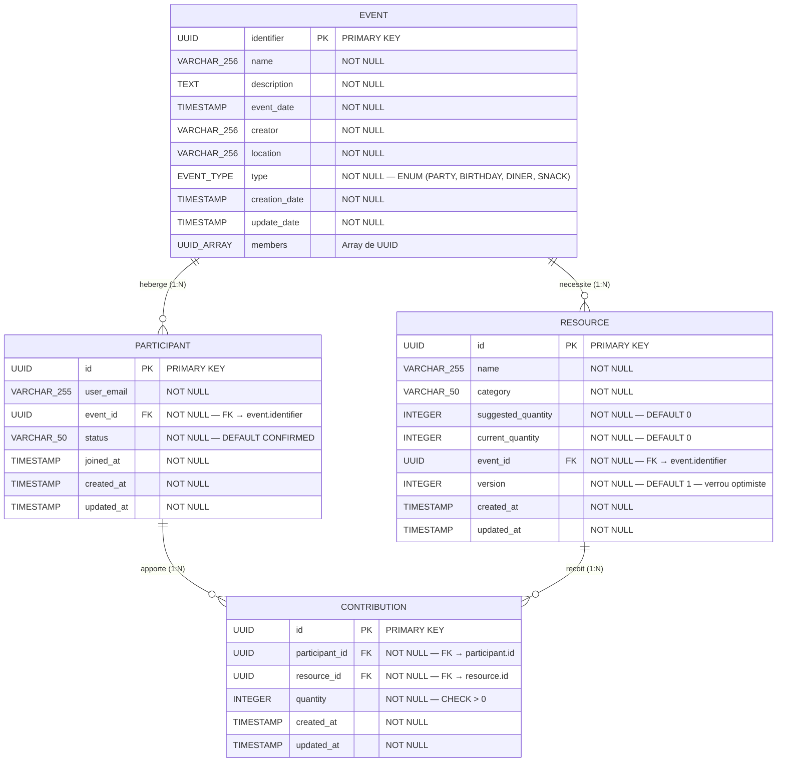

### Modèle Physique de Données (MPD)

Le MPD ci-dessous représente la structure physique réelle de la base PostgreSQL, telle que définie dans les classes Exposed (`EventTable`, `ParticipantTable`, `ResourceTable`, `ContributionTable`). Les tables sont créées automatiquement par `SchemaUtils.createMissingTablesAndColumns` au démarrage de l'application.

Toutes les tables sont dans le schéma PostgreSQL `configuration`.

#### Correspondance MCD → MPD

Le passage du MCD au MPD conserve les mêmes 4 entités et les mêmes 4 relations. Les cardinalités 1:N se traduisent par des clés étrangères (FK) dans les tables enfants. Aucune table d'association supplémentaire n'est nécessaire : la table `CONTRIBUTION` joue naturellement le rôle de table d'association entre `PARTICIPANT` et `RESOURCE`, avec un attribut propre (`quantity`).

#### Contraintes d'intégrité

| Contrainte | Table | Colonne(s) | Rôle |
|------------|-------|------------|------|
| **PK** | Toutes | `identifier` / `id` | Identifiant unique UUID généré automatiquement |
| **FK** | `PARTICIPANT` | `event_id` → `EVENT.identifier` | Intégrité référentielle événement–participant |
| **FK** | `RESOURCE` | `event_id` → `EVENT.identifier` | Intégrité référentielle événement–ressource |
| **FK** | `CONTRIBUTION` | `participant_id` → `PARTICIPANT.id` | Intégrité référentielle participant–contribution |
| **FK** | `CONTRIBUTION` | `resource_id` → `RESOURCE.id` | Intégrité référentielle ressource–contribution |
| **UNIQUE** | `EVENT` | `(name, creator)` | Empêche les doublons de nom par organisateur |
| **UNIQUE** | `PARTICIPANT` | `(user_email, event_id)` | Un utilisateur ne peut participer qu'une fois à un événement |
| **UNIQUE** | `CONTRIBUTION` | `(participant_id, resource_id)` | Un participant ne peut contribuer qu'une fois par ressource |
| **CHECK** | `CONTRIBUTION` | `quantity > 0` | Quantités strictement positives |
| **DEFAULT** | `PARTICIPANT` | `status = 'CONFIRMED'` | Statut initial d'un participant |
| **DEFAULT** | `RESOURCE` | `version = 1` | Version initiale pour le verrou optimiste |

#### Index de performance

| Index | Table | Colonne(s) | Unique | Rôle |
|-------|-------|------------|--------|------|
| `uq_participant_user_event` | `PARTICIPANT` | `user_email, event_id` | Oui | Unicité + recherche rapide par email et événement |
| `idx_participant_user` | `PARTICIPANT` | `user_email` | Non | Recherche par email |
| `idx_participant_event` | `PARTICIPANT` | `event_id` | Non | Recherche par événement |
| `idx_resource_event` | `RESOURCE` | `event_id` | Non | Recherche des ressources d'un événement |
| `uq_contribution_participant_resource` | `CONTRIBUTION` | `participant_id, resource_id` | Oui | Unicité + recherche rapide |
| `idx_contribution_participant` | `CONTRIBUTION` | `participant_id` | Non | Recherche par participant |
| `idx_contribution_resource` | `CONTRIBUTION` | `resource_id` | Non | Recherche par ressource |

#### Le champ `version` (verrou optimiste)

Le champ `version` de la table `RESOURCE` est le mécanisme central du verrou optimiste. Il est incrémenté atomiquement à chaque modification de `current_quantity` via un `UPDATE ... WHERE version = expectedVersion`. Si la version en base ne correspond plus à la version attendue (modification concurrente), l'UPDATE retourne 0 lignes et une `OptimisticLockException` est levée, renvoyée au client comme HTTP 409 Conflict.

Ce mécanisme est préféré à un verrou pessimiste (`SELECT FOR UPDATE`) car il ne bloque pas les autres transactions, offrant de meilleures performances en contexte de concurrence faible à modérée.
