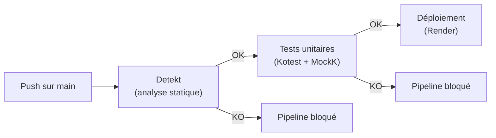

# 10. Plan de tests et jeu d'essai

## 10.1 Stratégie de tests

### Pyramide de tests

| Niveau | Outil | Scope | Quantité |
|--------|-------|-------|----------|
| **Tests unitaires** | Kotest + MockK | Use cases, logique métier | 2 tests (use cases) |
| **Tests d'intégration** | Testcontainers + Ktor TestHost | Repositories SQL, endpoints complets | ~40 tests (scénarios critiques) |
| **Analyse statique** | Detekt | Qualité de code, patterns à risque | Exécuté à chaque push |
| **Formatage** | Spotless (ktlint) | Style de code homogène | Exécuté à chaque push |

### Outils et frameworks

| Outil | Version | Rôle |
|-------|---------|------|
| **Kotest** | 5.9.1 | Framework de test Kotlin (assertions, matchers) |
| **MockK** | 1.14.5 | Mocking de dépendances Kotlin (coroutines, value classes) |
| **Arrow Test** | 2.1.2 | Assertions spécifiques `Either` : `shouldBeRight`, `shouldBeLeft` |
| **Testcontainers** | 1.21.3 | Conteneur PostgreSQL jetable pour tests d'intégration |
| **Detekt** | 1.23.7 | Analyse statique : complexité, code smells, sécurité |

### Exécution dans le pipeline CI/CD



Les tests d'intégration (Testcontainers) sont exclus du pipeline CI via `-PWithoutIntegrationTests` pour des raisons de performance, mais sont exécutés localement.

### Tests front-end

| Niveau | Outil | Scope | Fichiers |
|--------|-------|-------|----------|
| **Tests unitaires** | Vitest 3.2.4 + Testing Library + jsdom | Authentification (repository, provider, vue, composant) | 4 fichiers, 46 tests |
| **Tests E2E** | Playwright 1.59.0 | PWA (manifest, service worker, offline) | 1 fichier, 6 tests |

Les tests unitaires front-end utilisent `vi.mock()` pour mocker le SDK Supabase et `@testing-library/react` pour tester les composants de manière centrée utilisateur. Les tests se concentrent sur le module d'authentification (fonctionnalité la plus critique).

Les tests E2E Playwright vérifient les capacités PWA : présence du manifest, thème-color, icône Apple Touch, service worker enregistré, et fonctionnement offline (assets en cache).

## 10.2 Approche de test — Tests unitaires

### Structure BDD (Given / When / Then)

Les tests suivent une structure claire inspirée du BDD, avec des fonctions d'aide pour la lisibilité :

```kotlin
// domain/event/create/CreateEventUseCaseTestUT.kt

class CreateEventUseCaseTestUT {
  private val eventRepositoryMock = mockk<EventRepository>()
  private val participantRepositoryMock = mockk<ParticipantRepository>()
  private val useCase = CreateEventUseCase(
    eventRepositoryMock, participantRepositoryMock
  )

  @Test
  fun `should create event and auto-add creator as participant`() {
    givenACreateRequest()
      .andAWorkingCreation()
      .whenCreating()
      .then { (result) ->
        result shouldBeRight Persona.Event.anEvent
      }
  }

  @Test
  fun `should transfer error from event repository`() {
    val error = CreateEventRepositoryException(
      Persona.Event.aCreateEventRequest
    )
    givenACreateRequest()
      .andAFailingCreation(error)
      .whenCreating()
      .then { (result, request) ->
        result shouldBeLeft CreateEventException(request, error)
      }
  }
}
```

### Personas (fixtures réutilisables)

Les données de test sont centralisées dans des objets `Persona` partagés entre tous les tests :

```kotlin
// domain/testFixtures — Persona.kt, EventPersona.kt, etc.

object Persona {
  object Uuid { val aCorrelationId = UUID.fromString("...") }
  object User { val aUser = Creator("test@happyrow.com") }
  object Time { val aClock = Clock.fixed(...); val now = aClock.instant() }
  object Event {
    val anEvent = Event(
      identifier = ..., name = "Test Event",
      creator = User.aUser, ...
    )
    val aCreateEventRequest = CreateEventRequest(...)
  }
}
```

## 10.3 Jeu d'essai — Fonctionnalité représentative

La fonctionnalité la plus représentative du projet est **l'ajout d'une contribution avec verrou optimiste**, car elle implique :
- L'authentification (extraction de l'utilisateur du JWT)
- La recherche/création du participant (findOrCreate)
- La vérification d'une contribution existante
- La mise à jour atomique de la ressource avec vérification de version
- La gestion du cas de conflit concurrent

### Scénario nominal : ajout d'une nouvelle contribution

| Étape | Donnée en entrée | Donnée attendue | Donnée obtenue |
|-------|-----------------|-----------------|----------------|
| **1. Requête HTTP** | `POST /events/{eventId}/resources/{resourceId}/contributions` avec body `{ "quantity": 3 }` et header `Authorization: Bearer <jwt>` | Requête acceptée par le endpoint | Requête acceptée |
| **2. Authentification** | JWT valide avec `sub=userId`, `email=user@test.com` | `AuthenticatedUser(userId, email)` extrait | AuthenticatedUser correctement extrait |
| **3. Recherche participant** | `userEmail=user@test.com`, `eventId=<uuid>` | Participant existant ou créé avec statut CONFIRMED | Participant retourné par `findOrCreate` |
| **4. Vérification contribution** | `participantId + resourceId` | Pas de contribution existante (nouvelle) | `null` retourné par la requête SELECT |
| **5. Création contribution** | `participantId, resourceId, quantity=3` | INSERT réussi, contribution créée avec `id`, `createdAt` | Contribution créée avec UUID généré |
| **6. Mise à jour ressource** | `resourceId, delta=+3, expectedVersion=0` | `currentQuantity` passe de 0 à 3, `version` passe de 0 à 1 | UPDATE conditionnel réussi (1 row updated) |
| **7. Réponse HTTP** | — | `200 OK` avec `ContributionDto` | `200 OK` avec les données de la contribution |

**Analyse des écarts : aucun écart constaté** — le scénario nominal fonctionne conformément aux spécifications.

### Scénario d'erreur : conflit de concurrence (verrou optimiste)

| Étape | Donnée en entrée | Donnée attendue | Donnée obtenue |
|-------|-----------------|-----------------|----------------|
| **1. Utilisateur A** contribue 3 unités | `quantity=3, version=0` | Succès, `version` passe à 1 | Succès |
| **2. Utilisateur B** (qui avait lu `version=0`) contribue 2 unités | `quantity=2, expectedVersion=0` | Échec : `version` en base est maintenant 1 | `OptimisticLockException` levée |
| **3. Réponse B** | — | `409 Conflict` avec `type: "OPTIMISTIC_LOCK_FAILURE"` | `409 Conflict` avec message "Resource was modified by another user. Please refresh and try again." |

**Analyse des écarts : aucun écart** — le verrou optimiste détecte correctement le conflit et retourne l'erreur appropriée. Le client B doit rafraîchir les données (relire la version courante) et réessayer.

### Scénario de sécurité : tests de sécurité de la fonctionnalité contribution

Le tableau ci-dessous présente les tests de sécurité élaborés pour la fonctionnalité la plus représentative (ajout de contribution). Chaque test vérifie un vecteur d'attaque ou un cas de sécurité spécifique.

| # | Cas de test | Donnée en entrée | Donnée attendue | Donnée obtenue | Analyse |
|---|------------|-----------------|-----------------|----------------|---------|
| **S1** | Requête sans JWT | `POST /events/{eid}/resources/{rid}/contributions` sans header `Authorization` | `401 Unauthorized`, body `{ "type": "MISSING_TOKEN" }` | `401 Unauthorized`, body `{ "type": "MISSING_TOKEN", "message": "Authorization header with Bearer token is required" }` | Conforme — la route est protégée |
| **S2** | JWT expiré | Même requête avec un token JWT dont `exp` est dans le passé | `401 Unauthorized`, body `{ "type": "INVALID_TOKEN" }` | `401 Unauthorized`, body `{ "type": "INVALID_TOKEN", "message": "The Token has expired..." }` | Conforme — la librairie Auth0 vérifie l'expiration |
| **S3** | JWT avec mauvaise signature | Token signé avec un secret différent du `SUPABASE_JWT_SECRET` | `401 Unauthorized`, body `{ "type": "INVALID_TOKEN" }` | `401 Unauthorized`, body `{ "type": "INVALID_TOKEN", "message": "The Token's Signature..." }` | Conforme — HMAC256 rejette les signatures invalides |
| **S4** | Quantité négative | Body `{ "quantity": -5 }` avec JWT valide | `400 Bad Request` car la validation `require(quantity > 0)` échoue | `400 Bad Request`, body `{ "type": "INVALID_BODY" }` | Conforme — validation côté endpoint + contrainte CHECK en base |
| **S5** | Quantité non-numérique | Body `{ "quantity": "abc" }` avec JWT valide | `400 Bad Request` — échec de désérialisation Jackson | `400 Bad Request`, body `{ "type": "INVALID_BODY" }` | Conforme — Jackson en mode strict (`FAIL_ON_NULL_FOR_PRIMITIVES`) |
| **S6** | Injection SQL via le body | Body `{ "quantity": "1; DROP TABLE configuration.contribution;" }` | `400 Bad Request` — Jackson refuse la désérialisation en Integer | `400 Bad Request` | Conforme — double protection : Jackson + Exposed ORM (requêtes paramétrées) |
| **S7** | Identité usurpée (contribuer au nom d'un autre) | JWT de l'utilisateur A, mais tentative de contribuer avec l'email de B | L'email est extrait du JWT côté serveur, pas du body client | Contribution créée avec l'email de A (celui du JWT), pas celui de B | Conforme — `authenticatedUser().email` empêche l'usurpation |

**Analyse des écarts : aucun écart constaté.** L'ensemble des tests de sécurité confirment que les mécanismes de protection fonctionnent conformément aux spécifications. La stratégie de défense en profondeur (validation endpoint → validation domaine → contraintes base de données) est effective.

## 10.4 Situation de travail ayant nécessité une recherche

### Contexte : tester un verrou optimiste en conditions de concurrence

Lors de l'implémentation du verrou optimiste sur les contributions, une difficulté s'est présentée : **comment tester de manière fiable qu'un accès concurrent est bien détecté et rejeté ?**

### Problème

Un test unitaire classique (MockK) peut simuler le retour d'un `Either.Left(OptimisticLockException)`, mais ne prouve pas que le mécanisme fonctionne réellement en base de données avec deux transactions concurrentes. Le risque est qu'en production, le `UPDATE ... WHERE version = N` ne se comporte pas comme attendu (isolation transactionnelle, verrouillage implicite PostgreSQL).

### Recherche effectuée

J'ai effectué des recherches sur :

1. **Testcontainers** (documentation officielle + articles Medium) — pour exécuter des tests d'intégration avec une vraie base PostgreSQL dans un conteneur Docker jetable, garantissant un environnement identique à la production.
2. **Niveaux d'isolation transactionnelle PostgreSQL** (documentation PostgreSQL + blog 2ndQuadrant) — pour comprendre comment `READ COMMITTED` (niveau par défaut) interagit avec le pattern de verrou optimiste : chaque transaction voit les commits des autres, ce qui permet au `WHERE version = N` de détecter les modifications concurrentes.
3. **Patterns de test de concurrence en Kotlin** (Kotlin Coroutines documentation) — pour simuler deux opérations concurrentes avec `coroutineScope { launch { ... } }` et vérifier que l'une réussit et l'autre échoue avec `OptimisticLockException`.

### Résultat

Cette recherche a conduit à :

- L'écriture d'un **test d'intégration avec Testcontainers** qui crée une ressource avec `version=0`, lance deux contributions simultanées avec `expectedVersion=0`, et vérifie que l'une réussit (`Either.Right`) et l'autre échoue (`Either.Left(OptimisticLockException)`).
- La confirmation que le niveau d'isolation `READ COMMITTED` de PostgreSQL est suffisant pour le verrou optimiste (pas besoin de `SERIALIZABLE`).
- La décision d'exclure ces tests d'intégration du pipeline CI (trop lents) avec le flag `-PWithoutIntegrationTests`, tout en les exécutant localement avant chaque mise en production.
