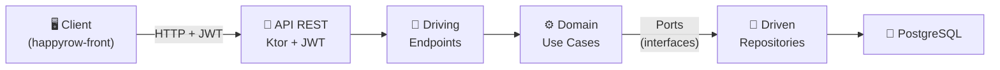
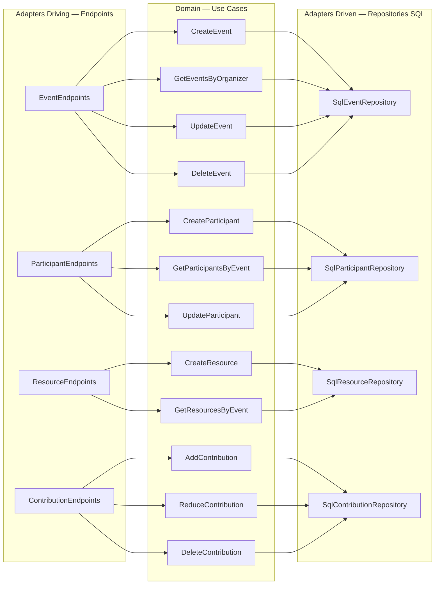
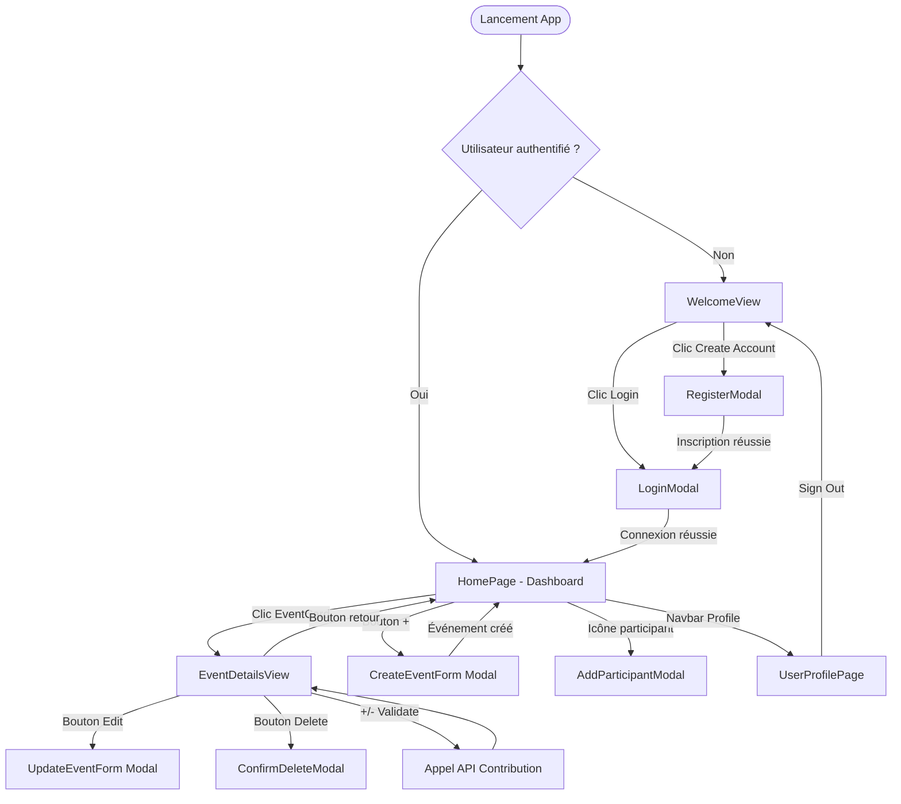
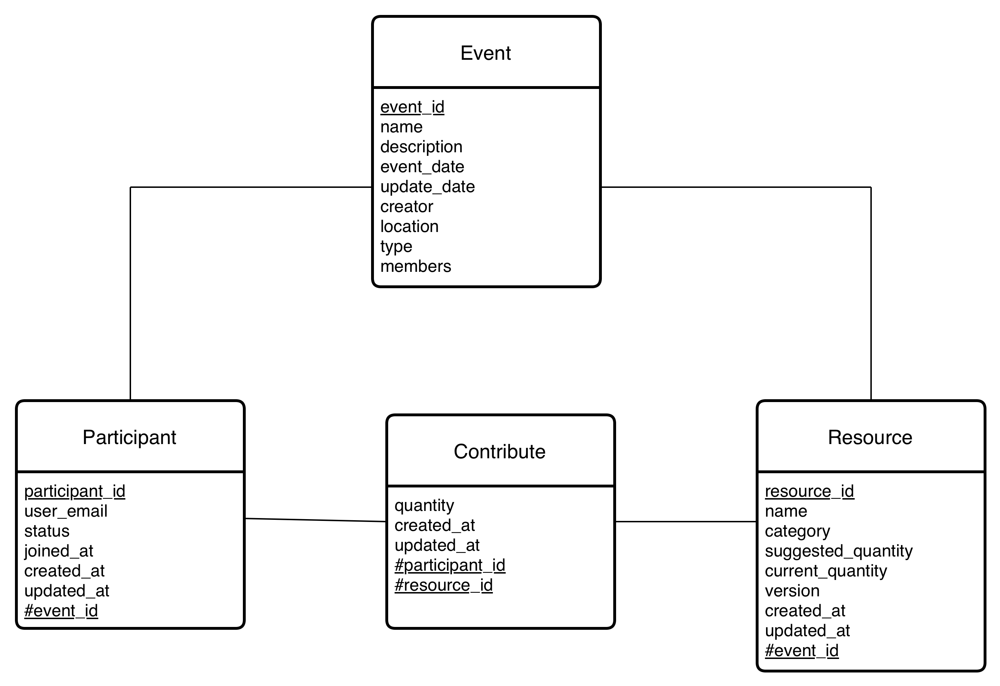
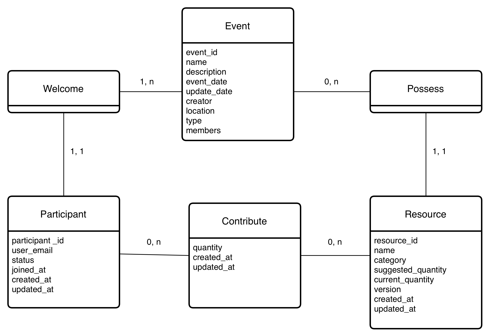
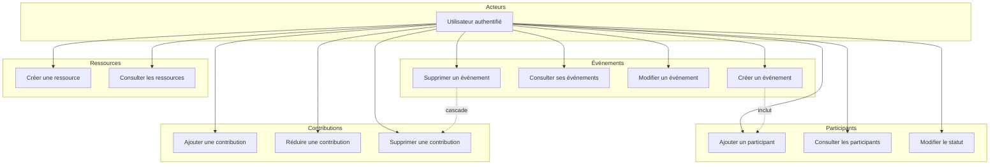
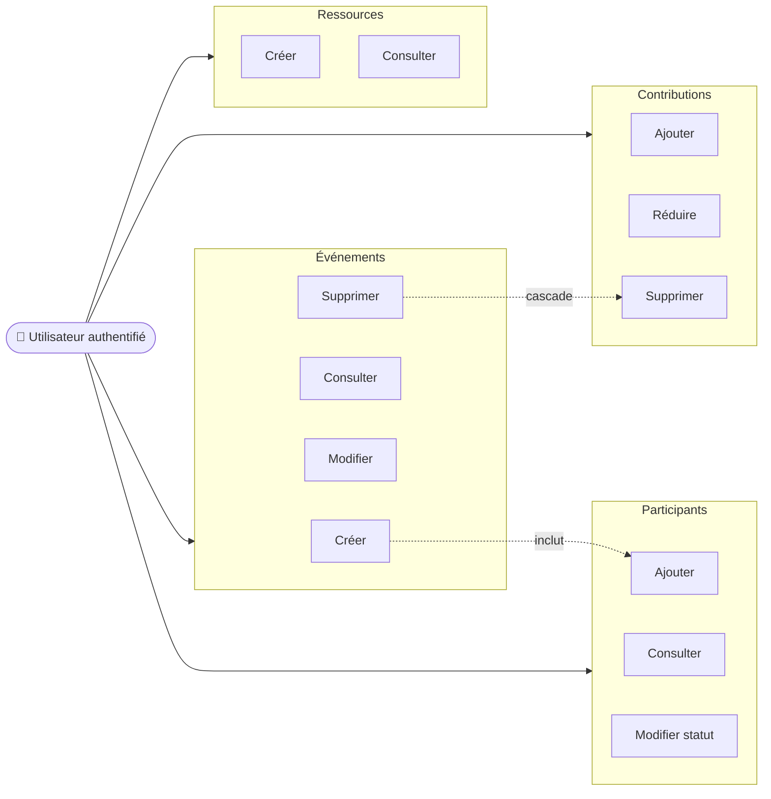
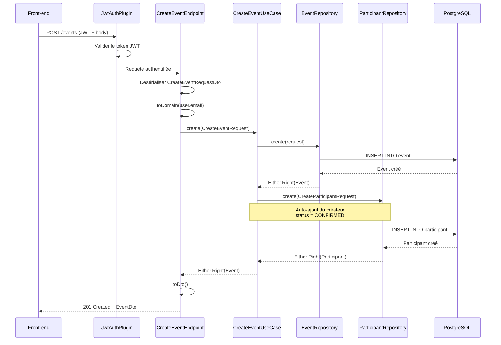
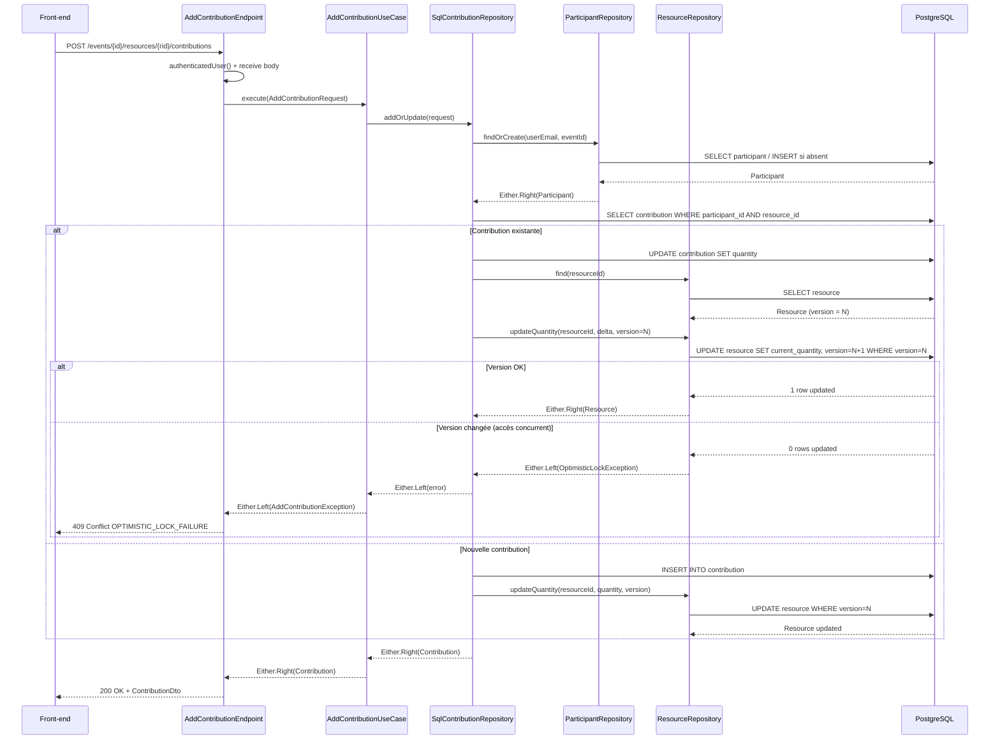

# 6. Spécifications fonctionnelles

## 6.1 Contraintes du projet et livrables attendus

### Contraintes

| Contrainte | Description |
|---|---|
| **Langage** | Kotlin sur JVM 21 — typage fort, null-safety, interopérabilité Java |
| **Framework** | Ktor 3.2.2 — framework web asynchrone non-bloquant |
| **Base de données** | PostgreSQL — SGBD relationnel avec support des enums, UUID, arrays |
| **Authentification** | Déléguée à Supabase (JWT HMAC256) — pas de gestion de mots de passe côté serveur |
| **Conteneurisation** | Docker obligatoire pour le déploiement |
| **Architecture** | Hexagonale imposée — séparation stricte domaine / infrastructure |
| **Qualité** | Analyse statique Detekt obligatoire dans le pipeline CI/CD |

### Livrables

1. API REST avec 15 endpoints couvrant les 4 domaines (Event, Participant, Resource, Contribution)
2. Base de données PostgreSQL avec schéma, contraintes et indexes
3. Pipeline CI/CD GitHub Actions (Detekt → Tests → Deploy)
4. Dockerfile multi-stage pour le déploiement
5. Configuration Render pour l'hébergement cloud
6. Documentation technique

## 6.2 Architecture logicielle du projet

### Architecture hexagonale (Ports & Adapters)

L'application suit une architecture hexagonale, organisée en deux modules Gradle indépendants :

```
happyrow-core/
├── domain/          ← Logique métier pure (aucune dépendance framework)
│   └── src/main/kotlin/
│       └── com/happyrow/core/domain/
│           ├── event/          ← Bounded context Événement
│           ├── participant/    ← Bounded context Participant
│           ├── resource/       ← Bounded context Ressource
│           └── contribution/   ← Bounded context Contribution
│
├── infrastructure/  ← Adapters techniques
│   └── src/main/kotlin/
│       └── com/happyrow/core/infrastructure/
│           ├── event/          ← Driving (endpoints) + Driven (SQL)
│           ├── participant/
│           ├── resource/
│           ├── contribution/
│           ├── technical/      ← Auth JWT, config DB, Jackson, Ktor
│           └── common/         ← Erreurs partagées
│
└── src/             ← Point d'entrée (Application.kt, Routing, Koin modules)
```

### Diagramme de composants

```mermaid
graph TB
    subgraph client [Client]
        Frontend["Front-end web<br/>(happyrow-front)"]
    end

    subgraph api [API REST - Ktor]
        Auth["JwtAuthenticationPlugin"]
        Routing["Routing"]
    end

    subgraph driving [Adapters Driving - Endpoints]
        EventEP["EventEndpoints"]
        ParticipantEP["ParticipantEndpoints"]
        ResourceEP["ResourceEndpoints"]
        ContributionEP["ContributionEndpoints"]
    end

    subgraph domainLayer [Domain - Use Cases]
        CreateEvent["CreateEventUseCase"]
        GetEvents["GetEventsByOrganizerUseCase"]
        UpdateEvent["UpdateEventUseCase"]
        DeleteEvent["DeleteEventUseCase"]
        CreateParticipant["CreateParticipantUseCase"]
        GetParticipants["GetParticipantsByEventUseCase"]
        UpdateParticipant["UpdateParticipantUseCase"]
        CreateResource["CreateResourceUseCase"]
        GetResources["GetResourcesByEventUseCase"]
        AddContribution["AddContributionUseCase"]
        ReduceContribution["ReduceContributionUseCase"]
        DeleteContribution["DeleteContributionUseCase"]
    end

    subgraph driven [Adapters Driven - Repositories SQL]
        SqlEvent["SqlEventRepository"]
        SqlParticipant["SqlParticipantRepository"]
        SqlResource["SqlResourceRepository"]
        SqlContribution["SqlContributionRepository"]
    end

    subgraph db [PostgreSQL]
        EventTbl["event"]
        ParticipantTbl["participant"]
        ResourceTbl["resource"]
        ContributionTbl["contribution"]
    end

    Frontend -->|"HTTP + JWT"| Auth
    Auth --> Routing
    Routing --> driving
    driving --> domainLayer
    domainLayer -->|"Ports (interfaces)"| driven
    driven --> db
```



### Flux global simplifié



### Détail par couche



### Principe de dépendance

Le module `domain` ne dépend d'aucune bibliothèque technique. Il définit des **ports** (interfaces de repository) que le module `infrastructure` implémente. Cette inversion de dépendance garantit que la logique métier est testable indépendamment et ne change pas si l'on remplace PostgreSQL par un autre SGBD.

## 6.3 Maquettes et enchaînement des écrans

L'application HappyRow est une **SPA (Single Page Application)** React. La navigation repose sur React Router DOM et un rendu conditionnel basé sur l'état d'authentification. Les maquettes Figma originales sont dans `design-figma/` du repo `happyrow-front`, avec une charte basée sur des Design Tokens CSS (teal `#5FBDB4`, navy `#3D5A6C`, coral `#E6A19A`, police Comic Neue).

### Enchaînement des écrans



### Écrans principaux

| Écran | Rôle | Composants clés |
|-------|------|-----------------|
| **WelcomeView** | Page d'accueil non authentifié | Logo, tagline, boutons Login / Create Account |
| **LoginModal** | Connexion email/mot de passe (Supabase) | Champs email/password, toggle visibilité, validation, animation fermeture 400ms |
| **RegisterModal** | Inscription nouvel utilisateur | Champs prénom, nom, email, mot de passe, confirmation |
| **HomePage** | Dashboard — liste des événements | `EventCard` (date, nom, participants, localisation), `AppNavbar` (Home, Profile, "+") |
| **EventDetailsView** | Détail complet d'un événement | Header avec retour/edit, `ResourceCategorySection` (Food/Drinks), `ResourceItem` (+/- et Validate), ajout ressource inline, bouton Delete Event |
| **CreateEventForm** | Formulaire de création d'événement | Nom (min 3 car.), description, date/heure (futur), lieu, type (Party, Birthday, Diner, Snack) |
| **UserProfilePage** | Profil et déconnexion | Avatar, nom, email, bouton Sign Out |

## 6.4 Modèle entités-associations et modèle physique

### Modèle Conceptuel de Données (MCD)

Le MCD ci-dessous représente les entités métier de l'application HappyRow et les associations qui les relient. On y distingue quatre entités principales — **Event**, **Participant**, **Resource** et **Contribution** — ainsi que leurs cardinalités : un événement héberge plusieurs participants et nécessite plusieurs ressources, tandis qu'une contribution fait le lien entre un participant et une ressource.


### Modèle Logique de Données (MLD)

Le MLD traduit le modèle conceptuel en un schéma relationnel. Les associations sont matérialisées par des clés étrangères : `event_id` dans les tables **Participant** et **Resource**, et `participant_id` / `resource_id` dans la table **Contribution**. Ce modèle met en évidence les contraintes d'intégrité référentielle et les index uniques composites qui garantissent la cohérence des données (un participant unique par événement, une contribution unique par couple participant-ressource).



### Modèle Physique de Données (MPD)

Le MPD détaille l'implémentation physique dans PostgreSQL, au sein du schéma `configuration`. Il précise les types de colonnes (UUID, VARCHAR, TIMESTAMP, INTEGER), les contraintes (PRIMARY KEY, NOT NULL, CHECK, DEFAULT), le type énuméré `EVENT_TYPE` (PARTY, BIRTHDAY, DINER, SNACK), ainsi que les index de performance. Le champ `version` de la table **Resource** implémente un mécanisme de verrou optimiste pour gérer les accès concurrents lors des mises à jour de contributions.



### Script de création de la base de données

```sql
-- init-db.sql — Initialisation du schéma et des types
CREATE SCHEMA IF NOT EXISTS configuration;
CREATE EXTENSION IF NOT EXISTS "uuid-ossp";
CREATE TYPE EVENT_TYPE AS ENUM ('PARTY', 'BIRTHDAY', 'DINER', 'SNACK');
GRANT ALL PRIVILEGES ON SCHEMA configuration TO happyrow_user;

-- Table EVENT
CREATE TABLE configuration.event (
  identifier  UUID         PRIMARY KEY DEFAULT uuid_generate_v4(),
  name        VARCHAR(256) NOT NULL,
  description TEXT         NOT NULL,
  event_date  TIMESTAMP    NOT NULL,
  creator     VARCHAR(256) NOT NULL,
  location    VARCHAR(256) NOT NULL,
  type        EVENT_TYPE   NOT NULL,
  creation_date TIMESTAMP  NOT NULL,
  update_date   TIMESTAMP  NOT NULL,
  members     UUID[]
);

-- Table PARTICIPANT
CREATE TABLE configuration.participant (
  id          UUID         PRIMARY KEY DEFAULT uuid_generate_v4(),
  user_email  VARCHAR(255) NOT NULL,
  event_id    UUID         NOT NULL REFERENCES configuration.event(identifier),
  status      VARCHAR(50)  NOT NULL DEFAULT 'CONFIRMED',
  joined_at   TIMESTAMP    NOT NULL,
  created_at  TIMESTAMP    NOT NULL,
  updated_at  TIMESTAMP    NOT NULL
);
CREATE UNIQUE INDEX uq_participant_user_event ON configuration.participant(user_email, event_id);
CREATE INDEX idx_participant_user ON configuration.participant(user_email);
CREATE INDEX idx_participant_event ON configuration.participant(event_id);

-- Table RESOURCE
CREATE TABLE configuration.resource (
  id                 UUID         PRIMARY KEY DEFAULT uuid_generate_v4(),
  name               VARCHAR(255) NOT NULL,
  category           VARCHAR(50)  NOT NULL,
  suggested_quantity INTEGER      NOT NULL DEFAULT 0,
  current_quantity   INTEGER      NOT NULL DEFAULT 0,
  event_id           UUID         NOT NULL REFERENCES configuration.event(identifier),
  version            INTEGER      NOT NULL DEFAULT 1,
  created_at         TIMESTAMP    NOT NULL,
  updated_at         TIMESTAMP    NOT NULL
);
CREATE INDEX idx_resource_event ON configuration.resource(event_id);

-- Table CONTRIBUTION
CREATE TABLE configuration.contribution (
  id              UUID      PRIMARY KEY DEFAULT uuid_generate_v4(),
  participant_id  UUID      NOT NULL REFERENCES configuration.participant(id),
  resource_id     UUID      NOT NULL REFERENCES configuration.resource(id),
  quantity        INTEGER   NOT NULL CHECK (quantity > 0),
  created_at      TIMESTAMP NOT NULL,
  updated_at      TIMESTAMP NOT NULL
);
CREATE UNIQUE INDEX uq_contribution_participant_resource
  ON configuration.contribution(participant_id, resource_id);
CREATE INDEX idx_contribution_participant ON configuration.contribution(participant_id);
CREATE INDEX idx_contribution_resource ON configuration.contribution(resource_id);
```

En pratique, les tables sont créées automatiquement par Exposed ORM au démarrage de l'application via `SchemaUtils.createMissingTablesAndColumns`. Le script ci-dessus représente le SQL équivalent généré.

## 6.5 Diagramme des cas d'utilisation



### Version compacte (orientation horizontale)



**Règles métier notables :**

- **UC1 → UC5** : La création d'un événement inclut automatiquement l'ajout du créateur comme participant confirmé.
- **UC4 → cascade** : La suppression d'un événement supprime en cascade tous les participants, ressources et contributions.
- **UC10** : L'ajout d'une contribution met à jour la quantité courante de la ressource via un verrou optimiste (protection contre les accès concurrents).

## 6.6 Diagrammes de séquence

### Séquence 1 : Création d'un événement (avec auto-ajout du créateur)



### Séquence 2 : Ajout d'une contribution (avec verrou optimiste)



Ce diagramme illustre le mécanisme central du verrou optimiste : la mise à jour de la quantité d'une ressource n'est acceptée que si la version en base n'a pas changé depuis la lecture. En cas de conflit (deux utilisateurs contribuant simultanément), le second reçoit une erreur 409 et doit réessayer.
