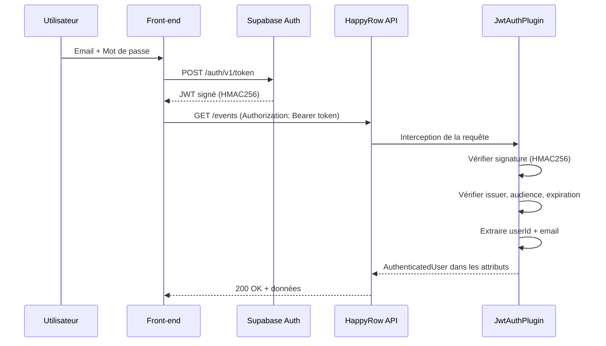

# 9. Éléments de sécurité de l'application

Dans ce chapitre, je présente la stratégie de sécurité que j'ai appliquée à l'ensemble de l'application HappyRow. J'ai suivi une approche de défense en profondeur : chaque couche apporte ses propres protections.

## 9.1 Authentification — JWT Supabase

### Flux d'authentification

Voici le flux d'authentification que j'ai mis en place :



### Mesures que j'ai appliquées

| Mesure | Détail |
|--------|--------|
| Algorithme de signature | HMAC256 — secret partagé entre Supabase et l'API |
| Validation de l'issuer | Vérifié : `{SUPABASE_URL}/auth/v1` |
| Validation de l'audience | Vérifié : `authenticated` |
| Expiration | Vérifiée automatiquement par la librairie Auth0 JWT |
| Stockage du secret | Variable d'environnement `SUPABASE_JWT_SECRET`, jamais dans le code |
| Routes publiques | Seules `/`, `/info` et `/health` sont accessibles sans token |

### Sécurité côté client

| Mesure | Ce que j'ai implémenté |
|--------|----------------|
| Stockage du JWT | Le SDK Supabase gère automatiquement la persistance dans `localStorage` + j'ai ajouté un state React via `AuthProvider` |
| Rafraîchissement | Mon `AuthProvider` vérifie l'expiration au démarrage et appelle `refreshSession()` si nécessaire |
| Injection du token | J'injecte une callback `getToken` dans les providers → header `Authorization: Bearer` sur chaque requête |
| Protection des routes | Rendu conditionnel sur `isAuthenticated` : non authentifié → `WelcomeView`, authentifié → `AppLayout` avec routes |
| Déconnexion | `signOut()` Supabase → listener `onAuthStateChange` met session à `null` → retour automatique au WelcomeView |
| Gestion des erreurs | J'ai mis en place 3 niveaux : Repository (response.ok), Use Case (contexte métier), Provider (rollback optimiste) |
| Secrets front-end | Variables `VITE_SUPABASE_*` injectées via 1Password CLI (dev), Vercel settings (prod), GitHub Secrets (CI) |
| Sécurité supply chain | `lockfile-lint` + `npm ci --ignore-scripts` + audit quotidien + vérification fraîcheur dépendances |

## 9.2 Autorisation

| Règle | Comment je l'ai implémentée |
|-------|----------------|
| Toutes les routes métier nécessitent un JWT valide | Mon `JwtAuthenticationPlugin` intercepte chaque requête |
| Suppression d'événement réservée au créateur | Dans `SqlEventRepository.delete`, je vérifie que `userId == event.creator` |
| Un utilisateur accède uniquement à ses événements | `GetEventsByOrganizerUseCase` filtre par `organizer = authenticatedUser` |
| Les contributions sont liées au participant authentifié | L'email est extrait du JWT côté serveur, pas transmis par le client |

## 9.3 Protection contre les injections SQL

J'utilise systématiquement **Exposed ORM** avec des requêtes paramétrées, ce qui élimine le risque d'injection SQL. Il n'y a aucune requête SQL brute dans le projet.

Voici un exemple concret de requête paramétrée :

```kotlin
ContributionTable
  .selectAll().where {
    (ContributionTable.participantId eq participant.identifier) and
      (ContributionTable.resourceId eq request.resourceId)
  }
```

Exposed traduit cette expression en SQL paramétré (`WHERE participant_id = ? AND resource_id = ?`), ce qui empêche toute injection.

## 9.4 Validation des entrées

J'ai mis en place la validation à trois niveaux :

| Niveau | Mesure |
|--------|--------|
| **Endpoint** | `Either.catch` sur la désérialisation du body, vérification des path parameters (UUID valides) |
| **DTO** | Jackson configuré avec `FAIL_ON_NULL_FOR_PRIMITIVES = true` — rejet des champs obligatoires manquants |
| **Base de données** | Contraintes CHECK (`quantity > 0`), NOT NULL, index uniques |

## 9.5 CORS (Cross-Origin Resource Sharing)

J'ai configuré le CORS pour restreindre les origines autorisées à une liste blanche :

- Origines de développement local (localhost sur les ports 3000, 3001, 4200, 5173, 8080, 8081)
- Domaines de déploiement Vercel et GitHub Pages
- Origines supplémentaires via variable d'environnement `ALLOWED_ORIGINS`

Méthodes autorisées : GET, POST, PUT, DELETE, PATCH, OPTIONS, HEAD.
Headers autorisés : Authorization, Content-Type, Accept, Origin.
Credentials : activés pour le passage des cookies/JWT.

## 9.6 Gestion des erreurs sécurisée

J'ai fait attention à ne jamais exposer d'informations sensibles dans les réponses d'erreur :

| Principe | Ce que j'ai fait |
|----------|------------|
| Pas de stack trace côté client | Les erreurs 500 retournent un message générique `{ "type": "TECHNICAL_ERROR" }` |
| Logs détaillés côté serveur | Ma fonction `logAndRespond()` enregistre l'exception complète avec le logger SLF4J |
| Messages d'erreur typés | Chaque erreur a un `type` machine-readable (`MISSING_TOKEN`, `OPTIMISTIC_LOCK_FAILURE`, `NAME_ALREADY_EXISTS`) |
| Pas de fuite d'information | Les messages d'erreur ne révèlent pas la structure interne (noms de tables, requêtes SQL) |

## 9.7 Sécurité de l'infrastructure

| Mesure | Détail |
|--------|--------|
| **HTTPS** | Forcé par Render en production (certificat TLS automatique) |
| **SSL PostgreSQL** | `DB_SSL_MODE=require` en production |
| **Utilisateur DB restreint** | `happyrow_user` avec droits limités au schéma `configuration` |
| **Docker non-root** | `USER 1000:1000` dans le Dockerfile — le processus ne tourne pas en root |
| **Secrets GitHub** | `RENDER_SERVICE_ID`, `RENDER_API_KEY`, variables Supabase stockées comme secrets GitHub Actions |
| **Analyse statique** | Detekt vérifie l'absence de secrets codés en dur et les patterns à risque |

## 9.8 Intégrité des données

J'ai mis en place plusieurs mécanismes pour protéger la cohérence des données :

| Mécanisme | Protection |
|-----------|-----------|
| **Verrou optimiste** | Empêche les mises à jour concurrentes silencieuses sur les quantités de ressources |
| **Clés étrangères CASCADE** | La suppression d'un événement supprime proprement toutes les données liées |
| **Index uniques composites** | Un participant ne peut contribuer qu'une fois par ressource ; un utilisateur ne peut participer qu'une fois à un événement |
| **Contrainte CHECK** | Les quantités de contribution sont strictement positives |
| **Transactions** | Chaque opération de repository est encapsulée dans une `transaction` Exposed |
