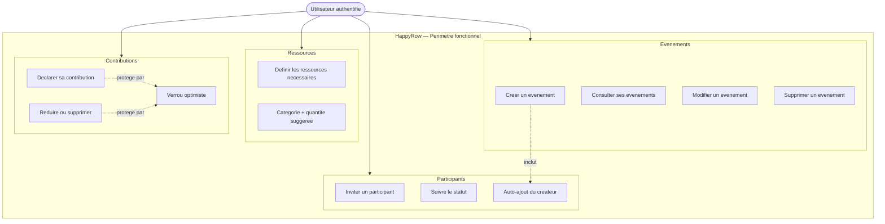

# Slide 6 — Les objectifs fonctionnels (schema)

> **Type** : CREATION — Ce diagramme n'existait pas, il a ete cree pour visualiser les objectifs fonctionnels.

## Diagramme a inserer dans la slide

## Ce qu'il faut dire (notes orales)

Le perimetre fonctionnel de HappyRow s'organise autour de 4 domaines. L'utilisateur authentifie peut :

1. **Evenements** : gerer le cycle de vie complet (CRUD)
2. **Participants** : inviter des personnes et suivre leur statut (le createur est auto-ajoute comme participant confirme)
3. **Ressources** : definir ce qui est necessaire a l'evenement, avec une categorie et une quantite suggeree
4. **Contributions** : declarer ce que chacun apporte, avec un mecanisme de verrou optimiste pour gerer les acces concurrents

Ce schema montre deux regles metier importantes :
- La creation d'un evenement **inclut** automatiquement l'ajout du createur comme participant
- Les operations de contribution sont **protegees** par le verrou optimiste
