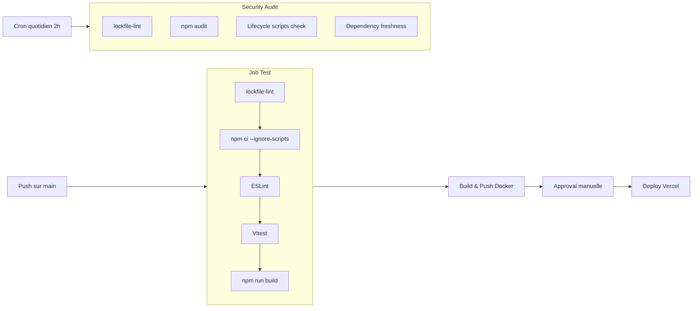

# Slide 14 — Pipeline CI/CD front-end (extrait + explications)

> **Type** : EXISTANT — Extraits de `happyrow-front/.github/workflows/deploy.yml` et `security-audit.yml`

## Extrait 1 : Pipeline principal (`deploy.yml`)

```yaml
name: Deploy to Production

on:
  push:
    branches: [ main, master ]

jobs:
  test:
    runs-on: ubuntu-latest
    steps:
    - name: Security check - Validate lockfile
      run: npx lockfile-lint --path package-lock.json --type npm --allowed-hosts npm --validate-https
    - name: Install dependencies (secure mode)
      run: npm ci --ignore-scripts
    - name: Run linter
      run: npm run lint
    - name: Run tests
      run: npm run test
    - name: Build application
      run: npm run build

  build-and-push:
    needs: test
    steps:
    - name: Build and push Docker image
      uses: docker/build-push-action@v5
      with:
        context: .
        target: production
        push: true

  deploy:
    needs: approval
    steps:
    - name: Deploy to Vercel
      run: vercel --prod --token=${{ secrets.VERCEL_TOKEN }} --yes
```

## Extrait 2 : Workflow Security Audit quotidien (`security-audit.yml`)

```yaml
name: Security Audit

on:
  schedule:
    - cron: '0 2 * * *'    # Tous les jours a 2h UTC

jobs:
  security-audit:
    steps:
    - name: Validate lockfile integrity
      run: npx lockfile-lint --path package-lock.json --type npm --allowed-hosts npm --validate-https
    - name: Run npm audit
      run: npm audit --audit-level=moderate
    - name: Check for lifecycle scripts
      run: node -e "/* Detection de scripts d'installation suspects */"
    - name: Check dependency freshness
      run: node -e "/* Alerte si un package a moins de 7 jours */"
```

## Diagramme du pipeline front-end



## Ce qu'il faut dire (notes orales)

Le front-end dispose de son propre pipeline GitHub Actions avec **4 jobs sequentiels** :

1. **Test** : On verifie d'abord l'integrite du lockfile avec `lockfile-lint`, puis on installe les dependances en mode securise (`npm ci --ignore-scripts` pour empecher l'execution de scripts malveillants). Ensuite ESLint, les tests unitaires Vitest, et enfin le build.

2. **Build and Push Docker** : Si les tests passent, on construit l'image Docker du front-end et on la pousse sur le GitHub Container Registry (ghcr.io).

3. **Approval** : Une etape d'approbation manuelle est requise avant le deploiement en production. C'est un gate de securite humain qui permet de valider visuellement les changements.

4. **Deploy** : Le deploiement final sur Vercel en mode production.

En parallele, un **workflow de securite quotidien** s'execute en cron a 2h du matin : il verifie les vulnerabilites connues avec `npm audit`, detecte les scripts d'installation suspects dans les dependances, et alerte si un package a moins de 7 jours (indicateur de supply chain attack potentiel).
