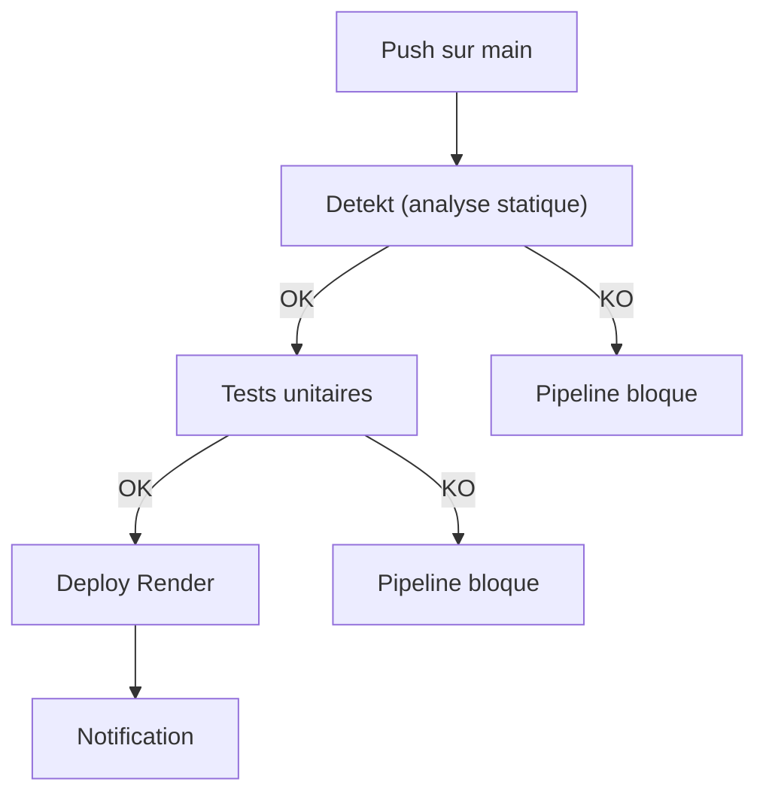

# Slide 15 — Pipeline CI/CD back-end (extrait + explications)

> **Type** : EXISTANT — Extrait de `.github/workflows/deploy-render.yml`

## Extrait du pipeline (`deploy-render.yml`)

```yaml
name: Deploy to Render

on:
  push:
    branches: [ main ]

jobs:
  detekt:
    name: Code Quality Analysis
    runs-on: ubuntu-latest
    steps:
    - name: Set up JDK 21
      uses: actions/setup-java@v4
      with:
        java-version: '21'
        distribution: 'temurin'
    - name: Run Detekt
      run: ./gradlew detekt

  test:
    name: Run Tests
    needs: detekt
    runs-on: ubuntu-latest
    steps:
    - name: Run tests
      run: ./gradlew test -PWithoutIntegrationTests

  deploy:
    name: Deploy to Render
    needs: [test]
    if: github.ref == 'refs/heads/main' && github.event_name == 'push'
    steps:
    - name: Deploy to Render
      uses: johnbeynon/render-deploy-action@v0.0.8
      with:
        service-id: ${{ secrets.RENDER_SERVICE_ID }}
        api-key: ${{ secrets.RENDER_API_KEY }}

  notify:
    name: Notify Deployment Status
    needs: [deploy]
    if: always() && github.ref == 'refs/heads/main'
    steps:
    - name: Notify Success / Failure
      run: echo "Deployment status: ${{ needs.deploy.result }}"
```

## Diagramme du pipeline back-end



## Points cles a mettre en avant

| Element | Detail |
|---------|--------|
| **Declencheur** | Chaque `push` sur la branche `main` |
| **JDK** | Eclipse Temurin 21 |
| **Analyse statique** | Detekt avec baseline et rapports HTML/XML/SARIF |
| **Tests** | Tests unitaires uniquement en CI (`-PWithoutIntegrationTests`) |
| **Deploy** | Render reconstruit l'image Docker multi-stage |
| **Secrets** | `RENDER_SERVICE_ID` et `RENDER_API_KEY` dans GitHub Secrets |
| **Notification** | Succes ou echec, toujours executee |

## Ce qu'il faut dire (notes orales)

Le pipeline back-end est **lineaire et sequentiel** avec 4 jobs :

1. **Detekt** : L'analyse statique est la premiere barriere. Elle detecte les code smells, les problemes de complexite et les violations de conventions. Si Detekt echoue, le pipeline est bloque — aucun test n'est execute, aucun deploiement n'a lieu.

2. **Tests** : Les tests unitaires avec Kotest et MockK. J'ai exclu les tests d'integration Testcontainers en CI (`-PWithoutIntegrationTests`) pour des raisons de performance — ils sont executes localement avant chaque mise en production.

3. **Deploy** : Si les deux premieres etapes passent, le pipeline notifie Render via son API. Render reconstruit l'image Docker multi-stage et redeploie le service automatiquement.

4. **Notify** : Une etape de notification qui s'execute toujours (meme en cas d'echec) pour signaler le resultat du deploiement.

Les secrets (service ID et API key Render) sont geres dans GitHub Secrets, jamais dans le code source.
