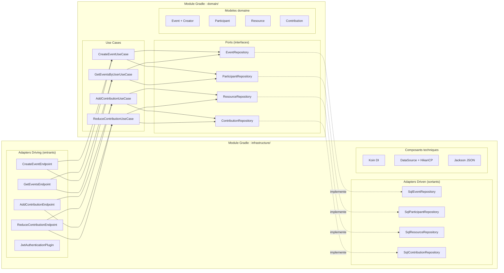
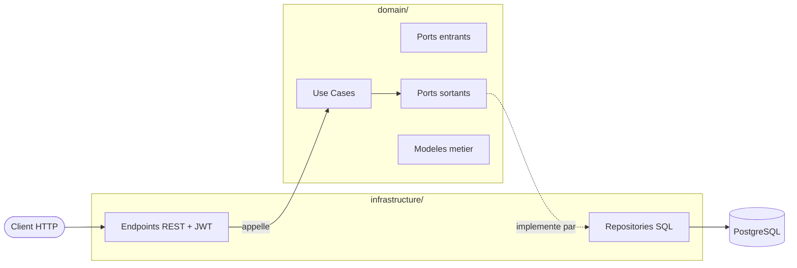

# Slide 17 — Architecture hexagonale (schema enrichi)

> **Type** : EXISTANT (diagram_1.mmd) + AMELIORATION — Schema enrichi pour mieux montrer les modules Gradle et le principe d'inversion de dependance.

## Diagramme enrichi

## Schema simplifie (alternative pour la slide)

## Points cles pour la slide

- **Deux modules Gradle independants** : `domain/` n'a aucune dependance vers `infrastructure/`
- **Inversion de dependance** : le domaine definit les interfaces (ports), l'infrastructure les implemente
- **Driving adapters** (entrants) : les endpoints REST qui recoivent les requetes
- **Driven adapters** (sortants) : les repositories SQL qui persistent les donnees
- **Koin** assemble le tout au demarrage (injection de dependances)

## Ce qu'il faut dire (notes orales)

L'architecture hexagonale est le fil conducteur du projet. J'ai materialise cette architecture avec deux modules Gradle physiquement separes.

Le module `domain` contient tout le coeur metier : les use cases, les modeles et les interfaces de repository — qu'on appelle les ports. Ce module n'a **aucune dependance technique** — ni Ktor, ni Exposed, ni Jackson. Il ne connait que Kotlin stdlib et Arrow.

Le module `infrastructure` contient les adapters. Cote entrant, les endpoints REST recoivent les requetes HTTP et appellent les use cases. Cote sortant, les repositories SQL implementent les interfaces definies dans le domaine.

Le principe fondamental, c'est l'**inversion de dependance** : la fleche de dependance va toujours de l'infrastructure vers le domaine, jamais l'inverse. Si demain je change d'ORM ou de framework web, seul le module infrastructure est impacte — le domaine reste intact.
