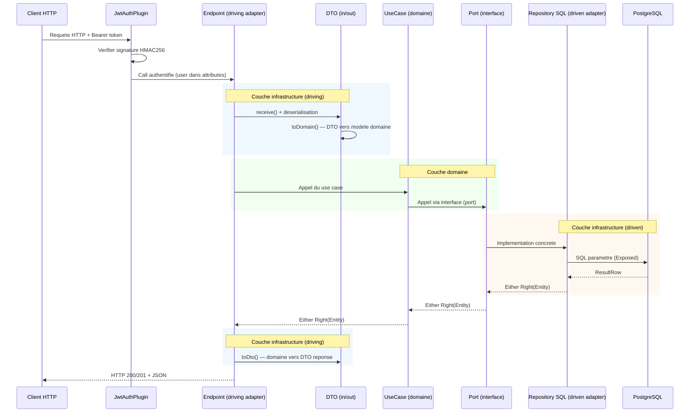
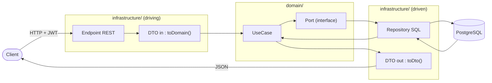

# Slide 19 — Flux d'une requete dans l'application (schema)

> **Type** : CREATION — Ce diagramme de sequence a ete cree pour visualiser le parcours complet d'une requete a travers les couches.

## Diagramme de sequence

## Schema simplifie (alternatif, pour tenir sur une slide)

## Ce qu'il faut dire (notes orales)

Ce schema montre le parcours complet d'une requete a travers les differentes couches de l'application.

1. **Entree** : Le client envoie une requete HTTP avec un token JWT. Le `JwtAuthenticationPlugin` verifie la signature HMAC256 et extrait l'identite de l'utilisateur.

2. **Couche driving (infrastructure)** : L'endpoint Ktor recoit la requete, la deserialise avec Jackson, et la convertit en objet domaine via `toDomain()`. C'est la frontiere entre le monde HTTP et le monde metier.

3. **Couche domaine** : Le use case applique la regle metier et dialogue avec les repositories via des interfaces abstraites (les ports). Le domaine ne sait pas comment les donnees sont stockees.

4. **Couche driven (infrastructure)** : Le repository SQL implemente le port et execute les requetes parametrees via Exposed. Les donnees sont lues depuis PostgreSQL et reconstruites en entites domaine.

5. **Retour** : L'entite domaine remonte a travers les couches, est convertie en DTO de reponse via `toDto()`, puis envoyee au client en JSON.

Le point cle : a chaque frontiere de couche, les objets sont **convertis** (DTO in/out vs entites domaine), ce qui maintient une separation nette et permet de faire evoluer chaque couche independamment.
