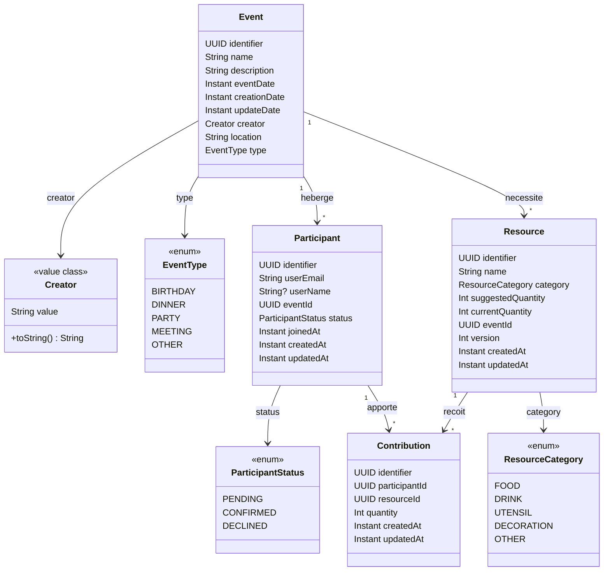

# Slide 27 — Modeles domaine (diagramme de classes)

> **Type** : CREATION — Diagramme de classes cree a partir des data classes reelles du module `domain/`.

## Diagramme de classes



## Extraits de code correspondants

### Event.kt
```kotlin
data class Event(
  val identifier: UUID,
  val name: String,
  val description: String,
  val eventDate: Instant,
  val creationDate: Instant,
  val updateDate: Instant,
  val creator: Creator,
  val location: String,
  val type: EventType,
)
```

### Creator.kt
```kotlin
@JvmInline
value class Creator(private val value: String) {
  override fun toString(): String = value
}
```

### Resource.kt (avec `version` pour le verrou optimiste)
```kotlin
data class Resource(
  val identifier: UUID,
  val name: String,
  val category: ResourceCategory,
  val suggestedQuantity: Int,
  val currentQuantity: Int,
  val eventId: UUID,
  val version: Int,          // <-- Semantique du verrou optimiste
  val createdAt: Instant,
  val updatedAt: Instant,
)
```

## Points cles a mettre en avant

| Modele | Particularite |
|--------|---------------|
| **Event** | Entite racine, porte le `Creator` comme value class |
| **Creator** | `@JvmInline value class` — typage fort sans cout memoire |
| **Participant** | Relie un utilisateur a un evenement, avec un statut |
| **Resource** | Porte un `version` pour le verrou optimiste |
| **Contribution** | Table de liaison Participant x Resource, avec une quantite |

## Ce qu'il faut dire (notes orales)

Les modeles du domaine sont des `data class` Kotlin pures — aucune annotation framework, pas de `@Entity`, pas de `@Column`. Le domaine est completement isole de l'infrastructure.

Quatre points a retenir :

1. **Creator** est un `@JvmInline value class`. C'est un typage fort qui encapsule un String sans cout memoire a l'execution — le compilateur l'inline. Ca empeche de confondre un email avec un nom ou un identifiant.

2. **Resource** porte un champ `version` qui materialise le verrou optimiste directement dans le modele domaine. Ce n'est pas un detail technique cache dans l'infrastructure — c'est un concept metier explicite.

3. **Contribution** est la table de liaison entre Participant et Resource, avec une quantite. C'est l'entite au coeur de la fonctionnalite principale du projet.

4. Aucune de ces classes ne depend d'un framework. Si on change d'ORM ou de framework web, ces modeles restent inchanges.
