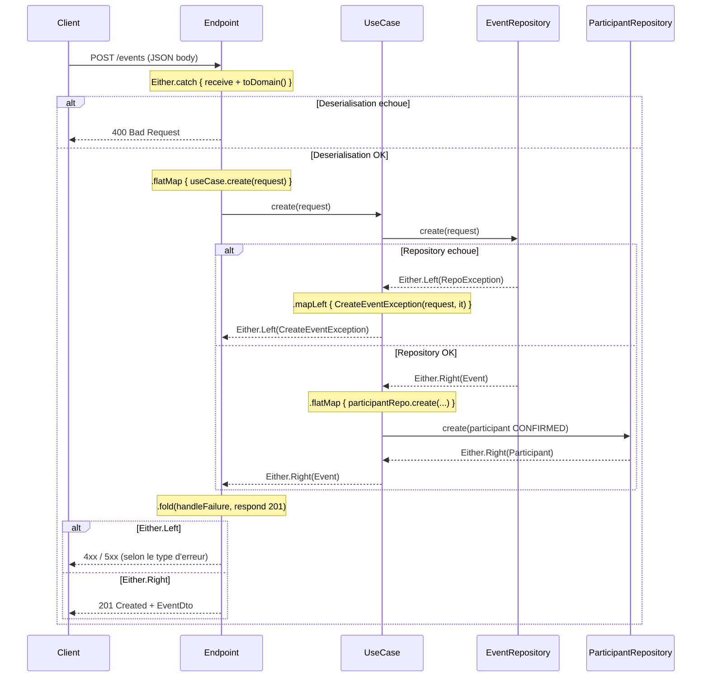
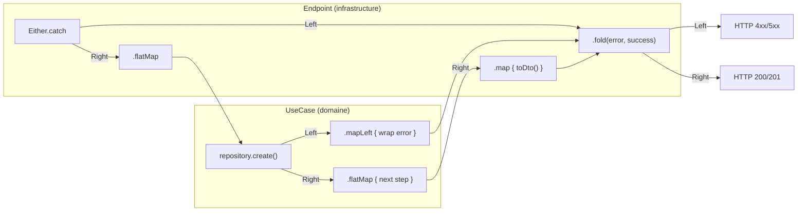

# Slide 28 — Gestion d'erreurs Arrow Either (diagramme de sequence + explications)

> **Type** : CREATION — Diagramme illustrant le pattern Either a travers les couches, base sur le code reel du projet.

## Diagramme de sequence : flux Either dans CreateEventEndpoint



## Schema simplifie du pattern Either



## Les 4 operateurs cles d'Arrow Either

| Operateur | Role | Exemple dans le projet |
|-----------|------|----------------------|
| **`Either.catch`** | Capture les exceptions et les transforme en `Either.Left` | `Either.catch { call.receive<Dto>() }` — capture les erreurs Jackson |
| **`flatMap`** | Chaine une operation qui depend du resultat precedent. N'execute le bloc que si c'est un `Right` | `.flatMap { request -> useCase.create(request) }` — n'appelle le use case que si le parsing a reussi |
| **`mapLeft`** | Transforme l'erreur (Left) pour ajouter du contexte, sans toucher au succes (Right) | `.mapLeft { CreateEventException(request, it) }` — enveloppe l'erreur repository |
| **`fold`** | Resout le resultat final en separant le chemin d'erreur du chemin de succes | `.fold({ handleFailure(call) }, { call.respond(201, it) })` |

## Extrait de code reel : CreateEventEndpoint

```kotlin
post {
    Either.catch {
      val user = call.authenticatedUser()
      val requestDto = call.receive<CreateEventRequestDto>()
      requestDto.toDomain(user.email)
    }
      .mapLeft { BadRequestException.InvalidBodyException(it) }
      .flatMap { request -> createEventUseCase.create(request) }
      .map { it.toDto() }
      .fold(
        { it.handleFailure(call) },
        { call.respond(HttpStatusCode.Created, it) },
      )
  }
```

## Extrait de code reel : CreateEventUseCase

```kotlin
fun create(request: CreateEventRequest): Either<CreateEventException, Event> =
    eventRepository.create(request)
      .mapLeft { CreateEventException(request, it) }
      .flatMap { event ->
        participantRepository.create(
          CreateParticipantRequest(
            userEmail = request.creator.toString(),
            eventId = event.identifier,
            status = ParticipantStatus.CONFIRMED,
          ),
        )
          .map { event }
          .mapLeft { CreateEventException(request, it) }
      }
```

## Ce qu'il faut dire (notes orales)

Le pattern de gestion d'erreurs repose sur Arrow Either. Chaque operation retourne un `Either<Error, Success>` — le type de retour est **explicite**, on voit dans la signature que l'operation peut echouer.

La composition se fait avec 4 operateurs :

1. **`Either.catch`** capture les exceptions (par exemple une erreur Jackson de deserialisation) et les transforme en `Either.Left`. C'est le point d'entree dans le flux fonctionnel.

2. **`flatMap`** chaine les operations qui dependent du resultat precedent. Si le parsing echoue, le use case n'est **jamais appele** — le `Left` se propage automatiquement.

3. **`mapLeft`** enveloppe les erreurs avec du contexte supplementaire. Chaque couche enrichit l'erreur de la couche inferieure — on peut tracer la cause racine a tout moment.

4. **`fold`** resout le resultat final : chemin d'erreur a gauche, chemin de succes a droite.

Les avantages par rapport aux exceptions classiques : c'est **composable**, il n'y a **pas de cout de stack trace**, et la **tracabilite** est meilleure car chaque couche enveloppe les erreurs de la couche inferieure.
