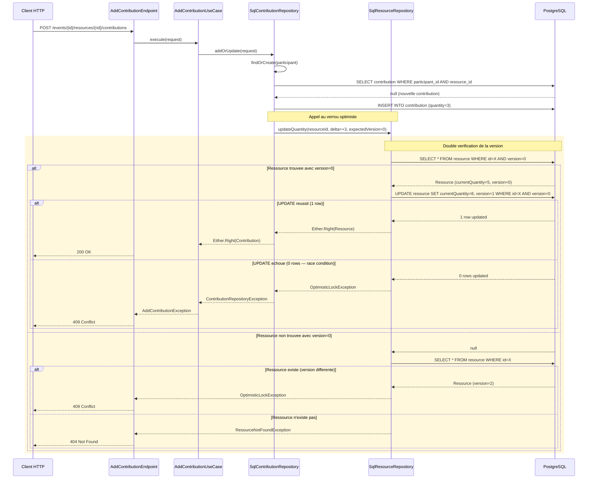
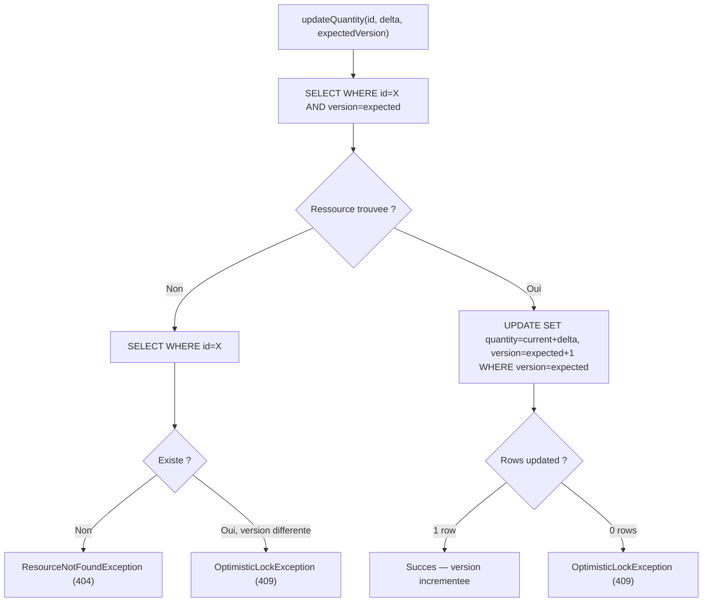

# Slide 29 — Verrou optimiste SqlResourceRepository (diag de sequence + code)

> **Type** : EXISTANT (diagram_6.mmd) + ENRICHISSEMENT avec le code reel de `SqlResourceRepository.kt`

## Diagramme de sequence enrichi



## Extrait de code : methode `updateQuantity` (SqlResourceRepository.kt)

```kotlin
override fun updateQuantity(
    resourceId: UUID,
    quantityDelta: Int,
    expectedVersion: Int,
  ): Either<GetResourceRepositoryException, Resource> {
    return Either.catch {
      transaction(exposedDatabase.database) {
        // Etape 1 : lire la ressource avec la version attendue
        val currentResource = ResourceTable
          .selectAll().where {
            (ResourceTable.id eq resourceId) and (ResourceTable.version eq expectedVersion)
          }
          .singleOrNull()

        if (currentResource == null) {
          // Distinguer : ressource inexistante vs version modifiee
          val existsWithDifferentVersion = ResourceTable
            .selectAll().where { ResourceTable.id eq resourceId }
            .singleOrNull()

          if (existsWithDifferentVersion == null) {
            throw ResourceNotFoundException(resourceId)
          } else {
            throw OptimisticLockException(resourceId, expectedVersion)
          }
        }

        val currentQuantity = currentResource[ResourceTable.currentQuantity]
        val newQuantity = currentQuantity + quantityDelta

        // Etape 2 : UPDATE conditionnel sur la version
        val updatedRows = ResourceTable.update({
          (ResourceTable.id eq resourceId) and (ResourceTable.version eq expectedVersion)
        }) {
          it[ResourceTable.currentQuantity] = newQuantity
          it[ResourceTable.version] = expectedVersion + 1
          it[ResourceTable.updatedAt] = clock.instant()
        }

        if (updatedRows == 0) {
          throw OptimisticLockException(resourceId, expectedVersion)
        }

        resourceId
      }
    }
    // ... mapLeft pour wrapper l'erreur
  }
```

**Source** : `infrastructure/src/main/kotlin/.../resource/common/driven/SqlResourceRepository.kt`

## Extrait de code : OptimisticLockException (domaine)

```kotlin
class OptimisticLockException(
  val resourceId: UUID,
  val expectedVersion: Int,
) : Exception(
  "Optimistic lock failure for resource $resourceId with version $expectedVersion. " +
    "Resource was modified by another user.",
)
```

**Source** : `domain/src/main/kotlin/.../resource/common/error/OptimisticLockException.kt`

## Schema du mecanisme en 2 etapes



## Ce qu'il faut dire (notes orales)

C'est l'extrait de code le plus significatif du projet. La methode `updateQuantity` implemente le verrou optimiste en **deux etapes de defense en profondeur** :

**Etape 1 — Lecture conditionnelle** : On lit la ressource avec une clause `WHERE version = expectedVersion`. Si aucune ligne n'est retournee, on distingue deux cas : la ressource n'existe pas du tout (404), ou elle existe mais avec une version differente (409 Conflict — quelqu'un d'autre l'a modifiee entre-temps).

**Etape 2 — UPDATE conditionnel** : On execute l'UPDATE avec la meme clause sur la version. Si entre la lecture et l'ecriture un autre thread a modifie la ressource, l'UPDATE retourne zero lignes et une `OptimisticLockException` est levee.

Cette double verification est une **defense en profondeur** contre les race conditions. Le delta de quantite (plutot qu'une valeur absolue) permet des mises a jour concurrentes valides si elles ne concernent pas la meme version.

Le choix du verrou optimiste plutot que pessimiste est justifie par le contexte : les conflits sont **rares** (peu de personnes contribuent simultanement sur la meme ressource), et on ne veut pas bloquer les transactions des autres utilisateurs.
