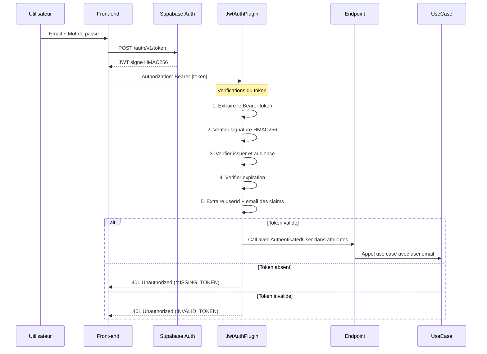

# Slide 33 — Authentification JWT (explications detaillees + exemples)

> **Type** : EXISTANT — Code reel de `JwtAuthenticationPlugin.kt` et `SupabaseJwtService.kt`

## Diagramme de sequence (existant : diagram_7.mmd)



## Extrait 1 : JwtAuthenticationPlugin.kt (le plugin Ktor)

```kotlin
val JwtAuthenticationPlugin = createApplicationPlugin(
  name = "JwtAuthenticationPlugin",
  createConfiguration = ::JwtAuthConfig,
) {
  val jwtService = pluginConfig.jwtService

  onCall { call ->
    // Routes OPTIONS (CORS pre-flight) et routes publiques exclues
    if (call.request.local.method == HttpMethod.Options
        || call.request.local.uri in PUBLIC_PATHS) {
      return@onCall
    }

    val token = extractBearerToken(call)

    if (token == null) {
      call.respond(HttpStatusCode.Unauthorized, mapOf(
        "type" to "MISSING_TOKEN",
        "message" to "Authorization header with Bearer token is required",
      ))
      return@onCall
    }

    jwtService.validateToken(token).fold(
      ifLeft = { exception ->
        call.respond(HttpStatusCode.Unauthorized, mapOf(
          "type" to "INVALID_TOKEN",
          "message" to exception.message,
        ))
      },
      ifRight = { user ->
        call.attributes.put(SupabaseAuthKey, user)
      },
    )
  }
}
```

**Source** : `infrastructure/src/main/kotlin/.../technical/auth/JwtAuthenticationPlugin.kt`

## Extrait 2 : SupabaseJwtService.kt (la verification)

```kotlin
class SupabaseJwtService(
  private val config: SupabaseJwtConfig,
) {
  private val algorithm = Algorithm.HMAC256(config.jwtSecret)

  fun validateToken(token: String): Either<Throwable, AuthenticatedUser> {
    return Either.catch {
      val verifier = JWT.require(algorithm)
        .withIssuer(config.issuer)
        .withAudience(config.audience)
        .build()

      val verifiedJwt = verifier.verify(token)
      extractUser(verifiedJwt)
    }
  }

  private fun extractUser(jwt: DecodedJWT): AuthenticatedUser {
    val userId = jwt.subject
      ?: throw JWTVerificationException("Token missing 'sub' claim")
    val email = jwt.getClaim("email").asString()
      ?: throw JWTVerificationException("Token missing 'email' claim")

    return AuthenticatedUser(userId = userId, email = email)
  }
}
```

**Source** : `infrastructure/src/main/kotlin/.../technical/auth/SupabaseJwtService.kt`

## Extrait 3 : Recuperation de l'utilisateur dans un endpoint

```kotlin
// Dans n'importe quel endpoint :
val user = call.authenticatedUser()
// user.email  → l'email extrait du JWT (claim "email")
// user.userId → le subject du JWT (claim "sub")
```

## Points cles de securite

| Aspect | Implementation |
|--------|---------------|
| **Algorithme** | HMAC256 (symetrique, secret partage avec Supabase) |
| **Verifications** | Signature + Issuer + Audience + Expiration |
| **Claims extraits** | `sub` (userId) et `email` |
| **Secret JWT** | Variable d'environnement, jamais dans le code |
| **Routes publiques** | Seules `/` et `/info` sont exclues |
| **CORS pre-flight** | Les requetes OPTIONS sont passees sans verification |
| **Erreur token absent** | 401 avec type `MISSING_TOKEN` |
| **Erreur token invalide** | 401 avec type `INVALID_TOKEN` |

## Pourquoi un plugin personnalise plutot que le module auth Ktor ?

- **Controle total** sur le flux : on decide exactement quoi verifier et quoi retourner
- **Routes publiques** gerees par une simple liste, sans configuration complexe
- **Messages d'erreur types** : on distingue `MISSING_TOKEN` de `INVALID_TOKEN` pour aider le debug cote client
- **Integration avec Arrow Either** : `validateToken` retourne un `Either` et non une exception

## Ce qu'il faut dire (notes orales)

L'authentification utilise un **plugin Ktor personnalise** plutot que le module auth standard. Ca donne un controle total sur le flux.

Le plugin intercepte **chaque requete**. Les routes OPTIONS (pre-vol CORS) et les routes publiques (`/`, `/info`) sont exclues. Pour toutes les autres routes :

1. Si le header `Authorization: Bearer` est **absent** → 401 avec `MISSING_TOKEN`
2. Si le token est present, le `SupabaseJwtService` verifie :
   - La **signature HMAC256** (avec le secret partage avec Supabase)
   - L'**issuer** et l'**audience** du token
   - L'**expiration**
3. Si tout est valide, on extrait le `userId` et l'`email` des claims, et on stocke un objet `AuthenticatedUser` dans les attributs du call
4. Si la verification echoue → 401 avec `INVALID_TOKEN`

Le point important : le **secret JWT n'est jamais dans le code**. Il est charge depuis une variable d'environnement. Et Detekt verifie l'absence de secrets dans le code source.
