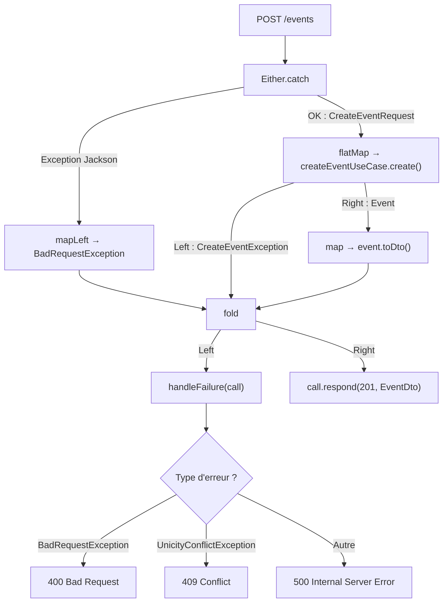

# Slide 34 — CreateEventEndpoint (explications detaillees)

> **Type** : EXISTANT — Code reel de `CreateEventEndpoint.kt`

## Extrait de code complet : CreateEventEndpoint.kt

```kotlin
fun Route.createEventEndpoint(createEventUseCase: CreateEventUseCase) = route("") {
  post {
    Either.catch {                                          // 1. Capturer les erreurs
      val user = call.authenticatedUser()                   //    Recuperer l'utilisateur du JWT
      val requestDto = call.receive<CreateEventRequestDto>()//    Deserialiser le body JSON
      requestDto.toDomain(user.email)                       //    Convertir DTO → domaine
    }
      .mapLeft { BadRequestException.InvalidBodyException(it) } // 2. Wrapper en erreur typee
      .flatMap { request -> createEventUseCase.create(request) }// 3. Appeler le use case
      .map { it.toDto() }                                       // 4. Convertir domaine → DTO
      .fold(                                                    // 5. Resoudre le resultat
        { it.handleFailure(call) },                             //    Chemin erreur
        { call.respond(HttpStatusCode.Created, it) },           //    Chemin succes → 201
      )
  }
}
```

**Source** : `infrastructure/src/main/kotlin/.../event/create/driving/CreateEventEndpoint.kt`

## Extrait de code : gestion d'erreurs en cascade

```kotlin
private suspend fun Exception.handleFailure(call: ApplicationCall) = when (this) {
  is BadRequestException -> call.logAndRespond(
    status = HttpStatusCode.BadRequest,        // 400
    responseMessage = ClientErrorMessage.of(type = type, detail = message),
    failure = this,
  )
  is CreateEventException -> this.handleFailure(call)
  else -> call.logAndRespond(
    status = HttpStatusCode.InternalServerError, // 500
    responseMessage = technicalErrorMessage(),
    failure = this,
  )
}

private suspend fun CreateEventException.handleFailure(call: ApplicationCall) = when (cause) {
  is CreateEventRepositoryException -> (cause as CreateEventRepositoryException).handleFailure(call)
  else -> call.logAndRespond(
    status = HttpStatusCode.InternalServerError,
    responseMessage = technicalErrorMessage(),
    failure = this,
  )
}

private suspend fun CreateEventRepositoryException.handleFailure(call: ApplicationCall) = when (cause) {
  is UnicityConflictException -> call.logAndRespond(
    status = HttpStatusCode.Conflict,           // 409
    responseMessage = ClientErrorMessage.of(
      type = NAME_ALREADY_EXISTS_ERROR_TYPE,
      detail = request.name,
    ),
    failure = this,
  )
  else -> call.logAndRespond(
    status = HttpStatusCode.InternalServerError,
    responseMessage = technicalErrorMessage(),
    failure = this,
  )
}
```

## Diagramme du flux Either dans cet endpoint



## Les 5 etapes du pattern endpoint

| Etape | Code | Role |
|-------|------|------|
| **1. Capture** | `Either.catch { receive + toDomain() }` | Deserialiser le JSON et convertir en objet domaine. Si Jackson echoue, l'exception est capturee. |
| **2. Wrapper** | `.mapLeft { BadRequestException(...) }` | Transformer l'erreur brute en erreur typee avec un code HTTP semantique. |
| **3. Delegation** | `.flatMap { useCase.create(request) }` | Appeler le use case **seulement si** la deserialisation a reussi. Sinon, le Left se propage. |
| **4. Conversion** | `.map { it.toDto() }` | Convertir l'entite domaine en DTO de reponse (monde HTTP). |
| **5. Resolution** | `.fold(error, success)` | Resoudre le resultat : erreur a gauche (HTTP 4xx/5xx), succes a droite (HTTP 201). |

## Ce qu'il faut dire (notes orales)

Cet endpoint est un **exemple typique de driving adapter**. Il illustre le pattern applique aux 15 endpoints de l'application.

Le flux se lit de haut en bas :

1. **`Either.catch`** capture tout ce qui peut echouer dans la phase de reception : la recuperation de l'utilisateur authentifie, la deserialisation Jackson du body JSON, et la conversion DTO vers objet domaine via `toDomain()`.

2. **`.mapLeft`** transforme l'erreur en `BadRequestException` si la deserialisation echoue. On ne veut pas envoyer une stack trace Jackson au client.

3. **`.flatMap`** appelle le use case — mais **seulement si** l'etape precedente a reussi. Si c'est un `Left`, le use case n'est jamais appele. C'est l'avantage principal de la composition fonctionnelle.

4. **`.map { toDto() }`** convertit l'entite domaine en DTO de reponse. Ca maintient la frontiere entre monde HTTP et monde metier.

5. **`.fold`** separe clairement le chemin d'erreur (handleFailure → HTTP 400/409/500) du chemin de succes (respond 201 Created).

La gestion d'erreur est **en cascade** : on deroule la cause racine pour choisir le bon code HTTP. Un conflit de nom d'evenement remonte comme 409, une erreur technique comme 500, et une requete mal formee comme 400.
