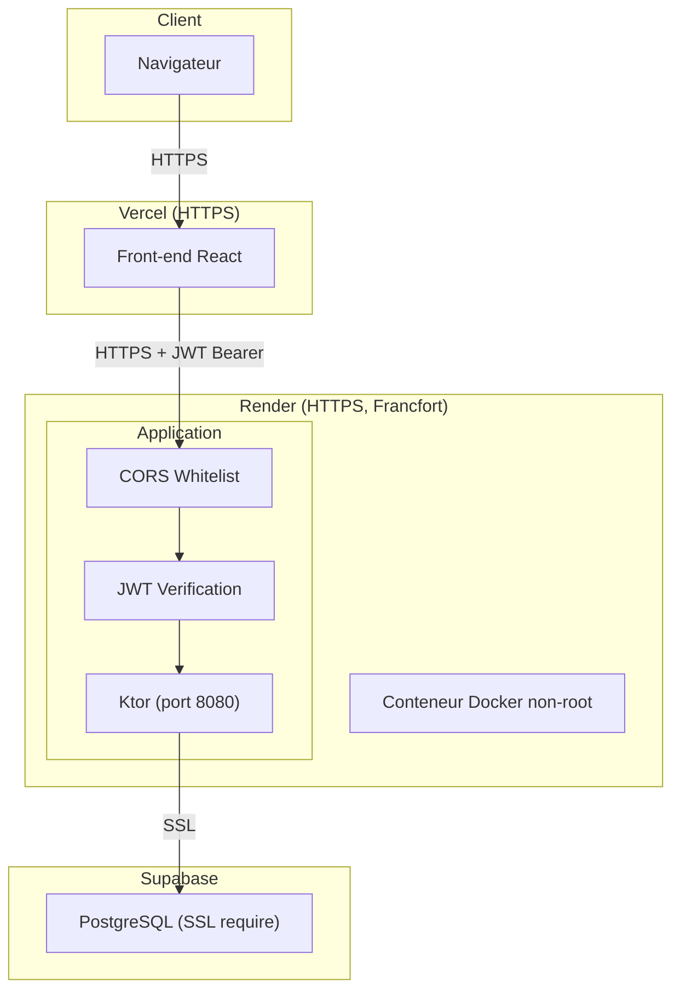

# Slide 38 — Securite infrastructure (explications + exemples concrets)

> **Type** : EXISTANT — Extraits reels du Dockerfile, de la config CORS, de application.conf et du code

## 1. Docker : conteneur non-root et image minimale

### Extrait du Dockerfile

```dockerfile
# Build stage : image complete avec Gradle + JDK
FROM gradle:8-jdk21 AS build
WORKDIR /app
COPY . .
RUN ./gradlew clean build --no-daemon -x test -x testFixturesClasses

# Runtime stage : image minimale avec JRE uniquement
FROM eclipse-temurin:21-jre-jammy

USER 1000:1000          # Utilisateur non-root

WORKDIR /app
COPY --from=build /app/build/libs/*.jar happyrow-core.jar
COPY --from=build /app/src/main/resources/application.conf /app/application.conf

EXPOSE 8080

ENTRYPOINT ["java"]
CMD ["-Xmx512m", "-Xms256m", "-XX:+UseG1GC", "-XX:MaxGCPauseMillis=200",
     "-Djava.security.egd=file:/dev/./urandom", "-jar", "happyrow-core.jar"]
```

**Source** : `Dockerfile`

### Points de securite Docker

| Mesure | Detail |
|--------|--------|
| **Multi-stage build** | Le SDK Gradle et les sources ne sont PAS dans l'image de production |
| **USER 1000:1000** | Le conteneur tourne en utilisateur non-root — pas d'acces root |
| **Image JRE-only** | `eclipse-temurin:21-jre-jammy` — pas de JDK, pas de compilateur |
| **JVM tunee** | `-Xmx512m -Xms256m` — memoire dimensionnee au besoin reel |
| **G1GC** | Garbage collector adapte aux charges web |
| **urandom** | Source d'entropie rapide pour la generation aleatoire |

---

## 2. CORS en liste blanche

### Extrait de Application.kt

```kotlin
private fun Application.configureCors() {
  install(CORS) {
    // Origines locales de developpement
    allowHost("localhost:3000")
    allowHost("localhost:5173")
    // ...

    // Origines de production (Vercel + GitHub Pages)
    allowHost("jimni6.github.io")
    allowHost("happyrow-front.vercel.app")
    allowHost("happyrow-front-git-main-jimni6s-projects.vercel.app")

    // Origines dynamiques via variable d'environnement
    val allowedOrigins = System.getenv("ALLOWED_ORIGINS") ?: ""
    if (allowedOrigins.isNotEmpty()) {
      allowedOrigins.split(",").forEach { origin ->
        val host = origin.trim().removePrefix("https://").removePrefix("http://")
        allowHost(host, schemes = listOf("http", "https"))
      }
    }

    // Methodes autorisees
    allowMethod(HttpMethod.Get)
    allowMethod(HttpMethod.Post)
    allowMethod(HttpMethod.Put)
    allowMethod(HttpMethod.Delete)

    // Headers autorises
    allowHeader(HttpHeaders.Authorization)
    allowHeader(HttpHeaders.ContentType)

    allowCredentials = true
  }
}
```

**Source** : `src/main/kotlin/com/happyrow/core/Application.kt`

### Points de securite CORS

| Mesure | Detail |
|--------|--------|
| **Liste blanche explicite** | Pas de wildcard `*` — chaque origine est declaree |
| **Origines dynamiques** | `ALLOWED_ORIGINS` en variable d'environnement pour la flexibilite |
| **Headers restreints** | Seuls `Authorization`, `ContentType`, `Accept`, `Origin` sont autorises |
| **Credentials** | `allowCredentials = true` pour le transport du JWT |

---

## 3. SSL PostgreSQL en production

### Extrait de application.conf

```hocon
database {
    url = ${?DATABASE_URL}
    username = ${?DB_USERNAME}
    password = ${?DB_PASSWORD}
    maxPoolSize = ${?DB_MAX_POOL_SIZE}
    sslMode = ${?DB_SSL_MODE}     # "require" en production
}
```

**Source** : `src/main/resources/application.conf`

### Points de securite base de donnees

| Mesure | Detail |
|--------|--------|
| **SSL require** | Connexion chiffree entre l'application et PostgreSQL |
| **Variables d'env** | URL, username, password — jamais dans le code |
| **HikariCP** | Pool de connexions avec timeout et limites configurables |
| **Supabase** | Base geree avec SSL, backups et restrictions d'acces |

---

## 4. HTTPS force par Render

| Mesure | Detail |
|--------|--------|
| **Certificat TLS** | Automatique, gere par Render |
| **Redirection HTTP→HTTPS** | Automatique, geree par Render |
| **Domaine** | `happyrow-core.onrender.com` avec HTTPS |

---

## 5. Secrets geres hors du code

### Ou sont les secrets ?

| Secret | Stockage | Utilisation |
|--------|----------|-------------|
| **JWT_SECRET** | Variable d'env Render | Verification signature HMAC256 |
| **DATABASE_URL** | Variable d'env Render | Connexion PostgreSQL |
| **DB_USERNAME / DB_PASSWORD** | Variable d'env Render | Auth base de donnees |
| **RENDER_SERVICE_ID** | GitHub Secrets | Deploiement CI/CD |
| **RENDER_API_KEY** | GitHub Secrets | Deploiement CI/CD |
| **VERCEL_TOKEN** | GitHub Secrets | Deploiement front-end |
| **ALLOWED_ORIGINS** | Variable d'env Render | Configuration CORS |

### Verification Detekt

Detekt est configure pour detecter les secrets dans le code source. La regle `MaxLineLength` et l'analyse des patterns de secrets empechent l'introduction accidentelle de tokens ou mots de passe dans le code.

---

## Schema recapitulatif



## Ce qu'il faut dire (notes orales)

La securite infrastructure repose sur **5 mesures concretes** :

1. **Docker non-root** : L'image de production est construite en multi-stage. Le SDK et les sources restent dans le build stage. Le conteneur de production contient uniquement le JRE et le JAR, et tourne avec `USER 1000:1000` — pas d'acces root. La JVM est dimensionnee au besoin reel avec 512 Mo max.

2. **CORS en liste blanche** : Pas de wildcard `*`. Chaque origine est declaree explicitement — les URLs locales pour le developpement, et les URLs Vercel/GitHub Pages pour la production. Une variable d'environnement `ALLOWED_ORIGINS` permet d'ajouter des origines dynamiquement sans toucher au code.

3. **SSL PostgreSQL** : La connexion a la base de donnees utilise SSL en mode `require` en production. L'URL, le username et le password sont en variables d'environnement, jamais dans le code.

4. **HTTPS** : Render fournit automatiquement un certificat TLS et redirige tout le trafic HTTP vers HTTPS.

5. **Secrets hors du code** : Tous les secrets (JWT secret, credentials BDD, API keys) sont stockes dans les variables d'environnement de Render ou dans GitHub Secrets pour la CI/CD. Detekt verifie l'absence de secrets dans le code source.
