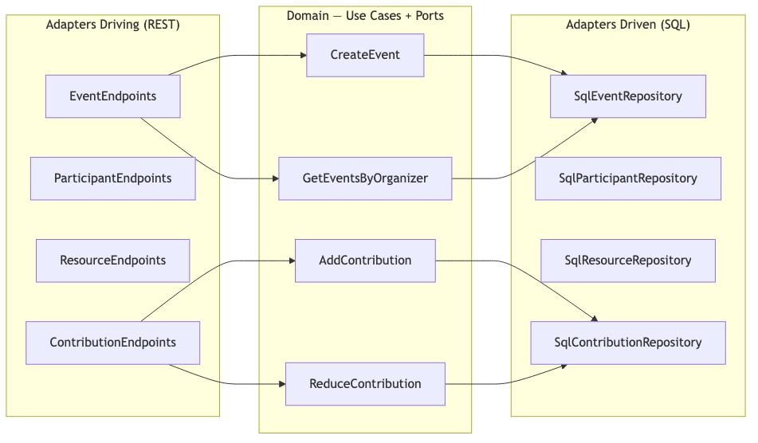
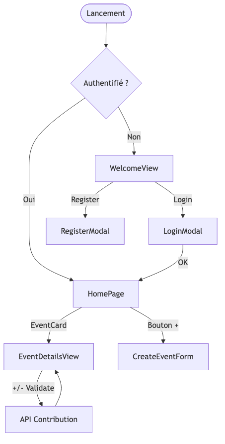
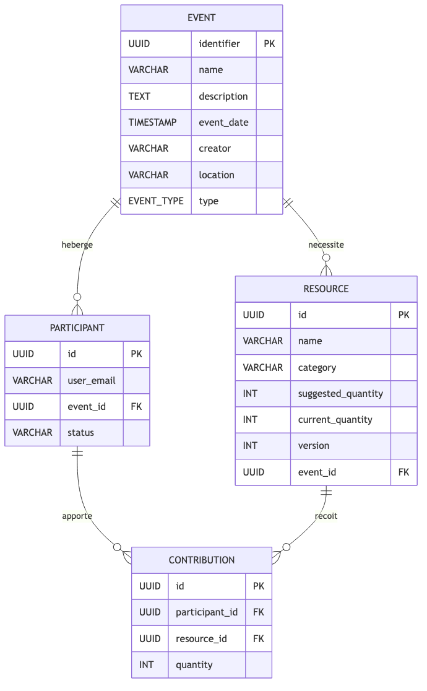
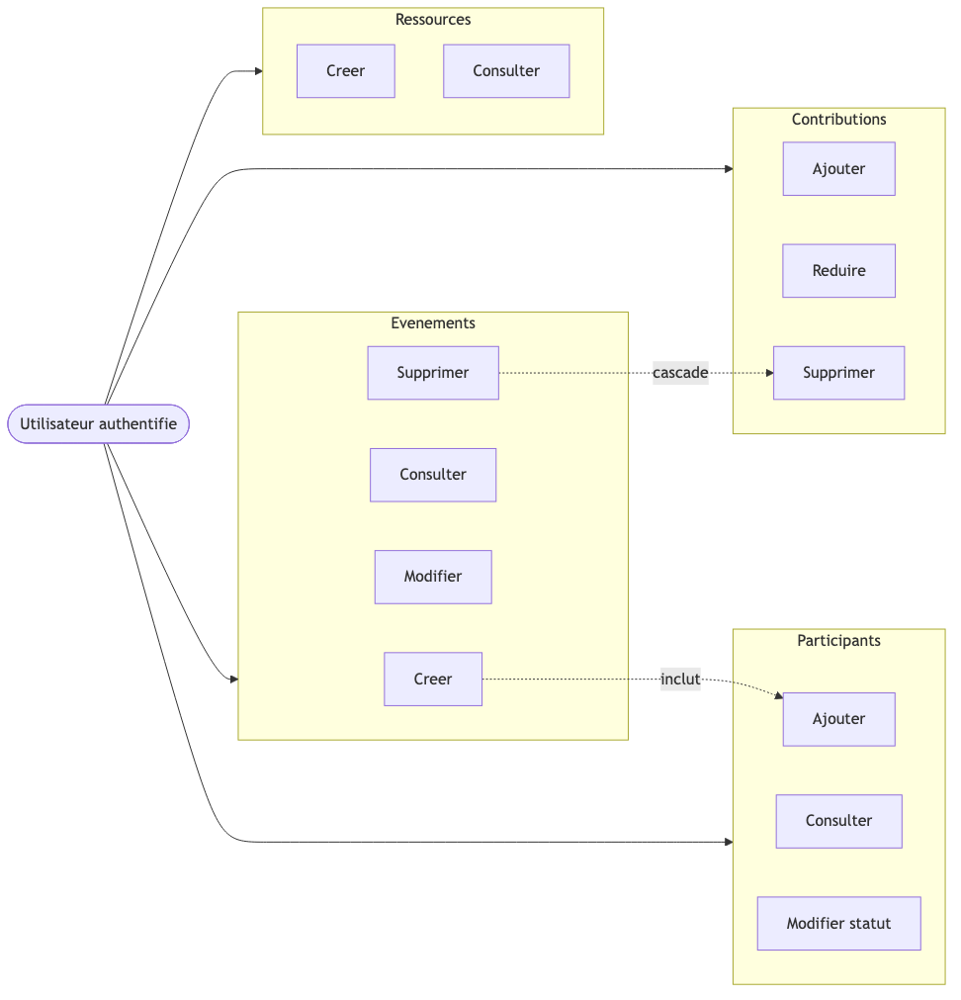
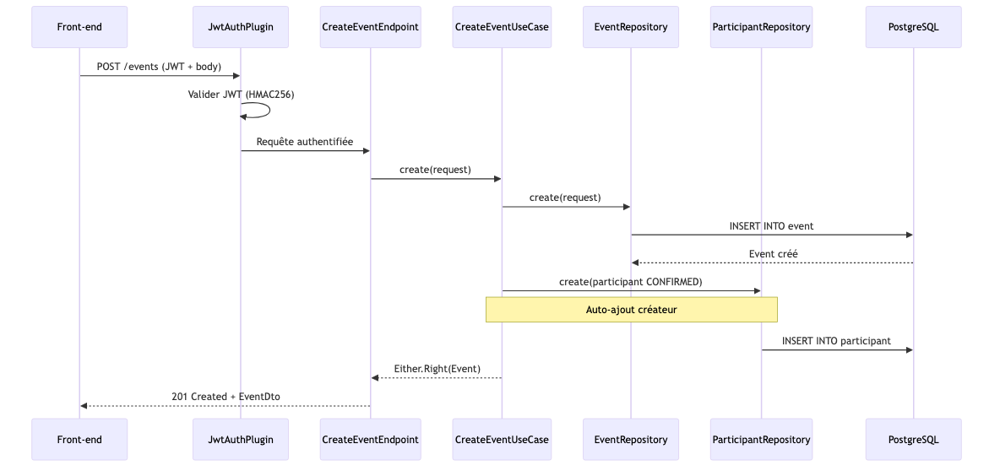
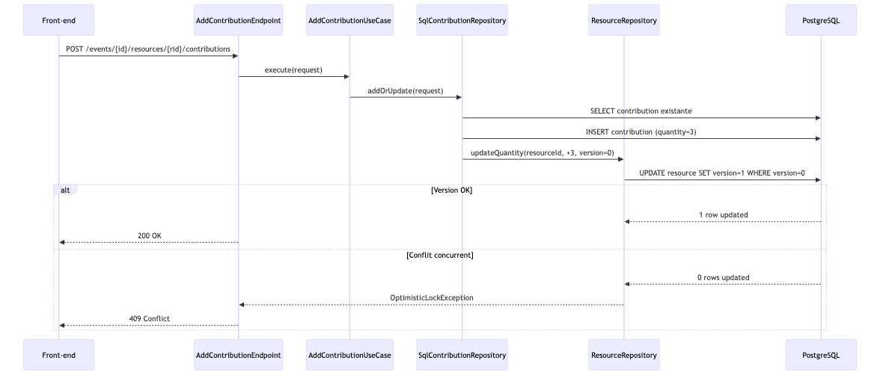
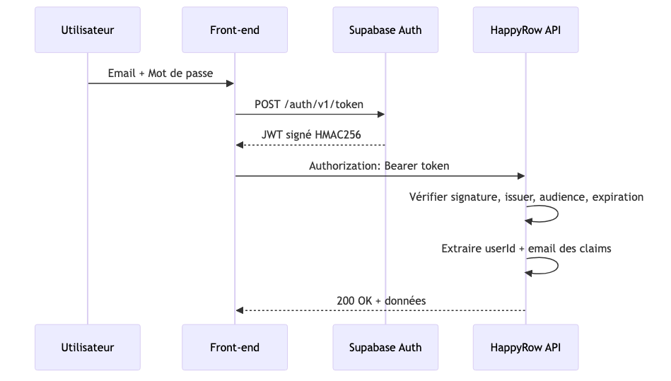
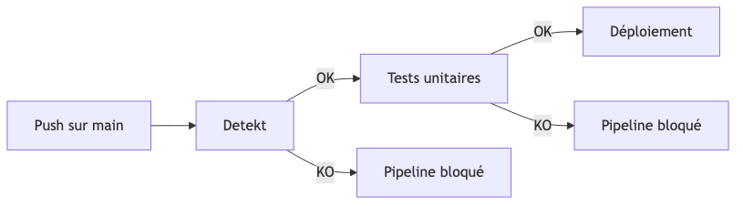
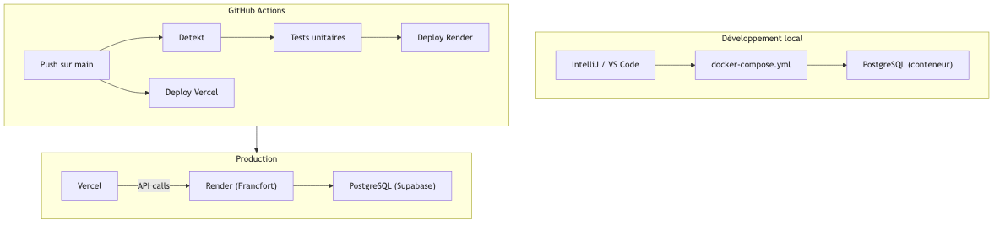

## Page titre


::: notes
Bonjour, je m'appelle *[Prénom Nom]* et je vous présente aujourd'hui mon projet **HappyRow**, réalisé dans le cadre du titre professionnel Concepteur Développeur d'Applications.
HappyRow est une plateforme collaborative de gestion d'événements, développée en Kotlin avec Ktor pour le back-end, et React TypeScript pour le front-end.

:::

## Plateforme collaborative de gestion d'événements


**Titre Professionnel visé** : Concepteur Développeur d'Applications (CDA) — Niveau 6

**Candidat** : *[Nom Prénom]*

**Date de session** : *[À compléter]*

**Centre de formation** : *[À compléter]*


| Dépôt | Stack |
|-------|-------|
| `happyrow-core` | Back-end — Kotlin / Ktor / PostgreSQL |
| `happyrow-front` | Front-end — React 19 / TypeScript |


## Sommaire


::: notes
Ma présentation est organisée en 13 parties. Je commencerai par le contexte et le cahier des charges, puis la gestion de projet. Ensuite, les spécifications fonctionnelles — architecture, maquettes, modèle de données. Puis les réalisations concrètes, organisées par couche : interfaces utilisateur, composants métier, accès aux données, et autres composants. Je poursuivrai avec la sécurité, les tests et le jeu d'essai, le déploiement et DevOps, la veille sécurité. Et je terminerai par la synthèse et la conclusion.

:::

1. **Contexte** — Formation, rôle, environnement de travail
2. **Cahier des charges** — Besoins, contraintes, livrables
3. **Gestion de projet** — Kanban, suivi, qualité
4. **Spécifications fonctionnelles** — Architecture, maquettes, MCD, séquences
5. **Réalisations — UI** — Captures d'écran, code React
6. **Réalisations — Métier** — Use cases, modèles domaine, Arrow Either
7. **Réalisations — Données** — Verrou optimiste, repositories SQL
8. **Réalisations — Autres composants** — JWT, endpoints REST, erreurs
9. **Sécurité** — Auth, applicative, infrastructure, éco-conception
10. **Tests et jeu d'essai** — Stratégie, Kotest, scénarios
11. **Déploiement et DevOps** — Docker, CI/CD, mise en production
12. **Veille sécurité** — OWASP Top 10, CVE
13. **Synthèse et conclusion** — Bilan, perspectives


## Compétences CDA mises en œuvre


::: notes
Avant d'entrer dans le projet, je vais vous montrer comment HappyRow couvre les 11 compétences du référentiel CDA, réparties dans les 3 CCP.
Pour le CCP 1 — Développer une application sécurisée : j'ai installé et configuré mon environnement avec Kotlin, JDK 21, Gradle multi-modules et Docker. J'ai développé les interfaces utilisateur côté front-end avec React et côté back-end avec les endpoints REST Ktor. Les composants métier sont les 12 use cases du module domaine. Et la gestion de projet s'appuie sur Kanban, GitHub Projects et les pipelines CI/CD.
Pour le CCP 2 — Concevoir et développer une application organisée en couches : l'analyse des besoins et les maquettes Figma, l'architecture hexagonale Ports et Adapters, le modèle de données PostgreSQL avec 4 tables et contraintes, et les 4 repositories SQL avec Exposed ORM.
Pour le CCP 3 — Préparer le déploiement : les tests unitaires et d'intégration avec Kotest, MockK, Testcontainers, Vitest et Playwright. Le déploiement documenté avec Docker multi-stage et Render. Et la mise en production DevOps avec les pipelines GitHub Actions.

:::


**CCP 1 — Développer une application sécurisée**


| Compétence | Mise en œuvre |
|---|---|
| **C1 — Installer et configurer l'environnement** | Kotlin 2.2 / JDK 21, Gradle multi-modules, Docker, IntelliJ IDEA, docker-compose |
| **C2 — Développer des interfaces utilisateur** | Endpoints REST Ktor + SPA React 19 / TypeScript (8 vues, 6 modales) |
| **C3 — Développer des composants métier** | 12 use cases (module `domain`), Arrow Either, verrou optimiste |
| **C4 — Contribuer à la gestion de projet** | Kanban GitHub, CI/CD GitHub Actions, Detekt + Spotless |


**CCP 2 — Concevoir et développer une application sécurisée organisée en couches**


| Compétence | Mise en œuvre |
|---|---|
| **C5 — Analyser les besoins et maquetter** | Expression des besoins, maquettes Figma, Design Tokens CSS |
| **C6 — Définir l'architecture logicielle** | Architecture hexagonale (Ports & Adapters), 2 modules Gradle, Koin DI |
| **C7 — Concevoir et mettre en place une BDD** | MCD 4 entités, PostgreSQL, FK, CHECK, UNIQUE, verrou optimiste |
| **C8 — Développer des composants d'accès aux données** | 4 repositories SQL (Exposed ORM), requêtes paramétrées, transactions |


**CCP 3 — Préparer le déploiement d'une application sécurisée**


| Compétence | Mise en œuvre |
|---|---|
| **C9 — Préparer et exécuter les plans de tests** | Kotest + MockK, Testcontainers, Vitest, Playwright, Detekt |
| **C10 — Préparer et documenter le déploiement** | Dockerfile multi-stage, render.yaml, docker-compose, procédure documentée |
| **C11 — Contribuer à la mise en production DevOps** | 2 pipelines CI/CD GitHub Actions, audit sécurité quotidien, Dependabot |


## L'organisme et la promotion


| | |
|---|---|
| **Organisme** | *[Nom du centre de formation]* |
| **Formation** | Titre Professionnel CDA — Niveau 6 |
| **Promotion** | *[Promotion CDA 2025-2026]* |
| **Effectif** | *[X apprenants]* |
| **Encadrement** | *[X formateurs techniques]* |


::: notes
Ce projet a été réalisé pendant ma formation CDA au sein de *[nom du centre de formation]*. Notre promotion comptait *[X]* apprenants, encadrés par *[X]* formateurs techniques.
La formation est organisée autour de projets individuels et collectifs. Chaque apprenant développe un projet personnel full-stack qui doit couvrir l'ensemble des compétences du référentiel CDA.

:::

## Mon rôle et le projet


**Projet personnel** réalisé en autonomie pendant la formation

- **Conception** : architecture, modèle de données, choix techniques
- **Développement** : back-end (Kotlin/Ktor) + front-end (React/TypeScript)
- **Tests** : unitaires, intégration, E2E, analyse statique
- **Déploiement** : Docker, CI/CD GitHub Actions, Render + Vercel
- **Encadrement** : formateurs en rôle de conseil et validation

> Objectif : couvrir les 11 compétences professionnelles du référentiel CDA


::: notes
HappyRow est un projet personnel que j'ai conçu, développé et déployé en totale autonomie, de l'analyse des besoins jusqu'à la mise en production.
J'ai été responsable de l'ensemble de la chaîne : la conception de l'architecture, le développement back-end et front-end, la mise en place de la base de données, l'écriture des tests, la configuration du CI/CD, et le déploiement en production.
Les formateurs ont joué un rôle de conseil et de validation, sans intervenir directement dans le code.

:::

## Environnement de travail


**Outils de développement**


| Outil | Usage |
|-------|-------|
| **IntelliJ IDEA** | IDE principal (Kotlin, Gradle, Docker) |
| **VS Code** | Développement front-end (React, TypeScript) |
| **JDK 21** (Eclipse Temurin) | Runtime JVM pour le back-end |
| **Node.js 22** | Runtime front-end, npm, Vite |
| **Docker Desktop** | Conteneurisation, PostgreSQL local |
| **Git + GitHub** | Gestion de versions, collaboration, CI/CD |


**Configuration locale**


```
docker-compose.yml → PostgreSQL local (port 5432)
application.conf   → Configuration Ktor (ports, DB, JWT)
.env               → Variables d'environnement (secrets locaux)
gradle/libs.versions.toml → Catalogue centralisé des dépendances
```


**Structure Gradle multi-modules**


```
happyrow-core/
├── domain/          → Logique métier pure (0 dépendance technique)
├── infrastructure/  → Ktor, Exposed, JWT, SQL adapters
├── build.gradle.kts → Configuration projet
└── docker-compose.yml
```

::: notes
Pour le développement, j'utilise IntelliJ IDEA comme IDE principal pour le back-end Kotlin et Gradle, et VS Code pour le front-end React et TypeScript.
Le runtime est JDK 21 Eclipse Temurin pour le back-end et Node.js 22 pour le front-end. Docker Desktop permet de lancer un conteneur PostgreSQL en local via docker-compose.
La configuration du projet est centralisée : `application.conf` pour Ktor, un fichier `.env` pour les secrets locaux, et un catalogue de dépendances dans `gradle/libs.versions.toml`.
Point important sur la structure : le projet est organisé en deux modules Gradle séparés — `domain` pour la logique métier pure, sans aucune dépendance technique, et `infrastructure` pour les adapters REST, SQL et l'authentification JWT. Cette séparation est au cœur de l'architecture hexagonale.

:::


## Contexte et objectifs


**HappyRow** — Application web collaborative de gestion d'événements

**Problème** : organiser un événement entre plusieurs personnes repose sur des échanges informels (messages, tableurs) — manque de structure et de visibilité

**Solution** : centraliser la coordination dans une application dédiée


**Objectifs fonctionnels**


- Créer et gérer des événements (fête, anniversaire, dîner…)
- Inviter des participants et suivre leur statut
- Définir les ressources nécessaires (nourriture, boissons, ustensiles…)
- Permettre aux participants de déclarer leurs contributions
- Gérer les accès concurrents sur les ressources (verrou optimiste)


::: notes
Le projet HappyRow est né d'un constat simple : quand on organise un événement entre amis ou collègues — une fête, un dîner — la coordination repose souvent sur des messages informels ou des tableurs partagés, qui manquent de structure. Qui apporte quoi ? Est-ce qu'on a assez de boissons ?
L'objectif est de centraliser cette coordination dans une application dédiée. Un utilisateur authentifié peut créer un événement, inviter des participants, définir les ressources nécessaires, et chaque participant peut déclarer sa contribution.
Un point clé : quand plusieurs personnes contribuent en même temps sur la même ressource, il faut gérer les accès concurrents. C'est ce qui m'a amené à implémenter un verrou optimiste.

:::

## Contraintes techniques et livrables


**Contraintes techniques**


| Contrainte | Choix |
|------------|-------|
| Langage | Kotlin 2.2 / JVM 21 |
| Framework web | Ktor 3.2.2 |
| Base de données | PostgreSQL |
| Authentification | JWT via Supabase (HMAC256) |
| Architecture | Hexagonale (Ports & Adapters) |
| Front-end | React 19 / TypeScript — SPA + PWA |
| Déploiement | Docker + Render (back) / Vercel (front) |
| Qualité | Detekt + Spotless obligatoires en CI |


**Livrables**


1. API REST — 15 endpoints, 4 domaines métier
2. Base PostgreSQL — 4 tables, contraintes, index
3. Front-end React 19 — PWA, 8 écrans, 6 modales
4. Pipelines CI/CD — back-end + front-end
5. Tests — unitaires, intégration, E2E

::: notes
Au niveau des contraintes techniques : le back-end est en Kotlin sur JVM 21 avec Ktor. La base de données est PostgreSQL. L'authentification est déléguée à Supabase avec un JWT signé en HMAC256. L'architecture est hexagonale. Le front-end est une SPA React 19 en TypeScript, déployée comme PWA. Et l'analyse statique avec Detekt et le formatage avec Spotless sont obligatoires dans le pipeline CI/CD.
Les livrables sont : une API REST avec 15 endpoints, une base PostgreSQL avec 4 tables, un front-end React avec 8 écrans, des pipelines CI/CD, et des tests unitaires, d'intégration et E2E.

:::


## Méthodologie et planning


**Kanban — GitHub Issues + Projects**


- **To Do** → **In Progress** → **Done**
- WIP limité pour rester focalisé
- Livraison continue et incrémentale


**Planning en 5 phases**


| Phase | Contenu | Livrables |
|-------|---------|-----------|
| **1. Fondations** | Architecture hexagonale, Gradle, Docker, PostgreSQL, CI/CD | Projet compilable, pipeline fonctionnel |
| **2. Événements** | CRUD événements, authentification JWT Supabase | Endpoints events, auth fonctionnelle |
| **3. Participants** | Gestion participants, auto-ajout du créateur | Endpoints participants |
| **4. Ressources & Contributions** | Contributions avec verrou optimiste | Endpoints ressources + contributions |
| **5. Qualité & Déploiement** | Tests, analyse statique, déploiement Render/Vercel | Application déployée et testée |


::: notes
J'ai adopté une approche Kanban, adaptée au contexte d'un développeur en autonomie. Les tâches sont organisées en tickets dans GitHub Issues, visualisées dans un tableau GitHub Projects avec trois colonnes : To Do, In Progress, Done.
Le projet a été découpé en 5 phases itératives. La phase 1 pose les fondations : architecture hexagonale, Gradle multi-modules, Docker, PostgreSQL et le pipeline CI/CD. Les phases 2 et 3 couvrent les événements et les participants. La phase 4, la plus complexe, implémente les ressources et les contributions avec le verrou optimiste. Et la phase 5 se concentre sur la qualité et le déploiement en production.

:::

## Suivi des tâches


**Outils de suivi**


| Outil | Usage |
|-------|-------|
| **GitHub Issues** | Tickets par fonctionnalité, bug, amélioration |
| **GitHub Projects** | Tableau Kanban — visualisation de l'avancement |
| **Git** | Branches par fonctionnalité, merge via PR |
| **GitHub Actions** | Feedback automatisé à chaque push |


**Gestion des versions Git**


- Branche `main` : code stable, déployé automatiquement
- Branches de fonctionnalité : développement isolé
- Chaque push sur `main` déclenche les pipelines CI/CD


::: notes
Le suivi du projet s'appuie sur 4 outils complémentaires. GitHub Issues pour le suivi des tâches — chaque ticket correspond à une fonctionnalité ou un bug. GitHub Projects pour la visualisation du tableau Kanban. Git avec des branches par fonctionnalité et merge via pull request. Et GitHub Actions pour le feedback automatisé à chaque push.
Le workflow Git est structuré : la branche `main` contient le code stable et est déployée automatiquement. Chaque fonctionnalité est développée dans une branche isolée, et chaque push sur `main` déclenche les pipelines CI/CD des deux dépôts — back-end et front-end.

:::

## Objectifs de qualité


| Objectif | Outil | Résultat |
|----------|-------|----------|
| Analyse statique | **Detekt** | Code smells, complexité, conventions |
| Formatage homogène | **Spotless** + ktlint (back) / Prettier (front) | Style uniforme |
| Tests automatisés | **Kotest** + MockK / **Vitest** + Playwright | Couverture fonctionnelle |
| Sécurité supply chain | npm audit quotidien, lockfile-lint, Dependabot | Alertes automatiques |
| Zéro régression | Pipelines CI/CD bloquants | Aucun déploiement si échec |


**Pipeline résumé**


```
Back-end :  Detekt → Tests unitaires → Déploiement Render
Front-end : ESLint → Vitest → Build Docker → Approval → Déploiement Vercel
```

::: notes
En termes de qualité, le projet repose sur plusieurs outils complémentaires. L'analyse statique avec Detekt détecte les code smells, les problèmes de complexité et les violations de conventions. Le formatage est assuré par Spotless avec ktlint côté back-end et Prettier côté front-end.
Les tests automatisés couvrent les use cases avec Kotest et MockK, et les fonctionnalités front-end avec Vitest et Playwright. La sécurité de la chaîne d'approvisionnement est vérifiée quotidiennement côté front-end avec npm audit et lockfile-lint.
L'objectif est clair : zéro régression en production. Si Detekt ou les tests échouent, le pipeline est bloqué et le déploiement n'a pas lieu.

:::


## Architecture hexagonale : principes


{ width=80% }


**Principe** : le domaine ne dépend d'aucune bibliothèque technique. Il définit des **ports** (interfaces), l'infrastructure les implémente.

- **Ports driving** (entrants) : les endpoints appellent les use cases
- **Ports driven** (sortants) : les use cases définissent des interfaces de repository
- **Inversion de dépendance** : le domaine est au centre, l'infrastructure est périphérique


::: notes
L'architecture suit strictement le pattern Ports et Adapters. Au centre, le domaine contient toute la logique métier : les use cases, les modèles et les interfaces de repository — qu'on appelle les ports.
Autour du domaine, deux types d'adapters. Les adapters driving, côté entrant, ce sont les endpoints REST qui reçoivent les requêtes HTTP et appellent les use cases. Les adapters driven, côté sortant, ce sont les repositories SQL qui implémentent les interfaces définies dans le domaine.
Le principe fondamental, c'est l'inversion de dépendance : le domaine ne dépend d'aucune bibliothèque technique — ni Ktor, ni Exposed, ni Jackson. C'est l'infrastructure qui dépend du domaine.

:::

## Architecture hexagonale : modules Gradle


**2 modules Gradle séparés**


```
happyrow-core/
├── domain/                          ← Module métier pur
│   └── src/main/kotlin/
│       ├── event/
│       │   ├── create/              ← CreateEventUseCase + port EventRepository
│       │   ├── getByOrganizer/
│       │   └── common/model/        ← Event, Creator (value class)
│       ├── participant/
│       ├── resource/
│       └── contribution/
│
├── infrastructure/                  ← Module technique
│   └── src/main/kotlin/
│       ├── event/
│       │   ├── create/driving/      ← CreateEventEndpoint (REST)
│       │   └── common/driven/       ← SqlEventRepository (SQL)
│       ├── technical/
│       │   ├── auth/                ← JwtAuthPlugin, SupabaseJwtService
│       │   ├── database/            ← ExposedDatabase, HikariCP
│       │   └── di/                  ← Koin modules
│       └── ...
```

- **`domain/`** : zéro dépendance technique (pas de Ktor, Exposed, Jackson)
- **`infrastructure/`** : implémente les ports, dépend du domaine
- **Injection de dépendances** : Koin connecte les ports aux adapters


::: notes
Concrètement, le code est organisé en deux modules Gradle séparés. Le module `domain` ne contient que la logique métier pure — les use cases, les modèles, les interfaces de repository. Il a zéro dépendance technique.
Le module `infrastructure` contient les adapters : les endpoints REST dans des dossiers `driving`, les repositories SQL dans des dossiers `driven`, et les composants techniques comme l'authentification JWT, la configuration de la base de données et l'injection de dépendances avec Koin.
Chaque bounded context — événements, participants, ressources, contributions — a sa propre arborescence dans les deux modules.

:::

## Maquettes et enchaînement des écrans


{ width=80% }


- **8 écrans/vues** + **6 modales**
- Design Tokens CSS : teal `#5FBDB4`, navy `#3D5A6C`, coral `#E6A19A`
- Police Comic Neue pour un ton convivial
- PWA installable avec mode offline (Service Worker Workbox)


::: notes
L'application est une SPA avec React Router. L'enchaînement repose sur l'état d'authentification : si l'utilisateur n'est pas connecté, il voit la page d'accueil avec les boutons Login et Register. Une fois authentifié, il accède au dashboard avec la liste de ses événements.
En cliquant sur un événement, il accède à la vue détail avec les ressources organisées par catégorie. C'est ici que la fonctionnalité de contribution est accessible : les boutons plus/moins pour sélectionner un delta, et le bouton Validate pour confirmer.
La charte graphique utilise des Design Tokens CSS avec les couleurs teal, navy et coral, et la police Comic Neue pour un ton convivial.

:::

## Modèle Conceptuel de Données


{ width=80% }


- 4 entités, relations 1-N
- `version` sur Resource pour le verrou optimiste
- Contraintes FK, CHECK, UNIQUE


::: notes
Le modèle conceptuel comprend 4 entités. Un événement héberge des participants et nécessite des ressources. Un participant apporte des contributions, et une ressource reçoit des contributions.
Les points importants : la table `resource` a un champ `version` pour le verrou optimiste, incrémenté à chaque modification de quantité. Les relations sont toutes en 1-N. Et les contraintes d'intégrité — clés étrangères, index uniques, contraintes CHECK — sont définies au niveau physique.

:::

## Modèle Physique et script SQL


**Tables Exposed (ORM Kotlin)**


```kotlin
object ResourceTable : UUIDTable("configuration.resource", "id") {
    val name = varchar("name", 255)
    val category = enumerationByName<ResourceCategory>("category", 50)
    val suggestedQuantity = integer("suggested_quantity")
    val currentQuantity = integer("current_quantity")
    val version = integer("version").default(0)
    val eventId = uuid("event_id").references(EventTable.id)
    val createdAt = timestamp("created_at")
    val updatedAt = timestamp("updated_at")
}
```


**Script d'initialisation (init-db.sql)**


```sql
CREATE SCHEMA IF NOT EXISTS configuration;

CREATE TABLE configuration.resource (
    id UUID PRIMARY KEY DEFAULT gen_random_uuid(),
    name VARCHAR(255) NOT NULL,
    category VARCHAR(50) NOT NULL,
    suggested_quantity INTEGER NOT NULL CHECK (suggested_quantity > 0),
    current_quantity INTEGER NOT NULL DEFAULT 0,
    version INTEGER NOT NULL DEFAULT 0,
    event_id UUID NOT NULL REFERENCES configuration.event(id),
    created_at TIMESTAMP NOT NULL DEFAULT NOW(),
    updated_at TIMESTAMP NOT NULL DEFAULT NOW()
);
```


::: notes
Au niveau physique, les tables sont définies avec Exposed ORM en Kotlin. Ici, la table `resource` dans le schéma `configuration` avec ses champs, l'enum pour la catégorie, la version initialisée à 0, et la clé étrangère vers la table `event`.
Le script SQL correspondant crée le schéma, la table avec les contraintes — `NOT NULL`, `CHECK` sur les quantités positives, `DEFAULT` pour la version. Exposed génère les requêtes SQL paramétrées à partir de ces définitions.

:::

## Cas d'utilisation


{ width=80% }


- **12 use cases**, **4 bounded contexts**
- Règle métier : création événement inclut auto-ajout créateur (CONFIRMED)
- Suppression événement → cascade contributions → ressources → participants


::: notes
Le projet couvre 12 cas d'utilisation répartis dans les 4 bounded contexts. Événements : créer, consulter, modifier, supprimer. Participants : ajouter, consulter, modifier le statut. Ressources : créer, consulter. Contributions : ajouter, réduire, supprimer.
Deux règles métier notables : la création d'un événement inclut automatiquement l'ajout du créateur comme participant confirmé — c'est le lien « inclut ». Et la suppression d'un événement déclenche la cascade de toutes les données liées.

:::

## Séquence : création d'événement


{ width=80% }


::: notes
Ce diagramme montre le flux complet de la création d'un événement. Le front-end envoie un POST avec le JWT et le body. Le plugin d'authentification valide le token HMAC256 et extrait l'utilisateur. Le endpoint désérialise la requête et appelle le use case.
Le use case crée l'événement dans le repository, puis crée automatiquement le participant avec le statut CONFIRMED — c'est la règle métier encapsulée dans le domaine. Enfin, le endpoint convertit le résultat en DTO et retourne un 201 Created.
Le point important, c'est l'utilisation d'Arrow Either. Si la création de l'événement échoue, le `flatMap` empêche la création du participant. L'erreur remonte proprement.

:::

## Séquence : contribution avec verrou optimiste


{ width=80% }


Le verrou optimiste évite les verrous SQL (`SELECT FOR UPDATE`) tout en garantissant la cohérence.


::: notes
C'est la fonctionnalité la plus complexe du projet. Quand un utilisateur contribue à une ressource, le système doit mettre à jour la quantité de façon atomique.
Le repository cherche d'abord si une contribution existe déjà. S'il s'agit d'une nouvelle contribution, il l'insère. Ensuite, il appelle `updateQuantity` sur la ressource avec le delta et la version attendue. Le SQL exécute un UPDATE conditionnel : `WHERE version = expectedVersion`. Si une autre personne a modifié la ressource entre-temps, la version en base ne correspond plus, zéro lignes sont mises à jour, et une `OptimisticLockException` est levée.
Cette exception remonte et le endpoint retourne un 409 Conflict. Le client doit rafraîchir et réessayer. L'avantage par rapport au verrou pessimiste, c'est que ça ne bloque pas les autres transactions.

:::

## Stack technique complète


**Back-end**


| Couche | Technologie | Version |
|--------|------------|---------|
| Langage | Kotlin | 2.2.0 / JVM 21 |
| Framework web | Ktor | 3.2.2 |
| ORM | Exposed | 0.61.0 |
| Base de données | PostgreSQL | — |
| Pool connexions | HikariCP | 6.3.1 |
| DI | Koin | 4.1.0 |
| Erreurs fonctionnelles | Arrow | 2.1.2 |
| Sérialisation | Jackson | Kotlin + JavaTime |
| Auth | Auth0 JWT + Supabase | 4.4.0 |


**Front-end**


| Couche | Technologie | Version |
|--------|------------|---------|
| Framework | React | 19.1.1 |
| Langage | TypeScript (strict) | 5.8.3 |
| Build | Vite | 7.1.2 |
| Routing | React Router DOM | 7.13.0 |
| Auth | Supabase JS SDK | 2.39.3 |
| PWA | vite-plugin-pwa + Workbox | 1.2.0 |
| HTTP | API native `fetch` | — |

::: notes
Pour résumer la stack technique : côté back-end, Kotlin 2.2 sur JVM 21, Ktor 3.2 pour le web, Exposed pour l'ORM, HikariCP pour le pool de connexions, Koin pour l'injection de dépendances, Arrow pour la gestion fonctionnelle des erreurs, Jackson pour la sérialisation JSON, et Auth0 JWT pour l'authentification.
Côté front-end : React 19 en TypeScript strict, Vite pour le build, React Router pour la navigation, Supabase SDK pour l'authentification, CSS natif avec Design Tokens, et PWA avec Workbox.
Point notable : le front-end n'a que 3 dépendances de production. Pas d'Axios, pas de framework CSS lourd. L'API native `fetch` est utilisée directement.

:::


## Captures d'écran : Dashboard / HomePage


- Le dashboard affiche les événements sous forme de cartes (`EventCard`)
- Chaque carte montre : date, nom, nombre de participants, localisation
- Barre de navigation : profil, créer un événement (+), accueil
- **3 dépendances de production** seulement (React, React Router, Supabase)
- PWA installable avec mode offline (Service Worker Workbox)


::: notes
Voici le dashboard de l'application. Il affiche les événements de l'utilisateur sous forme de cartes — les EventCards — avec la date, le nom, le nombre de participants et la localisation.
La barre de navigation permet d'accéder au profil, de créer un nouvel événement avec le bouton plus, et de revenir à l'accueil.
L'application est une PWA installable, avec un mode offline grâce au Service Worker Workbox. Et je le rappelle : seulement 3 dépendances de production — React, React Router et Supabase.

:::

## Captures d'écran : EventDetailsView


- Vue détail d'un événement avec ressources organisées par catégorie (Food, Drinks…)
- Chaque ressource affiche : quantité courante / suggérée
- Contrôles de contribution : boutons **+/−** pour sélectionner un delta
- Bouton **Validate** visible uniquement quand un delta est sélectionné
- Design Tokens CSS : teal `#5FBDB4`, navy `#3D5A6C`, coral `#E6A19A`


::: notes
La vue détail d'un événement montre les ressources organisées par catégorie — Food, Drinks, et cetera. Chaque ressource affiche la quantité courante par rapport à la quantité suggérée.
Les contrôles de contribution sont intégrés directement : les boutons plus et moins pour sélectionner un delta de quantité. Quand un delta est sélectionné, le bouton Validate apparaît pour confirmer la contribution.
Le design utilise les Design Tokens CSS — les couleurs teal, navy et coral définies comme variables CSS — ce qui garantit la cohérence graphique et facilite la maintenance.

:::

## Code React : ResourceItem


```typescript
// src/features/resources/components/ResourceItem.tsx
export const ResourceItem: React.FC<ResourceItemProps> = ({
  resource, currentUserId,
  onAddContribution, onUpdateContribution, onDeleteContribution,
}) => {
  const [selectedQuantity, setSelectedQuantity] = useState(0);
  const [isSaving, setIsSaving] = useState(false);

  const userContribution = resource.contributors.find(
    c => c.userId === currentUserId
  );
  const userQuantity = userContribution?.quantity || 0;

  const handleValidate = async () => {
    try {
      setIsSaving(true);
      const newQuantity = userQuantity + selectedQuantity;
      if (newQuantity <= 0) await onDeleteContribution(resource.id);
// ...
```

- Logique **add/update/delete** déterminée par l'état de la contribution existante
- `selectedQuantity` = delta par rapport à la contribution actuelle
- Bouton Validate visible uniquement quand un delta est sélectionné


::: notes
Le composant `ResourceItem` gère l'interaction de contribution. La logique est intéressante : selon l'état actuel, le composant décide s'il faut ajouter, mettre à jour ou supprimer la contribution.
Le `selectedQuantity` est un delta par rapport à la contribution existante. Si la quantité résultante tombe à zéro ou moins, c'est une suppression. Si l'utilisateur n'avait pas de contribution, c'est un ajout. Sinon, c'est une mise à jour.
Le bouton Validate n'apparaît que quand un delta est sélectionné — on ne peut pas soumettre une contribution vide. Et le state `isSaving` empêche les doubles soumissions pendant l'appel API.

:::

## Architecture front-end Clean Architecture


**Inversion de dépendance côté front-end**


```
[Composants React] → [Context/Provider] → [Use Cases] → [Repository (interface)] → [HttpRepository (fetch)]
```


**Organisation par features**


```
src/features/
├── auth/           → AuthProvider, AuthRepository, LoginModal
├── events/         → EventProvider, EventCard, CreateEventForm
├── participants/   → ParticipantProvider, ParticipantList
├── resources/      → ResourceProvider, ResourceItem
└── contributions/  → ContributionProvider, HttpContributionRepository
```


**Injection du token JWT**


```typescript
// Le token est injecté via callback getToken dans les providers
async createContribution(data: ContributionCreationRequest): Promise<Contribution> {
  const token = this.getToken();
  if (!token) throw new Error('Authentication required');
  const response = await fetch(`${this.baseUrl}/...`, {
    method: 'POST',
    headers: {
      'Content-Type': 'application/json',
      Authorization: `Bearer ${token}`,
    },
    body: JSON.stringify({ quantity: data.quantity }),
  });
  // ...
}
```

- Même principe d'architecture que le back-end : cohérence architecturale
- Chaque module isolé dans `src/features/` avec composants, hooks, services, types
- API native `fetch` — pas d'Axios, pas de dépendance tierce

::: notes
Le front-end suit le même principe d'inversion de dépendance que le back-end. Le flux est : Composants React → Context/Provider → Use Cases → Repository interface → HttpRepository qui utilise l'API native `fetch`.
Chaque domaine fonctionnel — auth, events, participants, resources, contributions — est un module isolé dans `src/features/` avec ses propres composants, hooks, services, use cases et types.
Le token JWT est injecté via une callback `getToken` dans les providers. Chaque repository HTTP ajoute le header Authorization Bearer automatiquement. Cette architecture permet de mocker les repositories dans les tests — exactement comme côté back-end.

:::


## Use Case : CreateEventUseCase


```kotlin
// domain/event/create/CreateEventUseCase.kt

class CreateEventUseCase(
  private val eventRepository: EventRepository,
  private val participantRepository: ParticipantRepository,
) {
  fun create(request: CreateEventRequest): Either<CreateEventException, Event> =
    eventRepository.create(request)
      .mapLeft { CreateEventException(request, it) }
      .flatMap { event ->
        participantRepository.create(
          CreateParticipantRequest(
            userEmail = request.creator.toString(),
            eventId = event.identifier,
            status = ParticipantStatus.CONFIRMED,
          ),
        )
          .map { event }
// ...
```

- Dépendance sur les **ports** (interfaces), jamais sur les implémentations SQL
- `flatMap` : le participant n'est créé que si l'événement a réussi
- **Règle métier encapsulée** : "le créateur est automatiquement participant confirmé"


::: notes
Ce use case illustre la composition fonctionnelle avec Arrow Either. La méthode `create` enchaîne deux opérations : la création de l'événement et l'ajout du participant.
Le `flatMap` assure que le participant n'est créé que si l'événement a réussi. Le `mapLeft` enveloppe les erreurs de repository dans une exception domaine pour préserver le contexte.
Le point fondamental, c'est que ce use case ne dépend que des interfaces — les ports — jamais des implémentations SQL. Il est testable avec des mocks, sans base de données. Et la règle métier — le créateur est automatiquement participant confirmé — est encapsulée dans le domaine, pas dans l'infrastructure.

:::

## Use Case : AddContributionUseCase


**Chaîne fonctionnelle complète**


```kotlin
// domain/contribution/add/AddContributionUseCase.kt

class AddContributionUseCase(
  private val contributionRepository: ContributionRepository,
  private val participantRepository: ParticipantRepository,
) {
  fun execute(request: AddContributionRequest): Either<AddContributionException, Contribution> =
    participantRepository.findOrCreate(request.userEmail, request.eventId)
      .mapLeft { AddContributionException(request, it) }
      .flatMap { participant ->
        contributionRepository.addOrUpdate(
          participant = participant,
          request = request,
        )
      }
      .mapLeft { AddContributionException(request, it) }
}
```

- **findOrCreate** : si le participant n'existe pas, il est créé automatiquement
- Le use case orchestre 2 repositories sans connaître leur implémentation
- L'`addOrUpdate` inclut le verrou optimiste (dans le repository SQL)


::: notes
Ce deuxième use case montre la chaîne fonctionnelle complète pour l'ajout d'une contribution. Il orchestre deux repositories : le repository de participants et celui des contributions.
D'abord, il cherche ou crée le participant avec `findOrCreate` — si le participant n'existe pas encore pour cet événement, il est créé automatiquement. Ensuite, il appelle `addOrUpdate` sur le repository de contributions, qui inclut le verrou optimiste dans son implémentation SQL.
Le use case ne connaît pas les détails de l'implémentation. Il ne sait pas qu'il y a un verrou optimiste ou une transaction SQL. Il sait seulement qu'il orchestre deux opérations qui peuvent réussir ou échouer, et il compose les résultats avec `flatMap`.

:::

## Modèles domaine


```kotlin
// domain/event/common/model/event/Event.kt
data class Event(
  val identifier: UUID, val name: String, val description: String,
  val eventDate: Instant, val creator: Creator, val location: String,
  val type: EventType, val members: List<Creator> = listOf(),
)

// domain/resource/common/model/Resource.kt
data class Resource(
  val identifier: UUID, val name: String, val category: ResourceCategory,
  val suggestedQuantity: Int, val currentQuantity: Int,
  val eventId: UUID, val version: Int,  // verrou optimiste
)

// domain/event/common/model/creator/Creator.kt
@JvmInline value class Creator(val value: String)
```

- **`data class`** : immutabilité, `equals`/`hashCode` automatiques, `copy`
- **Aucune annotation framework** : pas de `@Entity`, `@Column` — domaine pur
- **`Creator`** = `@JvmInline value class` : typage fort, zéro coût mémoire à l'exécution
- **`version`** : sémantique du verrou optimiste au niveau du modèle


::: notes
Les modèles du domaine sont des `data class` Kotlin pures. Aucune annotation framework — pas de `@Entity`, pas de `@Column`. Le domaine est complètement isolé de l'infrastructure.
Le type `Creator` est un `@JvmInline value class` : c'est un typage fort qui encapsule un String, mais sans coût mémoire à l'exécution — le compilateur l'inline. Ça empêche de confondre un email avec un nom ou un identifiant.
Le champ `version` dans `Resource` porte la sémantique du verrou optimiste directement au niveau du modèle. Ce n'est pas un détail technique caché dans l'infrastructure — c'est un concept métier explicite.

:::

## Gestion d'erreurs : Arrow Either


**Flux fonctionnel sans exceptions**


```kotlin
// Chaque opération retourne Either<Error, Success>
fun create(request: CreateEventRequest): Either<CreateEventException, Event>

// Composition via flatMap / mapLeft
eventRepository.create(request)          // Either<RepoError, Event>
  .mapLeft { CreateEventException(it) }  // Enveloppe l'erreur avec contexte
  .flatMap { event ->                    // Chaîne uniquement si Right (succès)
    participantRepository.create(...)
      .map { event }                     // Garde l'événement comme résultat
  }

// Résolution finale via fold
result.fold(
  ifLeft  = { error -> call.respond(error.toHttpStatus(), error.toDto()) },
  ifRight = { event -> call.respond(HttpStatusCode.Created, event.toDto()) },
)
```


**Avantages vs exceptions**


| Either | Exceptions |
|--------|-----------|
| Type de retour explicite | Invisible dans la signature |
| Composable (flatMap, map) | try/catch imbriqués |
| Pas de coût de stack trace | Stack trace coûteuse |
| Traçabilité (mapLeft enveloppe) | Perte de contexte |

::: notes
Pour résumer le pattern de gestion d'erreurs : chaque opération retourne un `Either<Error, Success>`. Le type de retour est explicite — on voit dans la signature que l'opération peut échouer.
La composition se fait via `flatMap` pour chaîner les opérations qui dépendent du résultat précédent, et `mapLeft` pour envelopper les erreurs avec du contexte supplémentaire. Et `fold` résout le résultat final en séparant le chemin d'erreur du chemin de succès.
Les avantages par rapport aux exceptions classiques : c'est composable, il n'y a pas de coût de stack trace, et la traçabilité est meilleure car chaque couche enveloppe les erreurs de la couche inférieure.

:::


## Verrou optimiste : SqlResourceRepository


```kotlin
// infrastructure/resource/common/driven/SqlResourceRepository.kt

override fun updateQuantity(
  resourceId: UUID, quantityDelta: Int, expectedVersion: Int,
): Either<GetResourceRepositoryException, Resource> {
  return Either.catch {
    transaction(exposedDatabase.database) {
      val currentResource = ResourceTable
        .selectAll().where {
          (ResourceTable.id eq resourceId) and
            (ResourceTable.version eq expectedVersion)
        }.singleOrNull()

      if (currentResource == null) {
        val exists = ResourceTable.selectAll()
          .where { ResourceTable.id eq resourceId }.singleOrNull()
        if (exists == null) throw ResourceNotFoundException(resourceId)
        else throw OptimisticLockException(resourceId, expectedVersion)
// ...
```

- **Double vérification** : version check à la lecture ET à l'écriture
- **Pas de verrou SQL** (`SELECT FOR UPDATE`) : meilleure performance
- **`OptimisticLockException`** → 409 Conflict côté client


::: notes
C'est l'extrait de code le plus significatif du projet. La méthode `updateQuantity` implémente le verrou optimiste en deux temps.
D'abord, elle lit la ressource avec une clause `WHERE version = expectedVersion`. Si aucune ligne n'est retournée, elle distingue deux cas : la ressource n'existe pas — erreur 404 — ou la version a changé — conflit de concurrence.
Ensuite, elle exécute un UPDATE conditionnel avec la même clause sur la version. Si entre la lecture et l'écriture un autre thread a modifié la ressource, l'UPDATE retourne zéro lignes, et une `OptimisticLockException` est levée.
La double vérification — à la lecture et à l'écriture — est une défense en profondeur contre les race conditions. Le delta de quantité, plutôt qu'une valeur absolue, permet des mises à jour concurrentes valides si elles ne concernent pas la même version.

:::

## Table Exposed : ContributionTable


```kotlin
// infrastructure/contribution/common/driven/ContributionTable.kt

object ContributionTable : UUIDTable("configuration.contribution", "id") {
  val participantId = uuid("participant_id").references(ParticipantTable.id)
  val resourceId = uuid("resource_id").references(ResourceTable.id)
  val quantity = integer("quantity")
  val createdAt = timestamp("created_at")
  val updatedAt = timestamp("updated_at")

  init {
    uniqueIndex("uq_contribution_participant_resource", participantId, resourceId)
    index("idx_contribution_participant", false, participantId)
    index("idx_contribution_resource", false, resourceId)
    check("chk_quantity_positive") { quantity greater 0 }
  }
}
```

- **`uniqueIndex` composite** : un participant ne contribue qu'une fois par ressource
- **`check` constraint** : quantités strictement positives
- **FK + index** : intégrité référentielle + performance des requêtes


::: notes
La table Exposed pour les contributions montre l'approche de défense en profondeur au niveau de la base de données.
L'index unique composite sur `participantId` et `resourceId` empêche qu'un participant contribue deux fois à la même ressource — même si un bug applicatif tentait de le faire. La contrainte CHECK garantit que les quantités sont positives. Les index sur les clés étrangères optimisent les requêtes de recherche.
C'est le principe : les contraintes ne sont pas seulement dans le code applicatif, elles sont aussi dans la base.

:::

## Repository : SqlContributionRepository


```kotlin
// infrastructure/contribution/common/driven/SqlContributionRepository.kt

override fun addOrUpdate(
  participant: Participant, request: AddContributionRequest,
): Either<AddContributionException, Contribution> {
  return Either.catch {
    transaction(exposedDatabase.database) {
      // Rechercher une contribution existante
      val existing = ContributionTable.selectAll().where {
        (ContributionTable.participantId eq participant.identifier) and
          (ContributionTable.resourceId eq request.resourceId)
      }.singleOrNull()

      if (existing != null) {
        // Mise à jour de la quantité
        ContributionTable.update({
          ContributionTable.id eq existing[ContributionTable.id]
        }) {
// ...
```

- Pattern **Repository** : interface dans le domaine, implémentation SQL ici
- Chaque opération dans une **transaction** Exposed
- Requêtes **paramétrées** automatiquement (protection injection SQL)


::: notes
Ce repository illustre l'implémentation concrète d'un port du domaine. La méthode `addOrUpdate` recherche d'abord une contribution existante pour le participant et la ressource. Si elle existe, elle met à jour la quantité. Sinon, elle insère une nouvelle contribution.
Tout est encapsulé dans une transaction Exposed, ce qui garantit l'atomicité. Et les requêtes sont automatiquement paramétrées par Exposed — pas de risque d'injection SQL.
Après l'opération sur la contribution, le use case appelle `updateQuantity` sur la ressource pour mettre à jour la quantité courante avec le verrou optimiste.

:::

## Transactions et intégrité des données


**Défense en profondeur**


| Mécanisme | Protection |
|-----------|-----------|
| **Verrou optimiste** | Empêche les mises à jour concurrentes silencieuses |
| **FK CASCADE** | Suppression événement → cascade contributions → ressources → participants |
| **UNIQUE composite** | Un participant ne contribue qu'une fois par ressource |
| **CHECK constraint** | Quantités strictement positives (`quantity > 0`) |
| **Transactions** | Chaque opération encapsulée dans `transaction { }` |


**Suppression en cascade (ordre imposé par les FK)**


```
1. Supprimer les contributions (FK → participant + resource)
2. Supprimer les ressources (FK → event)
3. Supprimer les participants (FK → event)
4. Supprimer l'événement
```

L'ordre est géré manuellement dans `SqlEventRepository.delete` pour garder le contrôle sur la logique et les logs.

::: notes
En résumé, l'intégrité des données repose sur cinq mécanismes complémentaires. Le verrou optimiste empêche les mises à jour concurrentes silencieuses. Les clés étrangères en cascade assurent la suppression propre des données liées. Les index uniques composites empêchent les doublons. Les contraintes CHECK garantissent la validité des données. Et chaque opération est encapsulée dans une transaction.
Pour la suppression en cascade, l'ordre est imposé par les clés étrangères : d'abord les contributions, puis les ressources, puis les participants, et enfin l'événement. Cet ordre est géré manuellement dans le repository pour garder le contrôle.

:::


## Authentification JWT : Plugin Ktor


```kotlin
// infrastructure/technical/auth/JwtAuthenticationPlugin.kt

val JwtAuthenticationPlugin = createApplicationPlugin(
  name = "JwtAuthenticationPlugin",
  createConfiguration = ::JwtAuthConfig,
) {
  val jwtService = pluginConfig.jwtService
  onCall { call ->
    if (call.request.local.method == HttpMethod.Options ||
        call.request.local.uri in PUBLIC_PATHS) return@onCall

    val token = extractBearerToken(call)
    if (token == null) {
      call.respond(HttpStatusCode.Unauthorized,
        mapOf("type" to "MISSING_TOKEN", "message" to "..."))
      return@onCall
    }
    jwtService.validateToken(token).fold(
// ...
```

```kotlin
// infrastructure/technical/auth/SupabaseJwtService.kt
class SupabaseJwtService(private val config: SupabaseJwtConfig) {
  private val algorithm = Algorithm.HMAC256(config.jwtSecret)
  fun validateToken(token: String): Either<Throwable, AuthenticatedUser> =
    Either.catch {
      val verifier = JWT.require(algorithm)
        .withIssuer(config.issuer).withAudience(config.audience).build()
      val jwt = verifier.verify(token)
      AuthenticatedUser(userId = jwt.subject, email = jwt.getClaim("email").asString())
    }
}
```

- **Plugin Ktor custom** : contrôle total sur le flux d'authentification
- **Triple validation** : issuer + audience + expiration
- **Secret** en variable d'environnement, jamais dans le code


::: notes
L'authentification utilise un plugin Ktor personnalisé plutôt que le module auth standard. Ça donne un contrôle total sur le flux.
Le plugin intercepte chaque requête. Les routes OPTIONS — pour le pré-vol CORS — et les routes publiques sont exclues. Si le token est absent, c'est un 401 avec le type `MISSING_TOKEN`. Sinon, le `SupabaseJwtService` vérifie la signature HMAC256, l'issuer, l'audience et l'expiration. Si tout est valide, l'utilisateur authentifié est stocké dans les attributs du call.
Le secret JWT est chargé depuis une variable d'environnement, jamais codé en dur. Detekt vérifie l'absence de secrets dans le code.

:::

## Endpoint REST : CreateEventEndpoint


```kotlin
// infrastructure/event/create/driving/CreateEventEndpoint.kt

fun Route.createEventEndpoint(createEventUseCase: CreateEventUseCase) = route("") {
  post {
    Either.catch {
      val user = call.authenticatedUser()          // Extraction utilisateur JWT
      val requestDto = call.receive<CreateEventRequestDto>()
      requestDto.toDomain(user.email)              // Conversion DTO → domaine
    }
      .mapLeft { BadRequestException.InvalidBodyException(it) }
      .flatMap { request -> createEventUseCase.create(request) }
      .map { it.toDto() }                          // Conversion domaine → DTO réponse
      .fold(
        { it.handleFailure(call) },                // Gestion d'erreur
        { call.respond(HttpStatusCode.Created, it) },
      )
  }
}
```

- `Either.catch` capture les exceptions de désérialisation → erreur typée
- `flatMap` chaîne le use case : si désérialisation échoue, use case non appelé
- `toDomain()` / `toDto()` : isolation objets API ↔ objets domaine
- `fold` sépare le chemin d'erreur du chemin de succès


::: notes
Cet endpoint est un example typique de driving adapter. Il reçoit la requête HTTP, la désérialise, appelle le use case du domaine, et formate la réponse.
`Either.catch` capture les exceptions de désérialisation et les transforme en erreur typée. `flatMap` chaîne l'appel au use case — si la désérialisation échoue, le use case n'est pas appelé. Les fonctions `toDomain()` et `toDto()` assurent l'isolation entre les objets de l'API et ceux du domaine. Et `fold` sépare clairement le chemin d'erreur du chemin de succès.
Ce pattern est appliqué à tous les 15 endpoints de l'application.

:::

## Gestion des erreurs HTTP


```kotlin
// infrastructure/contribution/add/driving/AddContributionEndpoint.kt

private suspend fun AddContributionException.handleAddContributionFailure(
  call: ApplicationCall
) {
  val rootCause = generateSequence<Throwable>(this.cause) { it.cause }.lastOrNull()
  when (rootCause) {
    is OptimisticLockException -> call.logAndRespond(
      status = HttpStatusCode.Conflict,
      responseMessage = ClientErrorMessage.of(
        type = "OPTIMISTIC_LOCK_FAILURE",
        detail = "Resource was modified. Please refresh and try again.",
      ),
      failure = this,
    )
    else -> call.logAndRespond(
      status = HttpStatusCode.InternalServerError,
      responseMessage = technicalErrorMessage(),
// ...
```


**Codes HTTP utilisés**


| Code | Situation |
|------|-----------|
| `201` | Création réussie |
| `200` | Opération réussie |
| `400` | Requête invalide (body mal formé) |
| `401` | Token JWT manquant ou invalide |
| `403` | Action non autorisée |
| `409` | Conflit (verrou optimiste, nom dupliqué) |
| `500` | Erreur technique (message générique) |

::: notes
La gestion des erreurs HTTP est typée et centralisée. Pour la contribution, le `handleFailure` remonte la cause racine via `generateSequence` pour distinguer un conflit de concurrence d'une erreur technique.
Si c'est une `OptimisticLockException`, on retourne un 409 Conflict avec un message explicite. Sinon, c'est un 500 avec un message générique — aucune stack trace exposée au client.
Les codes HTTP utilisés dans l'application sont standards : 201 pour la création, 200 pour le succès, 400 pour les requêtes invalides, 401 pour l'authentification manquante, 403 pour l'autorisation refusée, 409 pour les conflits, et 500 pour les erreurs techniques.

:::


## Authentification et autorisation


{ width=80% }


| Mesure | Implémentation |
|--------|----------------|
| **Authentification** | JWT Supabase vérifié à chaque requête (HMAC256) |
| **Autorisation** | Suppression réservée au créateur, identité extraite du JWT |
| **Routes publiques** | Seules `/`, `/info`, `/health` accessibles sans token |


::: notes
Le flux d'authentification complet passe par Supabase. L'utilisateur saisit son email et mot de passe côté front-end. Le SDK Supabase obtient un JWT signé en HMAC256. Ce token est envoyé dans le header Authorization à chaque requête API.
Côté autorisation, la suppression d'un événement est réservée au créateur. L'identité est toujours extraite du JWT côté serveur — jamais transmise par le client. C'est ce qui empêche un utilisateur de contribuer au nom d'un autre.

:::

## Sécurité applicative


| Menace | Protection |
|--------|-----------|
| **Injection SQL** | Exposed ORM — requêtes paramétrées exclusivement |
| **XSS** | API retourne du JSON uniquement, échappement React côté front |
| **CORS** | Liste blanche d'origines, pas de wildcard `*` |
| **Secrets exposés** | Variables d'environnement, Detekt vérifie l'absence de secrets codés en dur |
| **Erreurs techniques** | Messages génériques côté client, logs détaillés côté serveur |
| **Usurpation d'identité** | Email extrait du JWT serveur, jamais du body client |


**Validation des entrées — 3 niveaux**


| Niveau | Mesure |
|--------|--------|
| **Endpoint** | `Either.catch` sur désérialisation, vérification UUID |
| **DTO** | Jackson : `FAIL_ON_NULL_FOR_PRIMITIVES = true` |
| **Base de données** | CHECK (`quantity > 0`), NOT NULL, UNIQUE |


::: notes
Voici les mesures de sécurité applicatives. Contre l'injection SQL : Exposed ORM avec des requêtes paramétrées, aucune requête SQL brute. Contre le XSS : l'API ne retourne que du JSON, et React assure l'échappement côté front-end.
Le CORS est configuré avec une liste blanche d'origines — pas de wildcard. Les secrets ne sont jamais dans le code, et Detekt le vérifie. L'usurpation d'identité est impossible car l'email est extrait du JWT serveur, jamais du body client.
La validation des entrées se fait à 3 niveaux : endpoint, DTO Jackson, et contraintes en base de données.

:::

## Sécurité infrastructure


| Mesure | Détail |
|--------|--------|
| **HTTPS** | Forcé par Render en production (TLS automatique) |
| **SSL PostgreSQL** | `DB_SSL_MODE=require` |
| **Docker non-root** | `USER 1000:1000` dans le Dockerfile |
| **Utilisateur DB restreint** | `happyrow_user` — droits limités au schéma `configuration` |
| **Secrets CI/CD** | GitHub Secrets pour `RENDER_SERVICE_ID`, `RENDER_API_KEY`, Supabase |
| **Dependabot** | Alertes automatiques sur les dépendances vulnérables |


**Intégrité des données**


| Mécanisme | Protection |
|-----------|-----------|
| Verrou optimiste | Mises à jour concurrentes détectées |
| FK CASCADE | Suppression propre des données liées |
| UNIQUE + CHECK | Contraintes métier en base |
| Transactions | Atomicité de chaque opération |


::: notes
Au niveau infrastructure : HTTPS est forcé par Render avec un certificat TLS automatique. La connexion PostgreSQL utilise SSL en mode `require`. Le conteneur Docker tourne en utilisateur non-root. L'utilisateur de base de données a des droits restreints au schéma `configuration`. Les secrets CI/CD sont dans GitHub Secrets. Et Dependabot surveille les vulnérabilités des dépendances.
Pour l'intégrité des données, on combine le verrou optimiste, les clés étrangères en cascade, les index uniques et les transactions.

:::

## Éco-conception


| Principe | Application dans HappyRow |
|----------|--------------------------|
| **Sobriété fonctionnelle** | Périmètre limité aux besoins réels, pas de fonctionnalités superflues |
| **Minimalisme des dépendances** | 3 deps de production front-end (React, Router, Supabase), API `fetch` native |
| **Images Docker optimisées** | Build multi-stage : image prod = JRE 21 + JAR uniquement, pas de SDK |
| **PWA et mode offline** | Service Worker (Workbox) cache les assets, réduit les requêtes réseau |
| **Pool de connexions** | HikariCP mutualise les connexions PostgreSQL |
| **JVM tunée** | `-Xmx512m -Xms256m` — consomme uniquement la mémoire nécessaire |
| **Requêtes optimisées** | Index ciblés, verrou optimiste (pas de SELECT FOR UPDATE bloquant) |

> Conforme aux recommandations du référentiel GR491 (éco-conception de services numériques)

::: notes
La conception de HappyRow intègre des principes d'éco-conception numérique. La sobriété fonctionnelle limite le périmètre aux besoins réels. Le minimalisme des dépendances : seulement 3 dépendances de production côté front-end, API fetch native. Les images Docker sont optimisées avec le build multi-stage — l'image de production ne contient que le JRE et le JAR.
La PWA avec le Service Worker Workbox réduit les requêtes réseau grâce au cache. Le pool de connexions HikariCP mutualise les connexions PostgreSQL. Et la JVM est tunée avec des limites mémoire adaptées au besoin réel.

:::


## Stratégie de tests


**Pyramide de tests**


| Niveau | Outil | Scope | Quantité |
|--------|-------|-------|----------|
| **Tests unitaires** | Kotest + MockK | Use cases, logique métier | ~2 tests (domaine) |
| **Tests d'intégration** | Testcontainers | Repositories SQL, PostgreSQL réel | ~40 scénarios |
| **Analyse statique** | Detekt | Code smells, complexité, sécurité | À chaque push |
| **Tests unitaires front** | Vitest + Testing Library | Auth (4 fichiers) | 46 tests |
| **Tests E2E** | Playwright | PWA (manifest, SW, offline) | 6 tests |


**Exécution dans le pipeline CI**


{ width=80% }


::: notes
La stratégie suit une pyramide de tests. Les tests unitaires avec Kotest et MockK testent les use cases et la logique métier. Les tests d'intégration avec Testcontainers testent les repositories avec une vraie base PostgreSQL dans un conteneur Docker jetable.
L'analyse statique avec Detekt tourne à chaque push. Côté front-end, Vitest couvre l'authentification avec 46 tests unitaires, et Playwright vérifie les capacités PWA avec 6 tests E2E.
Les tests d'intégration Testcontainers sont exclus du pipeline CI pour la performance, mais sont exécutés localement avant chaque mise en production.

:::

## Tests unitaires : exemple Kotest BDD


```kotlin
// domain/event/create/CreateEventUseCaseTestUT.kt

class CreateEventUseCaseTestUT {
  private val eventRepositoryMock = mockk<EventRepository>()
  private val participantRepositoryMock = mockk<ParticipantRepository>()
  private val useCase = CreateEventUseCase(
    eventRepositoryMock, participantRepositoryMock
  )

  @Test
  fun `should create event and auto-add creator as participant`() {
    givenACreateRequest()
      .andAWorkingCreation()
      .whenCreating()
      .then { (result) ->
        result shouldBeRight Persona.Event.anEvent
      }
  }
// ...
```

- Structure **BDD** : Given / When / Then via fonctions d'aide
- **Personas** : données de test centralisées (`Persona.Event.anEvent`)
- **Arrow Test** : assertions `shouldBeRight`, `shouldBeLeft`
- **MockK** : mocking des repositories (ports du domaine)


::: notes
Les tests suivent une structure BDD — Given, When, Then — avec des fonctions d'aide pour la lisibilité. Le premier test vérifie le scénario nominal : créer un événement et vérifier que le créateur est automatiquement ajouté comme participant.
Le deuxième test vérifie la propagation des erreurs : si le repository échoue, l'erreur est correctement enveloppée dans une exception domaine.
Les données de test sont centralisées dans des objets Persona réutilisables. Les assertions Arrow — `shouldBeRight` et `shouldBeLeft` — vérifient le contenu de l'Either.

:::

## Jeu d'essai : scénarios nominal et conflit


**Fonctionnalité représentative : ajout contribution + verrou optimiste**


**Scénario nominal**

| Étape | Entrée | Attendu | Obtenu |
|-------|--------|---------|--------|
| 1. Requête HTTP | `POST .../contributions` + JWT + `{ "quantity": 3 }` | Acceptée | OK |
| 2. Auth | JWT valide | AuthenticatedUser extrait | OK |
| 3. Participant | email + eventId | findOrCreate retourne participant | OK |
| 4. Contribution | participantId + resourceId | INSERT contribution | OK |
| 5. Ressource | delta=+3, version=0 | quantity 0→3, version 0→1 | UPDATE 1 row |
| 6. Réponse | — | 200 OK + ContributionDto | 200 OK |

**Aucun écart constaté.**

**Scénario conflit (verrou optimiste)**

| Étape | Entrée | Attendu | Obtenu |
|-------|--------|---------|--------|
| 1. User A contribue | quantity=3, version=0 | Succès, version→1 | OK |
| 2. User B contribue | quantity=2, version=0 (périmé) | OptimisticLockException | Exception |
| 3. Réponse B | — | 409 Conflict | 409 + "OPTIMISTIC_LOCK_FAILURE" |


::: notes
La fonctionnalité la plus représentative est l'ajout d'une contribution avec verrou optimiste, car elle traverse toutes les couches.
Le scénario nominal montre les 6 étapes : la requête HTTP, l'extraction du JWT, la recherche du participant, la création de la contribution, la mise à jour de la ressource avec le verrou optimiste, et la réponse 200 OK. Pour chaque étape, j'ai vérifié la donnée en entrée, le résultat attendu et le résultat obtenu. Aucun écart constaté.
Le scénario de conflit montre ce qui se passe quand deux utilisateurs contribuent en même temps. L'utilisateur A réussit et fait passer la version de 0 à 1. L'utilisateur B, qui avait lu la version 0, échoue avec une `OptimisticLockException` et reçoit un 409 Conflict.

:::

## Tests de sécurité


| # | Cas de test | Entrée | Attendu | Obtenu |
|---|-------------|--------|---------|--------|
| S1 | Sans JWT | Requête sans Authorization | 401 MISSING_TOKEN | Conforme |
| S2 | JWT expiré | Token avec `exp` passé | 401 INVALID_TOKEN | Conforme |
| S3 | Mauvaise signature | Token signé avec autre secret | 401 INVALID_TOKEN | Conforme |
| S4 | Quantité négative | `{ "quantity": -5 }` | 400 Bad Request | Conforme |
| S5 | Quantité non-numérique | `{ "quantity": "abc" }` | 400 Bad Request | Conforme |
| S6 | Injection SQL | `"1; DROP TABLE..."` | 400 Bad Request | Conforme |
| S7 | Usurpation identité | JWT de A, email de B | Contribution avec email A | Conforme |

**Défense en profondeur** : validation endpoint → validation domaine → contraintes base de données

::: notes
J'ai élaboré 7 tests de sécurité spécifiques à la fonctionnalité contribution. Sans JWT : 401. JWT expiré : 401. Mauvaise signature : 401. Quantité négative : 400. Quantité non numérique : 400. Injection SQL via le body : 400 — double protection par Jackson et Exposed. Et tentative d'usurpation d'identité : la contribution est créée avec l'email du JWT, pas celui du body.
Tous les tests sont conformes. La stratégie de défense en profondeur fonctionne à chaque niveau.

:::


## Architecture de déploiement


{ width=80% }


| Environnement | Back-end | Front-end | Base de données |
|---------------|----------|-----------|-----------------|
| **Local** | `./gradlew run` | `npm run dev` (Vite) | docker-compose PostgreSQL |
| **CI** | GitHub Actions | GitHub Actions | — (tests unitaires seulement) |
| **Production** | Render (Docker) | Vercel | Supabase PostgreSQL |


::: notes
L'architecture de déploiement a trois environnements. En local, docker-compose lance PostgreSQL dans un conteneur, et les deux applications — back-end et front-end — tournent en mode développement.
En CI, GitHub Actions exécute les pipelines à chaque push sur `main`. Les secrets sont dans GitHub Secrets, jamais dans le code.
En production, le back-end est déployé sur Render à Francfort dans un conteneur Docker. Le front-end est déployé sur Vercel. La base de données PostgreSQL est hébergée par Supabase. Vercel communique avec Render via les appels API REST.

:::

## Pipeline CI/CD détaillé


**Back-end (deploy-render.yml)**


```yaml
on:
  push:
    branches: [ main ]

jobs:
  detekt:        # Analyse statique (Detekt)
    run: ./gradlew detekt

  test:          # Tests unitaires (Kotest + MockK)
    needs: detekt
    run: ./gradlew test -PWithoutIntegrationTests

  deploy:        # Déploiement Render via API
    needs: test
    uses: johnbeynon/render-deploy-action@v0.0.8
    with:
      service-id: ${{ secrets.RENDER_SERVICE_ID }}
      api-key: ${{ secrets.RENDER_API_KEY }}
```


**Front-end (4 jobs)**


1. **Test** : lockfile-lint → `npm ci --ignore-scripts` → ESLint → Vitest → build
2. **Build Docker** : image multi-stage → push `ghcr.io`
3. **Approval** : approbation manuelle (GitHub Environment "production")
4. **Deploy** : `vercel --prod`


**Sécurité quotidienne (cron)**


- `npm audit` — vulnérabilités connues
- `lockfile-lint` — intégrité du lockfile
- Détection de scripts d'installation suspects
- Contrôle de fraîcheur des dépendances


::: notes
Le pipeline back-end s'exécute en 3 étapes séquentielles : d'abord Detekt pour l'analyse statique, puis les tests unitaires avec Kotest et MockK — sans les tests d'intégration pour la performance — et enfin le déploiement sur Render via son API.
Le pipeline front-end a 4 étapes : d'abord les tests avec lockfile-lint, npm ci en mode sécurisé, ESLint et Vitest. Ensuite le build Docker avec push sur le registry GitHub. Puis une approbation manuelle — un gate de sécurité humain. Et enfin le déploiement sur Vercel.
En plus, un workflow de sécurité s'exécute quotidiennement en cron : audit npm pour les vulnérabilités connues, vérification de l'intégrité du lockfile, et détection de scripts d'installation suspects.

:::

## Mise en production


**Dockerfile multi-stage (back-end)**


```dockerfile
# Stage 1 — Build (image complète Gradle)
FROM gradle:8-jdk21 AS build
WORKDIR /app
COPY . .
RUN ./gradlew clean build --no-daemon -x test

# Stage 2 — Runtime (image légère JRE)
FROM eclipse-temurin:21-jre-jammy
USER 1000:1000
WORKDIR /app
COPY --from=build /app/build/libs/*.jar happyrow-core.jar
EXPOSE 8080
CMD ["-Xmx512m", "-Xms256m", "-XX:+UseG1GC", "-jar", "happyrow-core.jar"]
```


**Variables d'environnement (Render)**


| Variable | Description |
|----------|-------------|
| `DATABASE_URL` | URL de connexion PostgreSQL |
| `SUPABASE_JWT_SECRET` | Secret HMAC256 pour vérification JWT |
| `DB_SSL_MODE` | `require` — connexion SSL obligatoire |
| `CORS_ALLOWED_ORIGINS` | URL front-end Vercel autorisée |


**Procédure de déploiement**


1. Push sur `main` → GitHub Actions (Detekt → Tests → Deploy)
2. Render clone, exécute Dockerfile multi-stage
3. Image Docker : build Gradle → runtime JRE 21 uniquement
4. Déploiement zero-downtime, serveur Francfort (UE)

::: notes
Le déploiement back-end utilise un Dockerfile multi-stage. Le premier stage utilise l'image Gradle complète pour le build. Le second stage ne conserve que le JRE 21 et le JAR — le SDK et les sources ne sont pas dans l'image de production. Le conteneur tourne en utilisateur non-root et la JVM est configurée avec des limites mémoire.
Les variables d'environnement sur Render configurent la connexion à la base de données, le secret JWT Supabase, le mode SSL, et les origines CORS autorisées. La procédure est automatisée : push sur main, pipeline, déploiement zero-downtime.

:::


## Démarche et chronologie


| Période | Action | Résultat |
|---------|--------|----------|
| **Phase 1** — Fondations | Étude OWASP Top 10 (2021) | 6 catégories pertinentes identifiées |
| **Phase 2** — Authentification | Docs Ktor Security + Supabase Auth, vérification CVE auth0 java-jwt | Aucune CVE critique, HMAC256 validé (RFC 7518) |
| **Phase 3** — Participants | Activation Dependabot, vérification advisories Exposed ORM | Alertes automatiques configurées |
| **Phase 4** — Contributions | Recherche vulnérabilités concurrence (TOCTOU), docs PostgreSQL isolation | Verrou optimiste avec double vérification |
| **Phase 5** — Qualité | Audit npm, workflow Security Audit quotidien (cron GitHub Actions) | Pipeline sécurité front-end automatisé |
| **En continu** | Surveillance Dependabot, mises à jour Ktor/Supabase | Mises à jour mineures appliquées |


**Sources consultées**


OWASP Top 10 | CVE Database | GitHub Dependabot | Docs Ktor/Supabase | ANSSI | PostgreSQL Security


::: notes
La veille sécurité a été menée tout au long du projet, pas seulement à la fin. En début de projet, j'ai étudié le OWASP Top 10 pour établir la stratégie de sécurité. Pendant la phase d'authentification, j'ai consulté les documentations Ktor Security et Supabase Auth, et vérifié les CVE sur la librairie auth0 java-jwt — aucune CVE critique, choix validé par la RFC 7518.
J'ai activé Dependabot sur le dépôt GitHub dès la phase 3. Pendant la phase contributions, j'ai recherché les vulnérabilités liées à la concurrence — les problèmes de type TOCTOU, Time-Of-Check-Time-Of-Use — ce qui a renforcé ma décision d'implémenter le verrou optimiste avec double vérification.
En phase 5, le workflow Security Audit a été mis en place pour une surveillance quotidienne automatisée côté front-end.
Les sources consultées incluent le OWASP, la base CVE, GitHub Dependabot, les documentations officielles de Ktor, Supabase, PostgreSQL, et les recommandations de l'ANSSI.

:::

## OWASP Top 10 : couverture


**Catégories traitées**


| Catégorie | Protection appliquée |
|-----------|---------------------|
| **A01 — Broken Access Control** | JWT obligatoire, autorisation créateur, email du JWT serveur |
| **A02 — Cryptographic Failures** | HMAC256, HTTPS, SSL PostgreSQL, secrets en env vars |
| **A03 — Injection** | Exposed ORM, requêtes paramétrées, pas de SQL brut |
| **A05 — Security Misconfiguration** | CORS whitelist, Docker non-root, erreurs génériques |
| **A07 — XSS** | API JSON only, échappement React |
| **A08 — Data Integrity** | Dependabot, versions fixées, verrou optimiste, FK/CHECK |


**Catégories non traitées (justification)**


| Catégorie | Raison |
|-----------|--------|
| **A04 — Insecure Design** | Couvert implicitement : architecture hexagonale, validation multi-couche |
| **A06 — Vulnerable Components** | Couvert par Dependabot + versionnage strict |
| **A09 — Logging Failures** | Monitoring identifié comme perspective d'évolution |
| **A10 — SSRF** | Non applicable : aucun appel HTTP sortant basé sur des données utilisateur |

**Aucune CVE critique identifiée** sur les dépendances pendant la durée du projet.

::: notes
Sur les 10 catégories du OWASP 2021, j'en ai traité 6 explicitement. Broken Access Control avec le JWT obligatoire et l'autorisation par créateur. Cryptographic Failures avec HMAC256, HTTPS et SSL. Injection avec Exposed ORM et les requêtes paramétrées. Security Misconfiguration avec CORS whitelist et Docker non-root. XSS avec l'API JSON-only et l'échappement React. Et Data Integrity avec Dependabot, le verrou optimiste et les contraintes en base.
Pour les 4 restantes : Insecure Design est couvert implicitement par l'architecture hexagonale. Vulnerable Components est couvert par Dependabot. Security Logging est identifié comme perspective d'évolution. Et SSRF n'est pas applicable car l'API ne fait aucun appel HTTP sortant basé sur des données utilisateur.
Aucune CVE critique n'a été identifiée pendant la durée du projet.

:::


## Bilan et satisfactions


**Chiffres clés**


| | Back-end | Front-end |
|---|----------|-----------|
| **Endpoints / Écrans** | 15 endpoints REST | 8 écrans + 6 modales |
| **Code** | ~5 000 lignes Kotlin | React 19 / TypeScript |
| **Tests** | Kotest + MockK + Testcontainers | 46 tests Vitest + 6 E2E Playwright |
| **CI/CD** | Detekt → Tests → Render | ESLint → Tests → Docker → Vercel |
| **Dépendances** | Kotlin, Ktor, Exposed, Arrow | 3 deps prod (React, Router, Supabase) |


**Satisfactions**


- **Architecture hexagonale** : testabilité, évolutivité, lisibilité
- **Arrow Either** : gestion fonctionnelle des erreurs, composabilité, traçabilité
- **Verrou optimiste** : gestion d'un problème de concurrence réel
- **Clean Architecture front-end** : cohérence architecturale back/front
- **CI/CD complet** : filet de sécurité à chaque push


::: notes
En résumé, le projet HappyRow a abouti à une application full-stack fonctionnelle et déployée. Le back-end compte 15 endpoints REST, 12 use cases, environ 5 000 lignes de Kotlin. Le front-end est une PWA React 19 avec 8 écrans, 46 tests unitaires et 6 tests E2E. Seulement 3 dépendances de production.
Mes satisfactions principales : l'architecture hexagonale a tenu ses promesses en termes de testabilité et d'évolutivité. Arrow Either a transformé la gestion d'erreurs en la rendant explicite et composable. Le verrou optimiste m'a permis de résoudre un vrai problème de concurrence. La Clean Architecture côté front-end assure la cohérence architecturale. Et les pipelines CI/CD apportent une confiance réelle à chaque déploiement.

:::

## Difficultés et perspectives


**Difficultés rencontrées**


- **Concurrence** : propager la `version` à travers toutes les couches (Repository → UseCase → Endpoint → 409)
- **Suppression en cascade** : ordre imposé par les FK (contributions → ressources → participants → événement)
- **SSL Raspberry Pi** : tunnel Cloudflare + certificats PostgreSQL → centralisation des secrets en env vars


**Perspectives d'évolution**


| Évolution | Description |
|-----------|-------------|
| Application mobile | Client natif ou cross-platform |
| Notifications temps réel | WebSocket ou SSE |
| NoSQL | Logs d'activité, historique contributions |
| Tests intégration en CI | Testcontainers dans GitHub Actions |
| Monitoring | Micrometer + Grafana |


**Merci pour votre attention.**

*Je suis disponible pour vos questions.*

::: notes
Les difficultés principales ont été : la propagation de la version du verrou optimiste à travers toutes les couches, de la base de données jusqu'au 409 côté client. La suppression en cascade imposée par les clés étrangères, qui nécessite un ordre précis. Et la configuration SSL lors du déploiement alternatif sur Raspberry Pi, qui a conduit à centraliser tous les secrets en variables d'environnement.
En termes de perspectives : une application mobile native ou cross-platform, des notifications temps réel via WebSocket, l'exploration du NoSQL pour les logs d'activité, l'intégration des tests Testcontainers dans le pipeline CI, et l'ajout de monitoring avec Micrometer et Grafana.
Merci pour votre attention. Je suis disponible pour vos questions.
| Slides | Section | Timing |
|--------|---------|--------|
| 1-3 | Introduction (titre, sommaire, compétences) | 2:00 |
| 4-6 | Contexte de formation | 2:30 |
| 7-8 | Cahier des charges | 1:45 |
| 9-11 | Gestion de projet | 3:00 |
| 12-14 | Specs — Architecture + Maquettes | 2:30 |
| 15-16 | Specs — MCD + MPD | 1:45 |
| 17 | Specs — Cas d'utilisation | 0:45 |
| 18-19 | Specs — Diagrammes de séquence | 2:15 |
| 20 | Specs — Stack technique | 0:45 |
| 21-22 | Réalisations UI — Captures | 1:30 |
| 23-24 | Réalisations UI — Code React + Archi front | 2:30 |
| 25-26 | Réalisations métier — Use cases | 2:15 |
| 27-28 | Réalisations métier — Modèles + Arrow | 1:45 |
| 29-30 | Réalisations données — Verrou + Table | 2:15 |
| 31-32 | Réalisations données — Repo + Transactions | 1:45 |
| 33-35 | Autres composants — JWT + Endpoint + Erreurs | 3:00 |
| 36-39 | Sécurité | 3:00 |
| 40-43 | Tests et jeu d'essai | 3:15 |
| 44-46 | Déploiement et DevOps | 2:30 |
| 47-48 | Veille sécurité | 2:00 |
| 49-50 | Synthèse et conclusion | 2:00 |
| | **TOTAL** | **~41 min** |

:::
