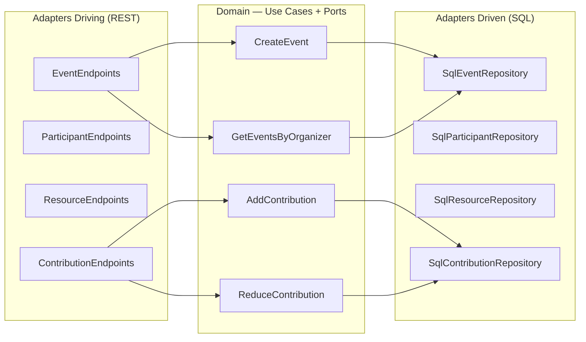
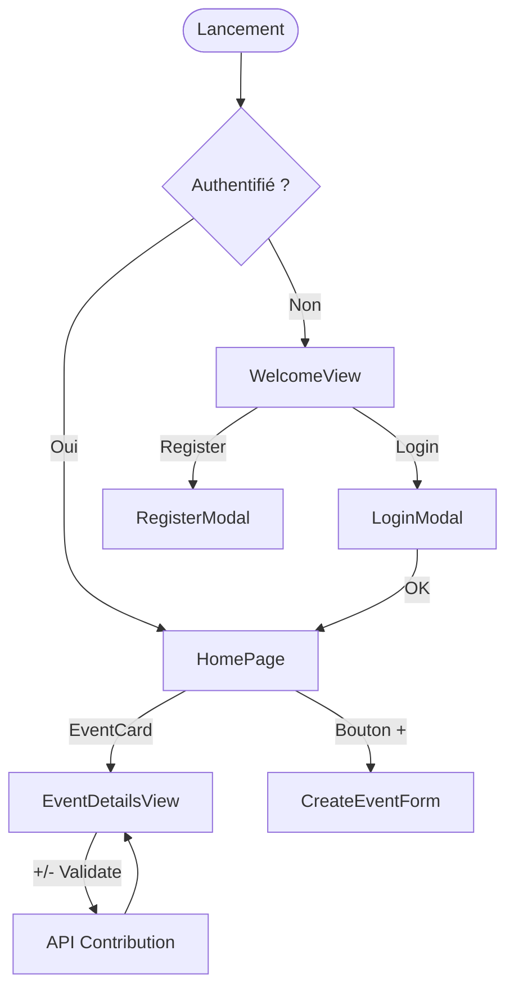
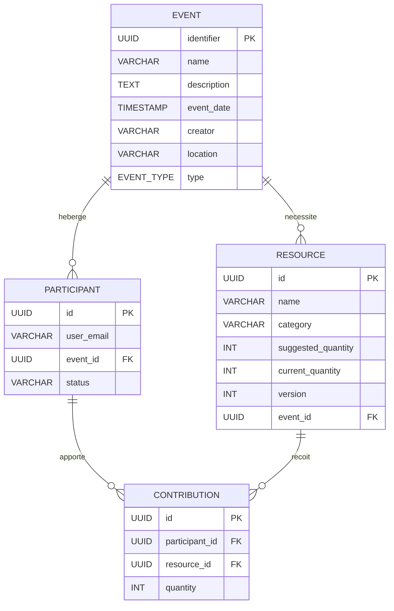
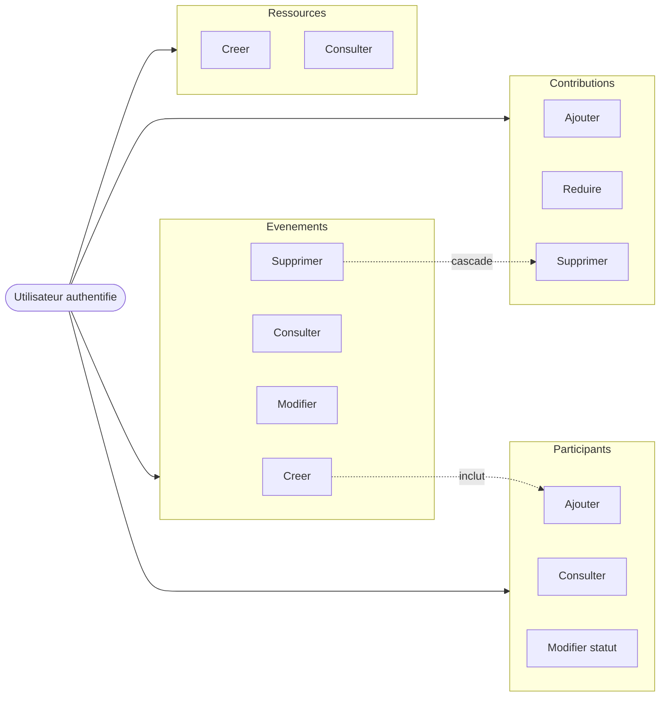
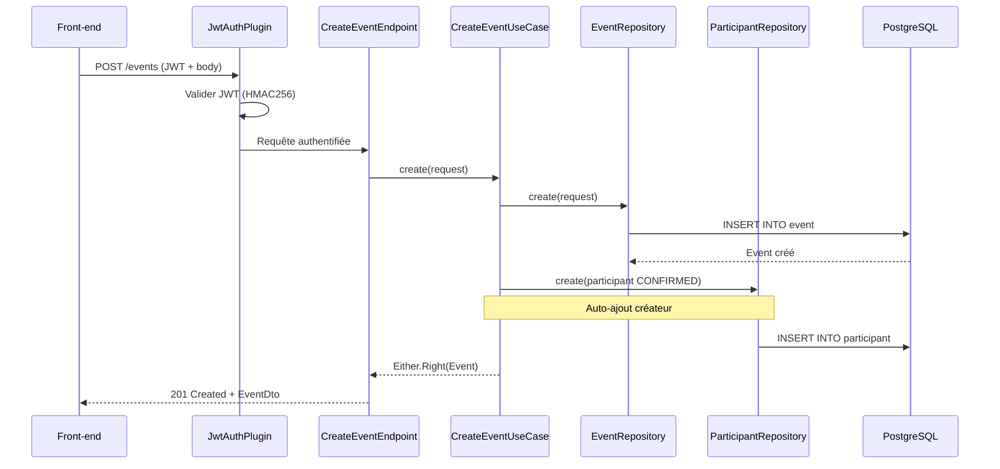
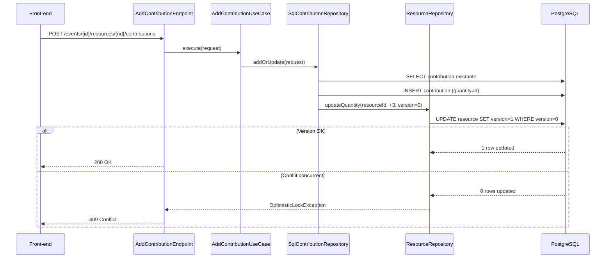

<!-- Slides 12-20 — Timing: 8 min -->

# Spécifications fonctionnelles

## Slide 12 — Architecture hexagonale : principes (1 min)



**Principe** : le domaine ne dépend d'aucune bibliothèque technique. Il définit des **ports** (interfaces), l'infrastructure les implémente.

- **Ports driving** (entrants) : les endpoints appellent les use cases
- **Ports driven** (sortants) : les use cases définissent des interfaces de repository
- **Inversion de dépendance** : le domaine est au centre, l'infrastructure est périphérique

---

## Slide 13 — Architecture hexagonale : modules Gradle (45s)

### 2 modules Gradle séparés

```
happyrow-core/
├── domain/                          ← Module métier pur
│   └── src/main/kotlin/
│       ├── event/
│       │   ├── create/              ← CreateEventUseCase + port EventRepository
│       │   ├── getByOrganizer/
│       │   └── common/model/        ← Event, Creator (value class)
│       ├── participant/
│       ├── resource/
│       └── contribution/
│
├── infrastructure/                  ← Module technique
│   └── src/main/kotlin/
│       ├── event/
│       │   ├── create/driving/      ← CreateEventEndpoint (REST)
│       │   └── common/driven/       ← SqlEventRepository (SQL)
│       ├── technical/
│       │   ├── auth/                ← JwtAuthPlugin, SupabaseJwtService
│       │   ├── database/            ← ExposedDatabase, HikariCP
│       │   └── di/                  ← Koin modules
│       └── ...
```

- **`domain/`** : zéro dépendance technique (pas de Ktor, Exposed, Jackson)
- **`infrastructure/`** : implémente les ports, dépend du domaine
- **Injection de dépendances** : Koin connecte les ports aux adapters

---

## Slide 14 — Maquettes et enchaînement des écrans (45s)



- **8 écrans/vues** + **6 modales**
- Design Tokens CSS : teal `#5FBDB4`, navy `#3D5A6C`, coral `#E6A19A`
- Police Comic Neue pour un ton convivial
- PWA installable avec mode offline (Service Worker Workbox)

> *[Insérer captures d'écran : HomePage + EventDetailsView]*

---

## Slide 15 — Modèle Conceptuel de Données (1 min)



- 4 entités, relations 1-N
- `version` sur Resource pour le verrou optimiste
- Contraintes FK, CHECK, UNIQUE

---

## Slide 16 — Modèle Physique et script SQL (45s)

### Tables Exposed (ORM Kotlin)

```kotlin
object ResourceTable : UUIDTable("configuration.resource", "id") {
    val name = varchar("name", 255)
    val category = enumerationByName<ResourceCategory>("category", 50)
    val suggestedQuantity = integer("suggested_quantity")
    val currentQuantity = integer("current_quantity")
    val version = integer("version").default(0)
    val eventId = uuid("event_id").references(EventTable.id)
    val createdAt = timestamp("created_at")
    val updatedAt = timestamp("updated_at")
}
```

### Script d'initialisation (init-db.sql)

```sql
CREATE SCHEMA IF NOT EXISTS configuration;

CREATE TABLE configuration.resource (
    id UUID PRIMARY KEY DEFAULT gen_random_uuid(),
    name VARCHAR(255) NOT NULL,
    category VARCHAR(50) NOT NULL,
    suggested_quantity INTEGER NOT NULL CHECK (suggested_quantity > 0),
    current_quantity INTEGER NOT NULL DEFAULT 0,
    version INTEGER NOT NULL DEFAULT 0,
    event_id UUID NOT NULL REFERENCES configuration.event(id),
    created_at TIMESTAMP NOT NULL DEFAULT NOW(),
    updated_at TIMESTAMP NOT NULL DEFAULT NOW()
);
```

---

## Slide 17 — Cas d'utilisation (45s)



- **12 use cases**, **4 bounded contexts**
- Règle métier : création événement inclut auto-ajout créateur (CONFIRMED)
- Suppression événement → cascade contributions → ressources → participants

---

## Slide 18 — Séquence : création d'événement (1 min)



---

## Slide 19 — Séquence : contribution avec verrou optimiste (1 min 15s)



Le verrou optimiste évite les verrous SQL (`SELECT FOR UPDATE`) tout en garantissant la cohérence.

---

## Slide 20 — Stack technique complète (45s)

### Back-end

| Couche | Technologie | Version |
|--------|------------|---------|
| Langage | Kotlin | 2.2.0 / JVM 21 |
| Framework web | Ktor | 3.2.2 |
| ORM | Exposed | 0.61.0 |
| Base de données | PostgreSQL | — |
| Pool connexions | HikariCP | 6.3.1 |
| DI | Koin | 4.1.0 |
| Erreurs fonctionnelles | Arrow | 2.1.2 |
| Sérialisation | Jackson | Kotlin + JavaTime |
| Auth | Auth0 JWT + Supabase | 4.4.0 |

### Front-end

| Couche | Technologie | Version |
|--------|------------|---------|
| Framework | React | 19.1.1 |
| Langage | TypeScript (strict) | 5.8.3 |
| Build | Vite | 7.1.2 |
| Routing | React Router DOM | 7.13.0 |
| Auth | Supabase JS SDK | 2.39.3 |
| PWA | vite-plugin-pwa + Workbox | 1.2.0 |
| HTTP | API native `fetch` | — |
