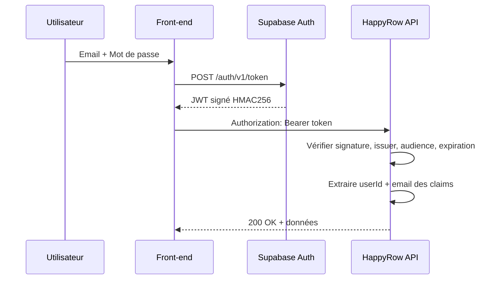

<!-- Slides 36-39 — Timing: 3 min -->

# Éléments de sécurité

## Slide 36 — Authentification et autorisation (45s)

| Mesure | Implémentation |
|--------|----------------|
| **Authentification** | JWT Supabase vérifié à chaque requête (HMAC256) |
| **Autorisation** | Suppression réservée au créateur, identité extraite du JWT |
| **Routes publiques** | Seules `/`, `/info`, `/health` accessibles sans token |

---

## Slide 37 — Sécurité applicative (45s)

| Menace | Protection |
|--------|-----------|
| **Injection SQL** | Exposed ORM — requêtes paramétrées exclusivement |
| **XSS** | API retourne du JSON uniquement, échappement React côté front |
| **CORS** | Liste blanche d'origines, pas de wildcard `*` |
| **Secrets exposés** | Variables d'environnement, Detekt vérifie l'absence de secrets codés en dur |
| **Erreurs techniques** | Messages génériques côté client, logs détaillés côté serveur |
| **Usurpation d'identité** | Email extrait du JWT serveur, jamais du body client |

### Validation des entrées — 3 niveaux

| Niveau | Mesure |
|--------|--------|
| **Endpoint** | `Either.catch` sur désérialisation, vérification UUID |
| **DTO** | Jackson : `FAIL_ON_NULL_FOR_PRIMITIVES = true` |
| **Base de données** | CHECK (`quantity > 0`), NOT NULL, UNIQUE |

---

## Slide 38 — Sécurité infrastructure (45s)

| Mesure | Détail |
|--------|--------|
| **HTTPS** | Forcé par Render en production (TLS automatique) |
| **SSL PostgreSQL** | `DB_SSL_MODE=require` |
| **Docker non-root** | `USER 1000:1000` dans le Dockerfile |
| **Utilisateur DB restreint** | `happyrow_user` — droits limités au schéma `configuration` |
| **Secrets CI/CD** | GitHub Secrets pour `RENDER_SERVICE_ID`, `RENDER_API_KEY`, Supabase |
| **Dependabot** | Alertes automatiques sur les dépendances vulnérables |

### Intégrité des données

| Mécanisme | Protection |
|-----------|-----------|
| Verrou optimiste | Mises à jour concurrentes détectées |
| FK CASCADE | Suppression propre des données liées |
| UNIQUE + CHECK | Contraintes métier en base |
| Transactions | Atomicité de chaque opération |

---

## Slide 39 — Éco-conception (45s)

| Principe | Application dans HappyRow |
|----------|--------------------------|
| **Sobriété fonctionnelle** | Périmètre limité aux besoins réels, pas de fonctionnalités superflues |
| **Minimalisme des dépendances** | 3 deps de production front-end (React, Router, Supabase), API `fetch` native |
| **Images Docker optimisées** | Build multi-stage : image prod = JRE 21 + JAR uniquement, pas de SDK |
| **PWA et mode offline** | Service Worker (Workbox) cache les assets, réduit les requêtes réseau |
| **Pool de connexions** | HikariCP mutualise les connexions PostgreSQL |
| **JVM tunée** | `-Xmx512m -Xms256m` — consomme uniquement la mémoire nécessaire |
| **Requêtes optimisées** | Index ciblés, verrou optimiste (pas de SELECT FOR UPDATE bloquant) |

> Conforme aux recommandations du référentiel GR491 (éco-conception de services numériques)
