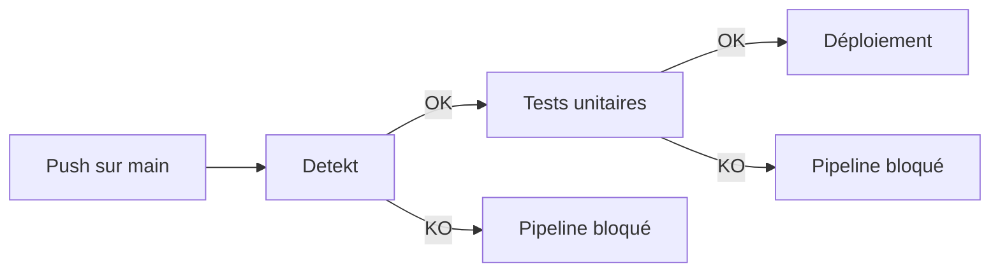

<!-- Slides 40-43 — Timing: 3 min 30s -->

# Plan de tests et jeu d'essai

## Slide 40 — Stratégie de tests (45s)

### Pyramide de tests

| Niveau | Outil | Scope | Quantité |
|--------|-------|-------|----------|
| **Tests unitaires** | Kotest + MockK | Use cases, logique métier | ~2 tests (domaine) |
| **Tests d'intégration** | Testcontainers | Repositories SQL, PostgreSQL réel | ~40 scénarios |
| **Analyse statique** | Detekt | Code smells, complexité, sécurité | À chaque push |
| **Tests unitaires front** | Vitest + Testing Library | Auth (4 fichiers) | 46 tests |
| **Tests E2E** | Playwright | PWA (manifest, SW, offline) | 6 tests |

### Exécution dans le pipeline CI



---

## Slide 41 — Tests unitaires : exemple Kotest BDD (45s)

```kotlin
// domain/event/create/CreateEventUseCaseTestUT.kt

class CreateEventUseCaseTestUT {
  private val eventRepositoryMock = mockk<EventRepository>()
  private val participantRepositoryMock = mockk<ParticipantRepository>()
  private val useCase = CreateEventUseCase(
    eventRepositoryMock, participantRepositoryMock
  )

  @Test
  fun `should create event and auto-add creator as participant`() {
    givenACreateRequest()
      .andAWorkingCreation()
      .whenCreating()
      .then { (result) ->
        result shouldBeRight Persona.Event.anEvent
      }
  }

  @Test
  fun `should transfer error from event repository`() {
    val error = CreateEventRepositoryException(Persona.Event.aCreateEventRequest)
    givenACreateRequest()
      .andAFailingCreation(error)
      .whenCreating()
      .then { (result, request) ->
        result shouldBeLeft CreateEventException(request, error)
      }
  }
}
```

- Structure **BDD** : Given / When / Then via fonctions d'aide
- **Personas** : données de test centralisées (`Persona.Event.anEvent`)
- **Arrow Test** : assertions `shouldBeRight`, `shouldBeLeft`
- **MockK** : mocking des repositories (ports du domaine)

---

## Slide 42 — Jeu d'essai : scénarios nominal et conflit (1 min)

### Fonctionnalité représentative : ajout contribution + verrou optimiste

**Scénario nominal**

| Étape | Entrée | Attendu | Obtenu |
|-------|--------|---------|--------|
| 1. Requête HTTP | `POST .../contributions` + JWT + `{ "quantity": 3 }` | Acceptée | OK |
| 2. Auth | JWT valide | AuthenticatedUser extrait | OK |
| 3. Participant | email + eventId | findOrCreate retourne participant | OK |
| 4. Contribution | participantId + resourceId | INSERT contribution | OK |
| 5. Ressource | delta=+3, version=0 | quantity 0→3, version 0→1 | UPDATE 1 row |
| 6. Réponse | — | 200 OK + ContributionDto | 200 OK |

**Aucun écart constaté.**

**Scénario conflit (verrou optimiste)**

| Étape | Entrée | Attendu | Obtenu |
|-------|--------|---------|--------|
| 1. User A contribue | quantity=3, version=0 | Succès, version→1 | OK |
| 2. User B contribue | quantity=2, version=0 (périmé) | OptimisticLockException | Exception |
| 3. Réponse B | — | 409 Conflict | 409 + "OPTIMISTIC_LOCK_FAILURE" |

---

## Slide 43 — Tests de sécurité (45s)

| # | Cas de test | Entrée | Attendu | Obtenu |
|---|-------------|--------|---------|--------|
| S1 | Sans JWT | Requête sans Authorization | 401 MISSING_TOKEN | Conforme |
| S2 | JWT expiré | Token avec `exp` passé | 401 INVALID_TOKEN | Conforme |
| S3 | Mauvaise signature | Token signé avec autre secret | 401 INVALID_TOKEN | Conforme |
| S4 | Quantité négative | `{ "quantity": -5 }` | 400 Bad Request | Conforme |
| S5 | Quantité non-numérique | `{ "quantity": "abc" }` | 400 Bad Request | Conforme |
| S6 | Injection SQL | `"1; DROP TABLE..."` | 400 Bad Request | Conforme |
| S7 | Usurpation identité | JWT de A, email de B | Contribution avec email A | Conforme |

**Défense en profondeur** : validation endpoint → validation domaine → contraintes base de données
