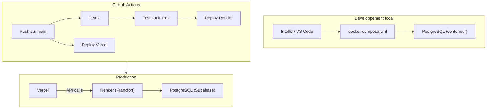

<!-- Slides 44-46 — Timing: 2 min 30s -->

# Déploiement et DevOps

## Slide 44 — Architecture de déploiement (45s)



| Environnement | Back-end | Front-end | Base de données |
|---------------|----------|-----------|-----------------|
| **Local** | `./gradlew run` | `npm run dev` (Vite) | docker-compose PostgreSQL |
| **CI** | GitHub Actions | GitHub Actions | — (tests unitaires seulement) |
| **Production** | Render (Docker) | Vercel | Supabase PostgreSQL |

---

## Slide 45 — Pipeline CI/CD détaillé (1 min)

### Back-end (deploy-render.yml)

```yaml
on:
  push:
    branches: [ main ]

jobs:
  detekt:        # Analyse statique (Detekt)
    run: ./gradlew detekt

  test:          # Tests unitaires (Kotest + MockK)
    needs: detekt
    run: ./gradlew test -PWithoutIntegrationTests

  deploy:        # Déploiement Render via API
    needs: test
    uses: johnbeynon/render-deploy-action@v0.0.8
    with:
      service-id: ${{ secrets.RENDER_SERVICE_ID }}
      api-key: ${{ secrets.RENDER_API_KEY }}
```

### Front-end (4 jobs)

1. **Test** : lockfile-lint → `npm ci --ignore-scripts` → ESLint → Vitest → build
2. **Build Docker** : image multi-stage → push `ghcr.io`
3. **Approval** : approbation manuelle (GitHub Environment "production")
4. **Deploy** : `vercel --prod`

### Sécurité quotidienne (cron)

- `npm audit` — vulnérabilités connues
- `lockfile-lint` — intégrité du lockfile
- Détection de scripts d'installation suspects
- Contrôle de fraîcheur des dépendances

---

## Slide 46 — Mise en production (45s)

### Dockerfile multi-stage (back-end)

```dockerfile
# Stage 1 — Build (image complète Gradle)
FROM gradle:8-jdk21 AS build
WORKDIR /app
COPY . .
RUN ./gradlew clean build --no-daemon -x test

# Stage 2 — Runtime (image légère JRE)
FROM eclipse-temurin:21-jre-jammy
USER 1000:1000
WORKDIR /app
COPY --from=build /app/build/libs/*.jar happyrow-core.jar
EXPOSE 8080
CMD ["-Xmx512m", "-Xms256m", "-XX:+UseG1GC", "-jar", "happyrow-core.jar"]
```

### Variables d'environnement (Render)

| Variable | Description |
|----------|-------------|
| `DATABASE_URL` | URL de connexion PostgreSQL |
| `SUPABASE_JWT_SECRET` | Secret HMAC256 pour vérification JWT |
| `DB_SSL_MODE` | `require` — connexion SSL obligatoire |
| `CORS_ALLOWED_ORIGINS` | URL front-end Vercel autorisée |

### Procédure de déploiement

1. Push sur `main` → GitHub Actions (Detekt → Tests → Deploy)
2. Render clone, exécute Dockerfile multi-stage
3. Image Docker : build Gradle → runtime JRE 21 uniquement
4. Déploiement zero-downtime, serveur Francfort (UE)
